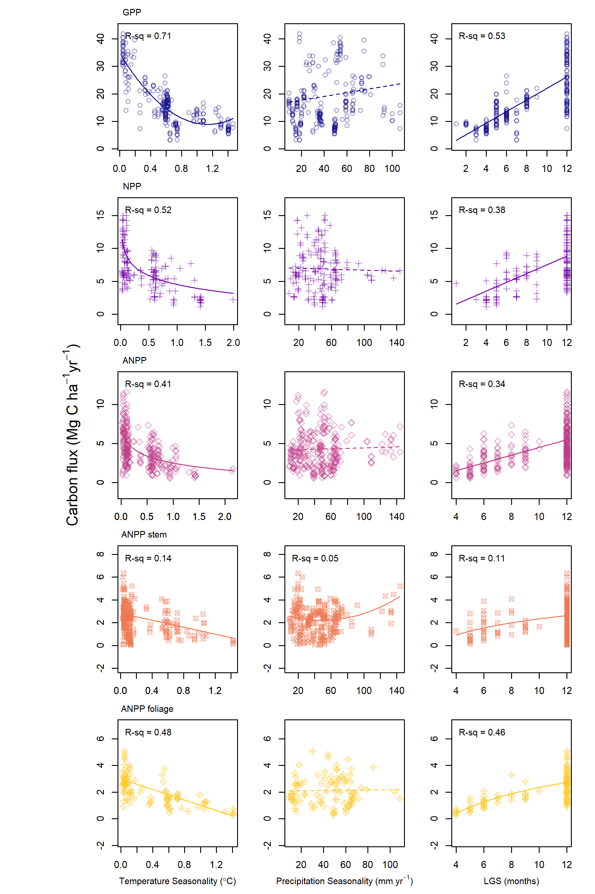

```{r, include=FALSE}
options(tinytex.verbose = TRUE)
options(knitr.table.format = "latex")
```


```{r setup, include = FALSE}
knitr::opts_knit$set(root.dir = 'C:/Users/becky/Dropbox (Smithsonian)/GitHub/Global_Productivity/manuscript/')
# knitr::opts_knit$set(root.dir = 'C:/Users/gyrcbm/Dropbox/Global_Productivity/manuscript/')
  # knitr::opts_knit$set(root.dir = '/Users/kteixeira/Dropbox (Smithsonian)/GitHub/ForC-db/Global_Productivity/manuscript/')
```

\listoftables
\listoffigures

\newpage

\blandscape

```{r eval = TRUE, echo=FALSE, warning=FALSE}
library(knitr)
library(kableExtra)
S1 <- read.csv("tables_figures/climate_variables.csv", stringsAsFactors = FALSE, check.names = FALSE)
kable(S1, format = "latex", booktabs = TRUE, caption = "Table S1. Climate variable definitions, sources, and abbreviations", escape = F)%>%
  kable_styling(latex_options = c("scale_down", "hold_position")) %>%
  column_spec(1, width = "2.5cm") %>%
  column_spec(2, width = "5cm") %>%
  column_spec(3, width = "2cm") %>%
  column_spec(4, width = "7cm") %>%
  column_spec(5, width = "2cm") %>%
  column_spec(6, width = "5cm") %>%
  kableExtra::footnote(number = c("Hijmans et al. (2005)", "Fick et al. (2017)", "Harris et al. (2017)", "Abatzoglou et al. (2018)"), footnote_as_chunk = TRUE) %>%
  kableExtra::footnote(symbol = "The WorldClim version used was the most recent available at the time of analysis", footnote_as_chunk = TRUE)

#@hijmans_very_2005; @fick_worldclim_2017; @harris_updated_2014;  @abatzoglou_terraclimate_2018
```
\elandscape
\newpage

\blandscape
```{r eval = TRUE, echo=FALSE, warning=FALSE}
library(knitr)
library(kableExtra)
S3 <- read.csv("tables_figures/r2_table1.csv", stringsAsFactors = FALSE, check.names = FALSE)
kable(S3, format = "latex", booktabs = TRUE, caption = "Table S2. Model form, $\\Delta$AIC, and R$^{2}$ for each climate variables as a single fixed effect in models for each C flux. Model forms include first-order linear (Lin), second-order polynomial (Poly), and logarithmic (Log).", caption.short = "Table S2. Model form, $\\Delta$AIC and R$^{2}$ for each climate variables as a single fixed effect in models for each C flux", escape = F) %>%
  kable_styling(latex_options = c("scale_down", "hold_position")) %>%
  add_header_above(c(" ", "Latitude"=3, "MAT"=3, "MAP"=3, "T Seas"=3, "P Seas"=3, "ATR"=3, "Solar R"=3, "AI"=3))
```

```{r eval = TRUE, echo=FALSE, warning=FALSE}
library(knitr)
library(kableExtra)
S4 <- read.csv("tables_figures/r2_table2.csv", stringsAsFactors = FALSE, check.names = FALSE)
kable(S4, format = "latex", booktabs = TRUE, escape = F) %>%
  kable_styling(latex_options = c("scale_down", "hold_position")) %>%
  add_header_above(c(" ", "Cloud"=3, "AFD"=3, "AWD"=3, "PET"=3, "VPD"=3, "Max VPD"=3, "WSM"=3, "LGS"=3))
```
\elandscape

```{r eval = TRUE, echo=FALSE, warning=FALSE}
library(knitr)
library(kableExtra)
S5 <- read.csv("tables_figures/mat_map.csv", stringsAsFactors = FALSE, check.names = FALSE)
kable(S5, format = "latex", booktabs = TRUE, caption = "Table S3. Joint effects of MAT and MAP on forest C fluxes", escape = F)%>%
  kable_styling(latex_options = c("scale_down", "hold_position"), font_size = 12) %>%
  column_spec(1, width = "4cm") %>%
  column_spec(2, width = "6cm") %>%
  column_spec(3, width = "6cm") %>%
  column_spec(4, width = "6cm")%>%
  column_spec(5, width = "2cm")%>%
  column_spec(6, width = "2cm")
```

\newpage
```{r eval = TRUE, echo=FALSE, warning=FALSE}
library(knitr)
library(kableExtra)
S2 <- read.csv("tables_figures/mat_growing_season.csv", stringsAsFactors = FALSE, check.names = FALSE)
kable(S2, format = "latex", booktabs = TRUE, caption = "Table S4. Comparison of growing season length and MAT as predictors of forest C fluxes", escape = F)%>%
  kable_styling(latex_options = c("scale_down", "hold_position")) %>%
  column_spec(1, width = "5cm") %>%
  column_spec(2, width = "2cm") %>%
  column_spec(3:4, width = "7cm") %>%
  pack_rows("GPP", 1, 3, latex_gap_space = "1em", colnum = 1, hline_before = FALSE) %>%
  pack_rows("NPP", 4, 6, latex_gap_space = "1em", colnum = 1, hline_before = TRUE) %>%
  pack_rows("ANPP", 7, 9, latex_gap_space = "1em", colnum = 1, hline_before = TRUE) %>%
  pack_rows("ANPP stem", 10, 12, latex_gap_space = "1em", colnum = 1, hline_before = TRUE) %>%
  pack_rows("ANPP foliage", 13, 15, latex_gap_space = "1em", colnum = 1, hline_before = TRUE) %>%
  pack_rows("BNPP root", 16, 18, latex_gap_space = "1em", colnum = 1, hline_before = TRUE) %>%
  pack_rows("BNPP fine root", 19, 21, latex_gap_space = "1em", colnum = 1, hline_before = TRUE) %>%
  pack_rows("R auto", 22, 24, latex_gap_space = "1em", colnum = 1, hline_before = TRUE) %>%
  pack_rows("R root", 25, 27, latex_gap_space = "1em", colnum = 1, hline_before = TRUE)
```


\newpage
```{r eval = TRUE, echo=FALSE, warning=FALSE}
library(knitr)
library(kableExtra)
S3 <- read.csv("tables_figures/best_models_each_flux.csv", stringsAsFactors = FALSE, check.names = FALSE)
kable(S3, format = "latex", booktabs = TRUE, caption = "Table S5. Best models by carbon flux. Where $\\Delta$AIC values </= 2 all models with a $\\Delta$AIC value </= 2 are presented", caption.short = "Table S5. Best models by carbon flux", escape = F) %>%
  kable_styling(latex_options = c("scale_down", "hold_position")) %>%
  collapse_rows(columns = 1, latex_hline = "major")
```

\newpage
\blandscape
```{r eval = TRUE, echo=FALSE, warning=FALSE}
library(knitr)
library(kableExtra)
S4 <- read.csv("tables_figures/pairwise_comparisons.csv", stringsAsFactors = FALSE, check.names = FALSE)
kable(S4, format = "latex", booktabs = TRUE, caption = "Table S6. Pairwise comparisons between carbon fluxes", escape = F) %>%
  kable_styling(latex_options = c("scale_down", "hold_position")) %>%
  collapse_rows(columns = c(1,2), latex_hline = "custom", custom_latex_hline = c(1,2))
  
```
\elandscape


\newpage
```{r echo=FALSE, fig.cap = "Figure S1: Maps showing distribution of samples for the nine forest C fluxes analyzed here", out.height ='95%', fig.pos='H'}

  knitr::include_graphics("tables_figures/distribution_all_samples.png")
```

\blandscape
```{r echo=FALSE, fig.align = "center", fig.cap = "Figure S2: Scatterplots and Pearson's R values for relationships between latitude and climate variables", out.height='95%', fig.pos='H'}

  
```
\elandscape


\blandscape
```{r echo=FALSE, fig.align = "center", fig.cap = "Figure S3: Ratios among forest C fluxes as a function of latitude and climate variables", out.width ='80%', fig.pos='H'}

  knitr::include_graphics("tables_figures/ratio_grid_plots.png")
```
\elandscape

\blandscape
```{r echo=FALSE, fig.cap = "Figure S4: Individual plots of forest C fluxes in relation to mean annual climate, part 1.", out.height='95%', fig.pos='H'}

  knitr::include_graphics("tables_figures/grid_plots_climate1.png")
```

\newpage

```{r echo=FALSE, fig.cap = "Figure S5: Individual plots of forest C fluxes in relation to mean annual climate, part 2.", out.height='95%', fig.pos='H'}

  
```
\elandscape


```{r echo=FALSE, fig.cap = "Figure S6: Individual plots of forest C fluxes in relation to mean climate seasonality, part 1.", out.height ='95%', fig.pos='H'}

  
```

\newpage
```{r echo=FALSE, fig.cap = "Figure S7: Individual plots of forest C fluxes in relation to mean climate seasonality, part 2.", out.width ='100%', fig.pos='H'}

  knitr::include_graphics("tables_figures/grid_plots_seasonality4.png")
```

\newpage
```{r echo=FALSE, fig.cap = "Figure S8: Growing season length-standardized forest C fluxes in relation to mean growing season climate, part 1.", out.width ='100%', fig.pos='H'}

  knitr::include_graphics("tables_figures/gridded_growing_season1.png")
```

\newpage
```{r echo=FALSE, fig.cap = "Figure S9: Growing season length-standardized forest C fluxes in relation to mean growing season climate, part 2.", out.width ='100%', fig.pos='H'}

  knitr::include_graphics("tables_figures/gridded_growing_season2.png")
```

\newpage
# References

