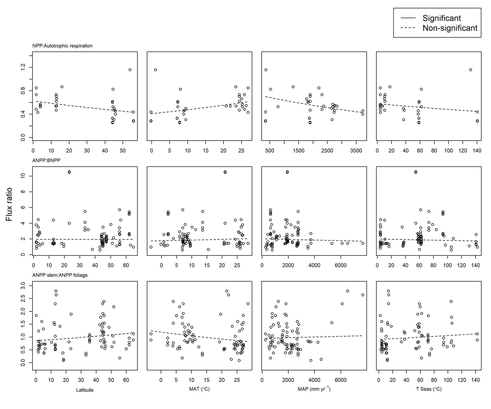

```{r, include=FALSE}
options(tinytex.verbose = TRUE)
options(knitr.table.format = "latex")
```


```{r setup, include = FALSE}
# knitr::opts_knit$set(root.dir = 'C:/Users/gyrcbm/Dropbox/Global_Productivity/manuscript/')
knitr::opts_knit$set(root.dir = '/Users/kteixeira/Dropbox (Smithsonian)/GitHub/ForC-db/Global_Productivity/manuscript/')
```

\listoftables
\listoffigures

\newpage
```{r eval = TRUE, echo=FALSE, warning=FALSE}
library(knitr)
library(kableExtra)
S1 <- read.csv("tables_figures/climate_variables.csv", stringsAsFactors = FALSE, check.names = FALSE)
kable(S1, format = "latex", booktabs = TRUE, caption = "Table S1. Climate variable definitions and sources", escape = F)%>%
  kable_styling(latex_options = c("scale_down", "hold_position")) %>%
  column_spec(1, width = "5cm") %>%
  column_spec(2, width = "2cm") %>%
  column_spec(3:4, width = "7cm") 
```

\newpage
# Table S_. Comparison of growing season length and mean annual temperature as predictors of FACF.
see [issue #58](https://github.com/forc-db/Global_Productivity/issues/58).

\newpage


\newpage


\newpage


\newpage


\newpage


\newpage


\newpage


\newpage


\newpage
