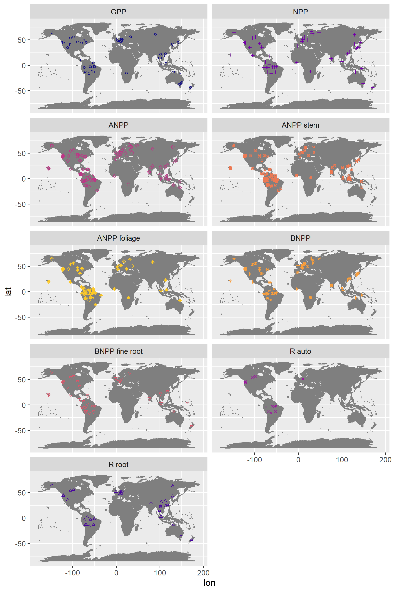
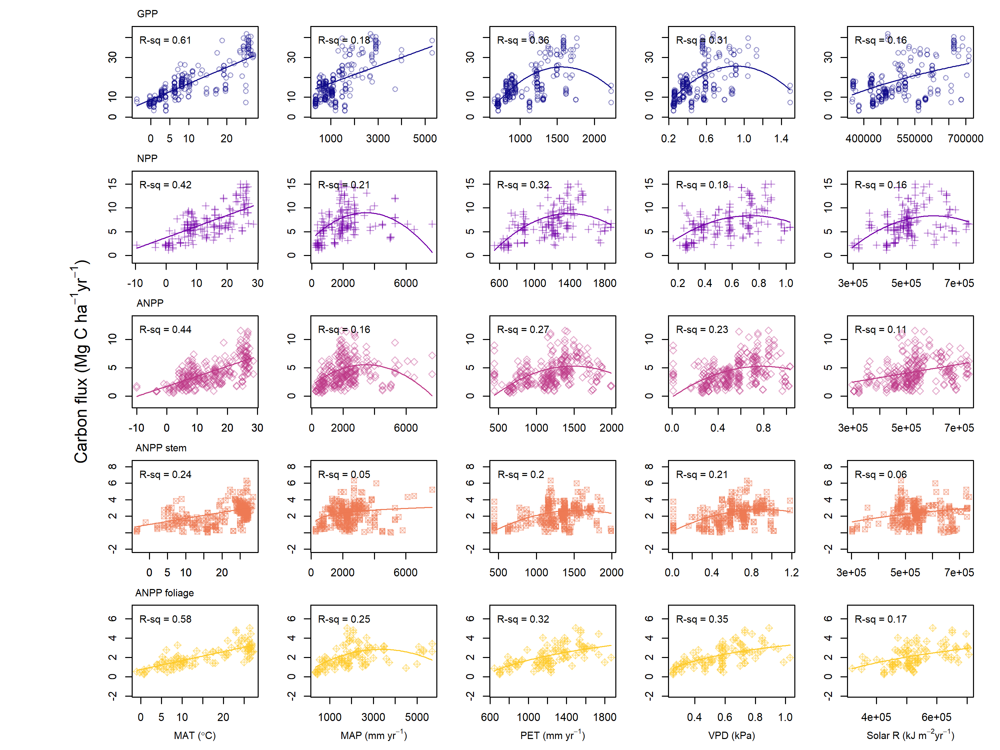
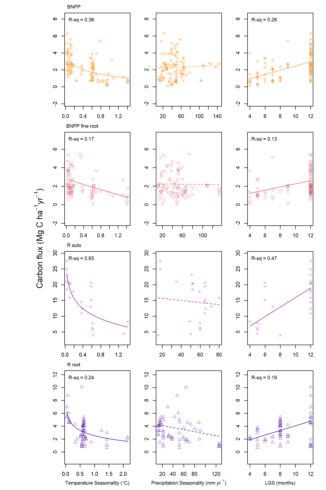
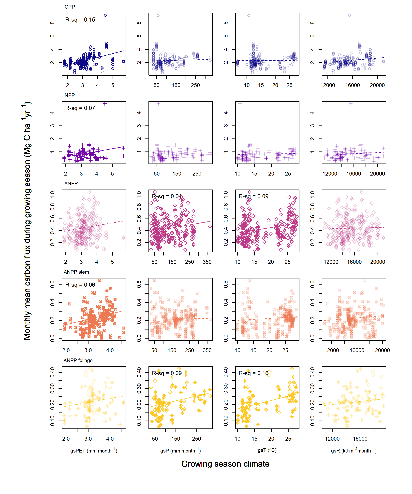

---
title: "Supplementary Information: Global patterns of forest autotrophic carbon fluxes"
author: "Rebecca Banbury Morgan, Valentine Herrmann, Norbert Kunert, Ben Bond-Lamberty, Helene C. Muller-Landau, Kristina J. Anderson-Teixeira"
output: 
  pdf_document:
    fig_caption: yes
    
header-includes:  \usepackage{float}
                  \usepackage{caption}
                  \captionsetup[table]{font=footnotesize}
                  \captionsetup[figure]{font=footnotesize}
                  \captionsetup[figure]{labelformat=empty}
                  \captionsetup[table]{labelformat=empty}
                  \usepackage{pdflscape}
                  \newcommand{\blandscape}{\begin{landscape}}
                  \newcommand{\elandscape}{\end{landscape}}

```{r, include=FALSE}
options(tinytex.verbose = TRUE)
options(knitr.table.format = "latex")
```


```{r setup, include = FALSE}
knitr::opts_knit$set(root.dir = 'C:/Users/becky/Dropbox (Smithsonian)/GitHub/Global_Productivity/manuscript/')
# knitr::opts_knit$set(root.dir = '/Users/kteixeira/Dropbox (Smithsonian)/GitHub/ForC-db/Global_Productivity/manuscript/')
```

\listoftables
\listoffigures

\newpage
```{r eval = TRUE, echo=FALSE, warning=FALSE}
library(knitr)
library(kableExtra)
S1 <- read.csv("tables_figures/climate_variables.csv", stringsAsFactors = FALSE, check.names = FALSE)
kable(S1, format = "latex", booktabs = TRUE, caption = "Table S1. Climate variable definitions, sources, and abbreviations", escape = F)%>%
  kable_styling(latex_options = c("scale_down", "hold_position"), font_size = 12) %>%
  column_spec(1, width = "5cm") %>%
  column_spec(2:3, width = "2cm") %>%
  column_spec(4, width = "7cm") 
```

\newpage
```{r eval = TRUE, echo=FALSE, warning=FALSE}
library(knitr)
library(kableExtra)
S1 <- read.csv("tables_figures/mat_growing_season.csv", stringsAsFactors = FALSE, check.names = FALSE)
kable(S1, format = "latex", booktabs = TRUE, caption = "Table S2. Comparison of growing season length and mean annual temperature as predictors of FACF", escape = F)%>%
  kable_styling(latex_options = c("scale_down", "hold_position")) %>%
  column_spec(1, width = "5cm") %>%
  column_spec(2, width = "2cm") %>%
  column_spec(3:4, width = "7cm") %>%
  pack_rows("GPP", 1, 3, latex_gap_space = "1em", colnum = 1, hline_before = FALSE) %>%
  pack_rows("NPP", 4, 6, latex_gap_space = "1em", colnum = 1, hline_before = TRUE) %>%
  pack_rows("ANPP", 7, 9, latex_gap_space = "1em", colnum = 1, hline_before = TRUE) %>%
  pack_rows("ANPP woody stem", 10, 12, latex_gap_space = "1em", colnum = 1, hline_before = TRUE) %>%
  pack_rows("ANPP foliage", 13, 15, latex_gap_space = "1em", colnum = 1, hline_before = TRUE) %>%
  pack_rows("BNPP root", 16, 18, latex_gap_space = "1em", colnum = 1, hline_before = TRUE) %>%
  pack_rows("BNPP fine root", 19, 21, latex_gap_space = "1em", colnum = 1, hline_before = TRUE) %>%
  pack_rows("Autotrophic respiration", 22, 24, latex_gap_space = "1em", colnum = 1, hline_before = TRUE) %>%
  pack_rows("Root respiration", 25, 27, latex_gap_space = "1em", colnum = 1, hline_before = TRUE)
```

\newpage
```{r echo=FALSE, fig.cap = "Figure S1: Maps showing distribution of samples for the nine FACF analyzed here.", out.width='100%', fig.pos='H'}

  
```

\blandscape

```{r echo=FALSE, fig.align = "center", fig.cap = "Figure S2: Correlations among latitude and climate variables. Variable names and units given in Table S1", out.width='100%', fig.pos='H'}

  knitr::include_graphics("tables_figures/climate_regressions.png")
```
\elandscape

\blandscape

```{r echo=FALSE, fig.cap = "Figure S2: Individual plots of FACF in relation to mean annual climate, part 1.", out.width='100%', fig.pos='H'}

  
```

\newpage
```{r echo=FALSE, fig.cap = "Figure S3: Individual plots of FACF in relation to mean annual climate, part 2.", out.width='100%', fig.pos='H'}

  knitr::include_graphics("tables_figures/grid_plots_climate2.png")
```
\elandscape


```{r echo=FALSE, fig.cap = "Figure S4: Individual plots of FACF in relation to mean climate seasonality, part 1.", out.width ='100%', fig.pos='H'}

  knitr::include_graphics("tables_figures/grid_plots_seasonality3.png")
```

\newpage
```{r echo=FALSE, fig.cap = "Figure S5: Individual plots of FACF in relation to mean climate seasonality, part 2.", out.width ='100%', fig.pos='H'}

  
```

\newpage
```{r echo=FALSE, fig.cap = "Figure S6: Growing season length-standardized FACF in relation to mean growing season climate, part 1.", out.width ='100%', fig.pos='H'}

  
```

\newpage
```{r echo=FALSE, fig.cap = "Figure S7: Growing season length-standardized FACF in relation to mean growing season climate, part 2.", out.width ='100%', fig.pos='H'}

  
```

\newpage
```{r echo=FALSE, fig.align = "center", fig.cap = "Figure S8: Ratios among FACF as a function of latitude and climate variables", out.width ='100%', fig.pos='H'}

  knitr::include_graphics("tables_figures/ratio_grid_plots.png")
```
