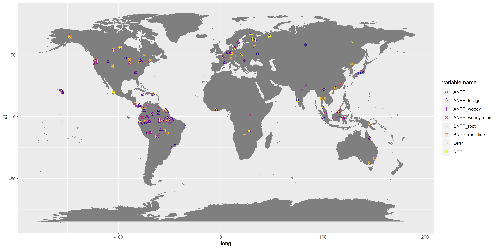
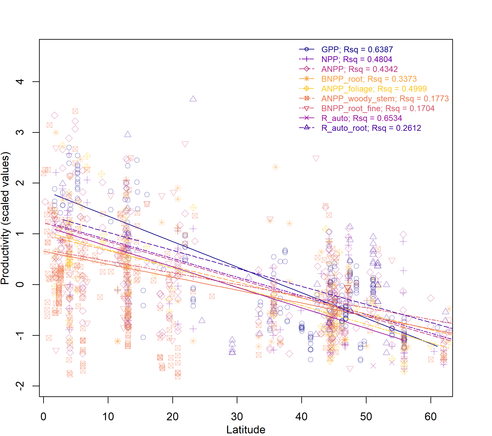

```{r, include=FALSE}
options(tinytex.verbose = TRUE)
```


```{r include=FALSE}
knitr::write_bib(c(
  .packages(), 'knitr', 'rmarkdown', 'lme4', 'MuMIn', 'plyr', 'raster', 'ncdf4', 'Hmisc', 'plyr', 'merTools', 'visreg', 'r2glmm', 'nlme', 'viridis', 'ggplot2', 'ggpubr', 'gridExtra', 'AICcmodavg'
), 'packages.bib')
```

```{r results="asis", include=FALSE}
cat("
<style>
caption {
      font-size: 0.75em;
    }
</style>
")
```


###Abstract
  
Globally, forests are a significant carbon sink, showing high levels of productivity and representing an important component of the carbon cycle. Current knowledge indicates that forest productivity decreases with latitude; however, there is evidence that this relationship varies across different fluxes. Furthermore, the climate variables that drive this relationship are poorly understood. Here, we use a comprehensive global database of forest carbon fluxes to show that, while all major carbon fluxes decrease with latitude, allocation to woody productivity increases with latitude, and allocation to root productivity declines. The best predictors of global patterns of productivity are temperature variables, including mean annual temperature, annual temperature range, and temperature seasonality, with the exception of woody productivity, which is most strongly influenced by potential evapotranspiration and vapour pressure deficit. Climate variables explain a large proportion of the variation in major carbon fluxes, but are a less significant predictor of subsidiary components. Our results illustrate the strong influence of climate on primary productivity, and particularly the importance of temperature in determining forest productivity. However, they also indicate that effects of climate are complex: fluxes show non-linear responses to climate variables, and many factors other than climate interact to determine allocation to subsidiary components. Knowledge of the relative influence of climate variables on forest carbon fluxes is an important component of understanding the responses of primary productivity to climate change.

### Introduction

Globally, forests play an important role in the carbon cycle and are a major component of global carbon dioxide budgets [@luyssaert_old-growth_2008]. They show higher levels of productivity than non-forest terrestrial ecosystems [@del_grosso_global_2008], and as a result achieve significant carbon sequestration and storage. Estimating the total role of forests in the carbon cycle is challenging, but studies indicate that old growth forests alone sequester up to 1.4 GtCyr^-1^ [@malhi_carbon_1999], while the total sequestration of carbon by established forests globally could be up to 2.4 GtCyr^-1^, with the largest sinks being in old-growth tropical forests [@pan_large_2011]. As atmospheric carbon dioxide levels continue to rise, with consequences for global climate, there is increasing recognition that proper protection and management of forest resources will have an important role to play in mitigating climate change. Understanding the patterns of forest productivity on a global scale, and the drivers behind them, is therefore a priority in forest research.  
  
There are two major questions to understand: firstly, how forest productivity varies globally - and specifically which areas show the greatest peaks in productivity -; and secondly, which climate variables drive this variation. On a global scale, the productivity of forests varies with latitude, with a general trend of increasing productivity towards the tropics [@beer_terrestrial_2010; @jung_global_2011]; however the exact nature of this pattern, and how it varies by component of productivity, is poorly understood. This latitudinal gradient is most likely to be explained by climatic gradients in temperature, precipitation, length of growing season, and combinations of the above. Productivity is influenced by a range of climatic drivers, including mean annual temperature (MAT) and mean annual precipitation (MAP) [@del_grosso_global_2008], but doesn't necessarily respond linearly to these drivers. Disentangling the shape of productivity responses to climate drivers will enable better predictions of future responses under climate change.  

*The components of forest* During photosynthesis, plants capture carbon dioxide from the atmosphere. The gross primary productivity (GPP) of an ecosystem is the gross uptake, via photosynthesis, of carbon dioxide by plants in that ecosystem. Only a fraction of the carbon captured is assimilated into plant tissue; the rest is used in autotrophic respiration (R~auto~). The component of GPP that is stored as plant material is the net primary productivity (NPP) of an ecosystem. Net primary productivity can therefore be expressed as:

$$ NPP = GPP + R~auto~ $$

Currently, GPP cannot be measured directly by observing total ecosystem photosynthesis. Instead field estimates of GPP have to be derived based on modelling and extrapolation of eddy-covariance studies and measurements of net ecosystem exchange (NEE) [@clark_reviews_2017].

In contrast, NPP can be calculated through direct field observations. In order to achieve greater accuracy in estimating NPP, NPP is often broken down into its component parts, with aboveground NPP (ANPP) and belowground NPP (BNPP) considered separately to each other. The components included when estimating ANPP and BNPP often vary between studies, depending on the intensity of fieldwork effort. At its most basic level, ANPP can be expressed as:

$$ ANPP = NPP~stem~ + NPP~branch~ + NPP~canopy~ $$
where NPP~stem~ is the annual woody increment of all stems above a specified diameter at breast height (DBH), NPP~branch~ is annual woody branch turnover, and NPP~canopy~ is annual foliage production, including leaves, twigs, and reproductive structures. ANPP may also include NPP~VOC~, the annual emission of volatile organic compounds, and NPP~herbivory~, the annual consumption of plant matter by herbivores, but these components are often excluded from field observations as they are much harder to quantify. Other components of aboveground productivity that remain largely unquantified include epiphytes, hemiepiphytes, and understory plants [@clark_reviews_2017]. The majority of current ANPP estimates are based on the assumption that the contribution of these components to overall NPP is insignificant.     
  
There are two major subcomponents of BNPP, which can be expressed as:

$$ BNPP = NPP~coarse root~ + NPP~fine root~ $$
where NPP~coarse root~ is the annual production of coarse roots (typically roots >2mm diameter), and NPP~fine root~ is the annual production of fine roots (typically roots <2mm diameter) [@aragao_above-_2009]. Calculations of BNPP may also include NPP~exudation~, a measure of annual carbon losses through root exudation, and NPP~symbionts~, the annual carbon allocation to mycorrhizae and legumes, but, as before, this is challenging to quantify and is often excluded from field observations.

BNPP is a poorly understood component of total ecosystem productivity, primarily because of the challenges in gaining accurate field measurements. Coarse root productivity is often estimated via extrapolation of NPP~stem~ estimates using allometries that may not have been empirically verified [@clark_net_2001]. NPP~fine root~ is easier to quantify through soil cores and minirhizotrons, however, sampling tends to be limited to the surface soils, with very few studies sampling to depths below 3 metres [cite]. As a result, it is possible that BNPP is currently significantly underestimated, despite being a hugely significant component of total ecosystem productivity [@pan_large_2011].  

*Which factors influence primary productivity?* Primary productivity is influenced by many factors, which often act across a range of scales, and may show interactive effects with each other. On a local scale, stand age [@litton_carbon_2007; @gillman_latitude_2015], management [@simova_enigma_2017]; nutrient availability [@aragao_above-_2009]; and altitude [@girardin_net_2010; @malhi_variation_2017] all impact forest productivity. On a global scale, changes in primary productivity are influenced by climatic variables and abiotic gradients, such as the length of growing season [@michaletz_convergence_2014]. There is some debate over the precise relationship between these drivers and productivity; While mean annual precipitation (MAP) and mean annual temperature (MAT) have been argued to be significant predictors of productivity [@chu_does_2016], other studies have found that the correlation between productivity and MAT is a factor of the relationship between productivity and growing season length [@kerkhoff_plant_2005; @malhi_productivity_2012; @michaletz_convergence_2014; @michaletz_drivers_2018]. Improving understanding of how these factors interact to control global patterns in primary productivity is essential to understanding the global carbon cycle.

Current research into how primary productivity varies with latitude is inconclusive, and - though it has primarily focussed on patterns of GPP, NPP, and ANPP - indicates that different components of productivity may show different relationships to latitude. Gross primary productivity is generally thought to be highest in the tropics. Modelling of global terrestrial ecosystem GPP though upscaling and calibration of eddy flux measurements indicates a peak in GPP in the tropics, with the highest levels in tropical forests [@beer_terrestrial_2010; @jung_global_2011]. This is corroborated by analysis of site-level GPP measurements, which show a strong positive correlation between GPP and MAT and MAP [@luyssaert_co2_2007], with the highest GPP values reported in tropical forests. The influence of latitude on global patterns of NPP is less clear than that of GPP. Simova and Storch (2017) found that, as with GPP, NPP decreases with latitude, peaking in the tropics. However, other studies have found the highest values of NPP in temperate forests [@luyssaert_co2_2007; @huston_global_2009]. Because of the challenges in accurately obtaining unbiased measures of belowground productivity, many studies focus on ANPP in preference to measures of NPP. Studies on global patterns of ANPP are equally inconclusive: Gillman et al. (2015) found a weak negative relationship between ANPP and latitude, with the relationship becoming stronger in older forest stands. These findings were echoed in other studies, which have found weak or no relationships between ANPP and latitude [@huston_global_2009].  

Furthermore, there is evidence that different components of productivity show individual responses to drivers of productivity. For example, increases in GPP have been reported to saturate above 25$^\circ$C MAT [@larjavaara_temperature_2012], while increases in NPP are recorded to saturate above 10$^\circ$C MAT [@luyssaert_co2_2007]. Similarly, allocation to different components of ANPP varies with climate. Within the tropics, allocation to canopy NPP appears fairly consistent, with significantly greater variation in allocation to woody and belowground NPP [@litton_carbon_2007; @malhi_allocation_2011]. Allocation to these structural biomass components has been shown to increase with water availability [@litton_carbon_2007; @bloom_decadal_2016], and is highest in the wet tropics, indicating that control of woody productivity by MAP may be more significant than control of foliar productivity. However, these studies are regional, meaning that our understanding of variation in allocation and its relationship to climate on a global scale remains limited. In addition, allocation is also influenced by stand age [@de_lucia_forest_2007], nutrient availability [@litton_carbon_2007] and forest structure [@taylor_greater_2019], which can make it challenging to disentangle the effects of climate. 

Data that control for stand age and standardize methodologies are required to resolve this question. Here, we use a comprehensive global database of forest carbon fluxes to explore global patterns in productivity. We explore three questions:  
1. **Which climatic variables are the most important drivers behind the latitudinal pattern in primary productivity?** To date, the majority of studies have focussed on productivity responses to precipitation and temperature, while the influence of other climate variables on productivity remains under-explored. We utilise global climate datasets to investigate the relationships between productivity and a range of climate variables.  
2. **Do the components of primary productivity show variation in their responses to these climatic drivers?** Allocation to components of primary productivity appears to show some variation across climate and latitudinal gradients. We use global datasets of a range of primary productivity components to explore how significant this variation in allocation is.  
3. **Does climate explain the same proportion of variation in different components of primary productivity?** Review of current research shows that, while the relationship between GPP and latitude is consistent, NPP and ANPP show weaker relationships with latitude. This may be a result of varying sensitivities to climate drivers. We use mixed models to estimate the proportion of variation explained by climate for different components of productivity, to investigate how the relative importance of climatic drivers varies across components.  
  

### Methods  
    
Analyses were conducted on data contained in the open-access ForC database [@anderson-teixeira_carbon_2016; @anderson-teixeira_forc:_2018]. This database contains records of field-based measurements of forest carbon stocks and annual fluxes, compiled from original publications and existing data compilations and databases. Associated data, such as stand age, measurement methodologies, and disturbance history, are also included. For each site, site geographic co-ordinates were used to extract the Koeppen-Geiger zone from the ESRI Koeppen-Geiger map [cite], and the FAO Global Ecological Zone from the ???. Additional targeted literature searches were conducted to identify any further available data on primary productivity, with particular focus on old-growth forests in temperate and boreal regions. ForC currently contains 29768 records from 5227 plots, representing 20 distinct ecozones across all forested biogeographic and climate zones.

```{r echo=FALSE, out.width='100%', fig.cap = "Map showing all data used in the analysis, coded by variable", fig.pos='H'}
  
```
*Data selection.* Over 50 variables of forest carbon stocks and annual fluxes are represented in the ForC database; this analysis focussed on measures of primary productivity. Table 1 contains details of the variables selected for analysis.  
  
| Variable | Definition | Components included | Methodologies used | Number of records | Number of plots |
|--------------|-------------------|-------------|------------------------|-------|-------|
| GPP | Annual gross primary production; annual uptake of carbon dioxide by an ecosystem | NA | Flux partitioning of eddy covariance | 257 | 80 |
| NPP | Annual net primary production; the component of GPP that is stored in plant tissue; GPP minus ecosystem respiration | Foliage, branch, stem, coarse root, fine root and optionally understory | Direct measurement of annual increments of components | 93 | 78 |
| ANPP | Aboveground net primary production | Foliage, stem, and optionally branch | Direct measurement of annual increments of components | 258 | 166 |
| ANPP~foliage~ | Net primary production of foliage | Foliage | Direct measurement of litterfall, correcting for changes in leaf biomass when measured | 98 | 94 |
| ANPP~woodystem~ | Net primary production of woody stems | Woody stems | Direct measurement of stem growth increment | 266 | 252 |
| BNPP~root~ | Belowground net primary production | Coarse and fine roots | Direct measurement of one or more of: fine root turnover, soil cores, root ingrowth cores, minirhizotrons; indirect estimates of coarse roots using allometries based on aboveground stem increment measures | 107 | 87 |
| BNPP~fineroot~ | Net primary production of fine roots | Fine roots | Direct measurement of one or more of: minirhizotrons, fine root turnover, soil cores, root ingrowth cores | 90 | 77 |
| R~auto~ | Annual autotrophic respiration, including above- and belowground components | Foliage, stem, and root | Chamber measurements of component gas exchange | 22 | 22 |
| R~root~ | Annual root respiration | Coarse and fine roots | Measurement of root gas exchange | 65 | 43 |
  
Table: Definitions and sample sizes of variables used in analysis

A subset of the ForC database was generated for the purposes of this analysis, in order to control for data quality and remove biasing factors. Since management can alter observed patterns of primary productivity [@simova_enigma_2017], sites were excluded from analysis if they were managed, defined as plots that were planted, managed as plantations, irrigated, fertilised or including the term "managed" in their site description. Sites that had experienced significant disturbance were also excluded. Disturbances that justified site exclusion were major cutting or harvesting, and/or burning, flooding, drought and storm events with site mortality >10% of trees. Grazed sites were retained.  
There is evidence that stand age influences patterns of primary productivity and carbon allocation in forest ecosystems, and can confound relationships between latitude and primary productivity [@de_lucia_forest_2007; @gillman_latitude_2015]. To reduce any biasing effects of stand age, stands under 100 years of age were excluded from analysis. Sites for which stand age was unknown were excluded from analysis.
  
*Methodological consistency.* The data in ForC is derived from a range of studies, often employing different methods. For this reason, criteria were introduced to standardise for differences in methodology. Where data was based on forest plot census measurements, studies which used a minimum diameter at breast height (DBH) measure of >10cm were excluded from analysis.  It would be preferable to standardise by minimum area sampled; however x% of plots in the database are 1 ha or under in size; excluding these plots would place significant constraints on sample size.

As discussed above, estimates of NPP, ANPP, and BNPP are generated through summing measurements of their component parts. Since the components included in productivity estimates vary between studies, estimates of productivity were classified within the ForC database according to their components, and then filtered for analysis. Estimates of NPP were selected if they included foliage, branch, stem, coarse root, and fine root. Measures of NPP which included additional components, including understorey, volatile organic compounds (VOCs), exudates, estimates of NPP lost to herbivory, and the NPP of reproductive structures, were excluded. Estimates of ANPP were selected if they included foliage, stem growth and optionally branch turnover. Any measures of primary productivity where components were unknown were excluded from analysis. 
  
*Climate datasets.* Where site-level data on mean annual temperature, mean annual precipitation, and latitude were available in the primary literature, this data was compiled and entered directly into the ForC database. In addition to this data, climate data for each site was extracted from five open-access climate datasets based on site geographic co-ordinates. Where site-level data was missing for mean annual temperature and/or mean annual precipitation, data was extracted from the WorldClim dataset.
  

| Database | Variables downloaded | Citation |
|-----------------------|--------------------------------------------|---------------------|
| WorldClim | Mean annual temperature; temperature seasonality; annual temperature range; mean annual precipitation | [@hijmans_very_2005] |
| WorldClim2 | Solar radiation | [@fick_worldclim_2017] |
| Climate Research Unit (CRU) time-series dataset v 4.03 | Cloud cover; annual frost days; annual wet days; potential evapotranspiration | [@harris_updated_2014] |
| Global Aridity Index and Potential Evapotranspiration Climate Database | Aridity; potential evapotranspiration | [@trabucco_global_2018] |
| TerraClimate | Vapour pressure deficit | [@abatzoglou_terraclimate_2018] |

Table: Sources of climate data
  
Additionally, two climate variables were derived from the above datasets: maximum vapour pressure deficit, defined as the vapour pressure deficit of the month with the largest deficit; and water stress months, defined as the number of months annually where precipitation was lower than potential evapotranspiration.

*Length of growing season.* Growing season months were defined as months with mean minimum temperature > 0.5. Growing season months were initially calculated following methods used by Kerkhoff et al. (2005), which additionally required that growing season months had a moisture index, defined as (MAT - PET)/PET, > -0.95. Michaletz et al. (2014) included an equivalent requirement in their calculation of growing season length. However, we found that including this requirement had no effect on the estimates of growing season length, and so chose to exclude it.

Monthly data for PET, precipitation, and temperature was downloaded from the Climate Research Unit (CRU) time-series dataset v 4.03 [@harris_updated_2014], and for solar radiation from WorldClim2 [@fick_worldclim_2017], and used to calculate mean monthly PET, precipitation, temperature and solar radiation during the growing season. Total growing season precipitation and solar radiation were also calculated. 
  
*Model specification.* The effects of climate and latitude on primary productivity were analysed using mixed effects models using the package 'lme4' [@bates_fitting_2015] in R v.3.5.1 [@r_core_team_r:_2018]. The effect of each extracted climate variable on each measure of primary productivity was modelled by specifying the climate variable as a fixed effect. For each climate variable, three models were specified: a null model; a model with the climate variable as a linear term; and a model with the climate variable as a polynomial term. AIC values were calculated for the models and used to select the best model. If the best model included a polynomial term, the shape of the polynomial relationship was considered. If the shape of the relationship made biological sense, and was a significant improvement on the linear relationship (deltaAIC >2), we accepted the polynomial as the best model. If not, we ran the linear model as the final model. R^2^ values were calculated for the best model. All R^2^ values presented here are marginal R^2^ values, and refer to the proportion of variation explained by only the fixed effects, unless otherwise specified. In addition, slope coefficients were calculated for the linear models.  
  
Because the magnitude of fluxes varies significantly, in order to facilitate comparisons between regression models for each flux, data for each flux was scaled, to give the data a mean of 0 and standard deviation of 1. As each data set was scaled separately, this does not allow for statistical comparisons of slope values, but does assist in visualising the data.  
  
To test for a potential influence of altitude, models were also run with site altitude included as a second fixed effect. These models were compared against models with no altitude term, and AIC values calculated to identify whether inclusion of altitude as a term improved the models. Including altitude had a very small effect on most models, with the difference in AIC values between models including and excluding altitude often being <2, suggesting the models are very similar in their explanatory power. As a result, it was decided to present results only from models do not include altitude as a fixed term.
  
Within the ForC database, sites within 25km^2^ of each other are clustered into geographic areas. To account for correlations in measurements between tightly clustered sites, a random effect was specified as plot nested within geographic area. Data from the temperate regions was heavily skewed towards studies from the old-growth forests of the Pacific Northwest. These forests have very high productivity, and so to ensure that results were not unduly influenced by geographic sampling bias, we tried a version of the model where data were weighted according to forested land area within each Koeppen climate zone. Results were similar between the weighted and unweighted model, so, to avoid problems of over-fitting, the weighted model was dropped, and results from this are not presented here.  
  
Models were run for total annual productivity against annual climate variables, and for monthly growing season productivity, defined as total productivity/length of growing season, against growing season climate variables. For analyses on data within the growing season, only linear models were specified.  
   
To investigate the potential interactive effects of climate variables on carbon fluxes, multivariate models were also specified. To ensure that models were biologically meaningful, the terms included in the models tested built on results from the univariate models. Modelling of individual climate variables identified that the best predictors of carbon fluxes were variables related to temperature. We therefore decided to include mean annual temperature as a term in all multivariate models. We first modelled the interaction effect between mean annual temperature and mean annual precipitation, in order to capture climate variation along the axes of temperature and water availability. Models were tested for a significant interactive effect and a significant additive effect. We then explored whether any other climate variable, in combination with mean annual temperature, could significantly improve on the combination of mean annual temperature and mean annual precipitation. In specifying the range of models to test, climate variables which were strongly correlated with temperature were dropped, in order to capture the greatest range of variation in climate. For each possible pairing of climate variables, two models were specified: a model with the two climate variables showing an additive effect; and a model with the two climate variables showing an interactive effect. As before, plot nested within geographic area was included as a random effect. Altitude was not considered. AIC values were calculated for the models, and used to compare models. Models were considered to be significantly better than the baseline MAT*MAP model if:  
  i) the AIC value of the model was smaller than the AIC value of the baseline model by >2  
  ii) the r-squared value of the model was larger than the r-squared value of the baseline model by >5  
  
*Validating models of component fluxes.* Comparison of component fluxes is based on the assumption that components sum accurately to estimates of larger fluxes. To test this, components of larger fluxes were regressed against latitude, and the models used to generate a series of point estimates along lines of best fit for each component. The point estimates for smaller component fluxes were summed to generate new "stacked" estimates of larger fluxes, which were then compared against actual measurements of the larger flux. Confidence intervals for the larger flux were calculated using the 'bootMer' function from the lme4 package [@bates_fitting_2015]. Stacked plots were generated for:  
1. GPP = NPP + R~auto~  
2. NPP = ANPP + BNPP  
3. ANPP = ANPP~foliage~ + ANPP~woody stem~  
4. Total belowground carbon flux = BNPP + R~root~  
  
*Allocation to carbon fluxes along latitudinal gradients.* Variation in allocation to component carbon fluxes along latitudinal gradients was explored for a range of pairings: firstly, GPP:NPP, ANPP:BNPP, and ANPP~foliage~:ANPP~woody stem~; and secondly, the ratio of NPP to each of ANPP, BNPP, ANPP~foliage~, and ANPP~woody stem~. For each set of paired fluxes, measurements taken at the same site and plot, and in the same year, were paired together, and the ratio of each pair of measurements calculated. The ratios were regressed against latitude and climate variables, using the linear model specified above. Cook's distance analyses were carried out for each of the models, and indicated that data from a few high-elevation sites were having a disproportionate influence on the regressions. To account for this, models were re-run using only data from sites $\leq$ 1000m.
     
###Results

*Closure of fluxes* Analysis of component fluxes indicates that measures of smaller component fluxes do approximately sum to measures of larger fluxes (fig. 2). Modelled estimates of GPP, generated from the sum of NPP and R auto; NPP, generated from the sum of ANPP and BNPP~root~; and ANPP, generated from the sum of ANPP~foliage~ and ANPP~woody stem~, fall completely within the confidence intervals of the regressions of field estimates of GPP, NPP and ANPP respectively.  
  
```{r echo=FALSE, out.width='100%', fig.cap = "Graphs of primary productivity $(MgC~ha^-1~yr^-1)$ regressed against latitude. Lines of best fit are plotted according to the best model selected during analysis. All regressions are significant $(p<0.05)$. Plots 1 - 3 show two component fluxes; a larger flux, defined as the combination of the two component fluxes; and a modelled estimate of the sum of the two component fluxes. 95\\% confidence intervals are plotted for the larger flux. Plot 4 shows three belowground fluxes, and a modelled estimate of the total belowground carbon flux", fig.pos='H'}

  knitr::include_graphics("combined_stacked.png")
```
  
*How do carbon fluxes vary with latitude?* All major carbon fluxes increase linearly with decreasing latitude (fig. 3).   
  
```{r echo=FALSE, out.width='100%', fig.cap = "Graphs to show primary productivity $(MgC~ha^-1~yr^-1)$ regressed against latitude. Lines of best fit are plotted according to the best model selected during analysis. All regressions are significant $(p<0.05)$.", fig.pos='H'}
  
```
  
Latitude is a strong predictor for many of the carbon fluxes, explaining 64% of variation in GPP (n = 254, p<0.0001), 50% in NPP (n = 114, p<0.0001) and 45% in ANPP (n = 259, p<0.0001). For all fluxes, their relationship with latitude was best predicted by the linear model. 
  
We find no evidence that allocation between fluxes varies with latitude or climate. There were no significant results from regressing ratios of carbon fluxes against latitude, or against any of the climate variables.
   
*How does productivity relate to MAT and MAP?* MAT is a significant (p<0.05) and strong predictor of productivity for all carbon fluxes tested, with all fluxes showing a linear increase with temperature (fig. 5). We found no support for a saturation point of productivity with temperature.  
  
MAP was found to be a significant (p<0.05) but poor predictor of productivity, explaining, with the exception of R~auto~, at most 37% of variation in carbon flux. For the majority of fluxes productivity is best predicted by a polynomial model. Productivity increases with precipitation, up until a saturation point at between 3000 and 4000mm annual precipitation, above which productivity starts to decrease (fig. 5). The notable exception to this is GPP: the model indicates that GPP continues to increase with precipitation up to measures of at least 5000mm annually (p<0.0001, R^2^ = 0.33. Data above this point is not available, but the model trend indicates that the saturation point for this model is around 5000mm mean annual precipitation. 

There was a significant interactive effect between MAT and MAP for GPP, BNPP~root~, BNPP~fine root~, ANPP, ANPP~woody stem~, and R~root~ (fig.4). There was a significant additive effect for R~auto~. NPP and ANPP~foliage~ showed no significant interactive or additive effect: including MAP as a second variable did not improve on the model including only MAT.  
  
For the variables which showed a significant interactive or additive effect between MAT and MAP, no other climate variable, in combination with MAT, significantly improved on that model. For NPP, there was a significant interactive effect between MAT and water stress months, with this model explaining nearly 5% more variation in NPP than MAT alone. However, for ANPP~foliage~, no multivariate model improved on the univariate model including only MAT.  

```{r echo=FALSE, out.width='100%', fig.cap = "Plots of primary productivity $(MgC~ha^-1~yr^-1)$ regressed against mean annual precipitation. Points are grouped into bins of 0 - 1000, 1001 - 2000, 2001 - 3000, and >3000mm mean annual precipitation, and lines of best fit plotted for mean annual precipitation values of 500, 1500, 2500, and 3500mm. All regressions are significant $(p<0.05)$.", fig.pos='H'}
  knitr::include_graphics("mat_map_interaction.png")
```

*How does productivity relate to other climate variables?* Our results indicate that productivity is most strongly explained by temperature, with temperature-related climate variables coming out as strong predictors of productivity. In addition to MAT, temperature seasonality, annual temperature range, and annual frost days were consistently identified as good predictors of productivity across fluxes.  
  
We found a significant relationship between productivity and potential evapotranspiration for all fluxes. ANPP~foliage~, BNPP~fine root~ and R~root~ increased linearly with PET, however all other fluxes showed a polynomial relationship with PET (fig. 5). We find strong evidence for a saturation point or peak with PET: productivity tends to increase at values below 1000mm, before saturating between 1200 and 1700mm. There is evidence that productivity begins to decrease at values above 1800mm PET.

Vapour pressure deficit was a significant predictor of productivity for all fluxes. BNPP~fine root~ showed a linear relationship with vapour pressure deficit (R^2^ = 0.07, p<0.05), but all other fluxes showed a polynomial relationship (fig. 5). Productivity initially increased with vapour pressure deficit, before saturating at around 0.8 kPa. At values above 0.8 kPa, productivity began to decrease.

All fluxes, with the exception of R~root~, show a positive linear relationship with solar radiation. Solar radiation explains a low proportion of variability in productivity for all fluxes, explaining less than 20% of the variation in each flux, with the exception of R~auto~ (R^2^ = 0.26, p<0.05).
  
Of the climate variables tested, annual wet days, aridity, cloud cover, mean diurnal temperature range, precipitation seasonality, maximum vapour pressure deficit and water stress months were poor or non-significant explainers of variation in productivity, explaining less than 20% of the variation in each of the carbon fluxes.

```{r echo=FALSE, out.width='100%', fig.cap = "Plots of primary productivity $(MgC~ha^-1~yr^-1)$ regressed against the climate variables identified as the best predictors: mean annual temperature; temperature seasonality; annual temperature range; and vapour pressure. Lines of best fit are plotted according to the best model selected during analysis. All regressions are significant $(p<0.05)$.", fig.pos='H'}
  knitr::include_graphics("combined_plots.png")
```

*What is the role of seasonality in explaining productivity?* Temperature seasonality is a significant predictor of productivity. We found a polynomial relationship with productivity for GPP, NPP, ANPP, and R~root~. Productivity decreases rapidly as seasonality increases, with the rate of decrease slowing as seasonality increases (fig. 5). ANPP~foliage~, ANPP~woody stem~ and R~auto~ decrease linearly with temperature seasonality. Temperature seasonality is strongly correlated with annual temperature range, and, as expected, all fluxes show almost identical responses to it. Productivity is highest where temperature seasonality = 0, and at an annual temperature range of 15$^\circ$C or lower. 

In contrast, there is no significant effect of precipitation seasonality on productivity.

We find a significant relationship between length of growing season and productivity, with all fluxes showing a linear increase in productivity with length of growing season (fig. 5). Length of growing season is a strong predictor of productivity, explaining 51% of variation in GPP, 39% of variation in NPP, and 34% of variation in ANPP, but it is not identified as a stronger predictor than MAT for any of the fluxes analysed.

*Within the growing season, how does productivity vary with climate?* Within growing season months, we find that climate has a much weaker effect on productivity. For each of temperature, precipitation, PET, and solar radiation, we find a small effect of climate for certain carbon fluxes. There is a small increase in productivity with temperature and precipitation for ANPP (with temperature R^2^ = 0.10, p<0.001; with precipitation R^2^ = 0.04, p<0.05) and ANPP_foliage (with temperature R^2^ = 0.16, p<0.01; with precipitation R^2^ = 0.09, p<0.05). Productivity increases with solar radiation for GPP (R^2^ = 0.21, p<0.001), NPP (R^2^ = 0.21, p<0.001), BNPP (R^2^ = 0.16, p<0.001) and BNPP~fine root~ (R^2^ = 0.12, p<0.01), and with PET for GPP (R^2^ = 0.15, p<0.01), NPP (R^2^ = 0.18, p<0.01), BNPP (R^2^ = 0.23, p<0.0001), BNPP~fine root~ (R^2^ = 0.11, p<0.05), and ANPP~woody stem~ (R^2^ = 0.06, p<0.05).

*Does climate explain the same proportion of variation in different components of primary productivity?*  
  
| Variable | Latitude | Mean annual temperature | Temperature seasonality | Potential evapotranspiration | MAT*MAP |
|----------|----------|----------|----------|--------------|----------|
| R~auto~ | 0.65 | 0.77 | 0.62 | 0.63 | NA |
| GPP | 0.64 | 0.63 | 0.72 | 0.36 | 0.64 |
| NPP | 0.50 | 0.52 | 0.52 | 0.33 | 0.56 |
| ANPP | 0.45 | 0.46 | 0.42 | 0.28 | 0.48 |
| ANPP~foliage~ | 0.54 | 0.63 | 0.54 | 0.35 | 0.64 |
| ANPP~woodystem~ | 0.17 | 0.23 | 0.12 | 0.19 | 0.28 |
| BNPP~root~ | 0.33 | 0.26 | 0.23 | 0.36 | 0.35 |
| BNPP~fineroot~ | 0.15 | 0.11 | 0.16 | 0.11 | 0.19 |
| R~root~ | 0.22 | 0.21 | 0.30 | 0.01* | 0.28 |
  
Table: R^2^ values presented for latitude, three climate variables, and the best multivariate model for each carbon flux. Values marked * are not significant. 
  
R^2^ values are generally highest in the major fluxes, and decrease in subsidiary fluxes. Of the major fluxes, R~auto~ and GPP are the most strongly explained by latitude and climate. Mean annual temperature explains 77% of variation in R~auto~, while temperature seasonality explains 72% of variation in GPP. The proportion of variation explained by climate and latitude decreases in NPP and ANPP. The climatic variables with the strongest explanatory power explain around 50% of the variation in these fluxes. Of the major fluxes, BNPP~root~ is the least well explained by climate and latitude, with climate explaining at most 36% of variation.  
  
With the exception of ANPP~foliage~, the proportion of variation explained by climate and latitude in subsidiary fluxes is much lower. Climate explains at most 23% of variation in ANPP~woody stem~, 16% in BNPP~fine root~, and 30% in R~root~. In contrast, climate strongly explains variation in ANPP~foliage~, with mean annual temperature explaining 63% of variation.

This pattern is also seen in the R^2^ values for multivariate models. 
  
###Discussion

In this analysis we use a comprehensive global database, containing an unprecedented amount of data and representing all global forest ecosystems and all significant forest carbon fluxes, to comprehensively explore the relationships between climate and productivity on a global scale. Many of our findings support and clarify previously published work; however we use a much larger and more complete database than has previously been available, allowing for higher quality control and standardisation of data. This enabled us to control for factors not previously controlled for - such as stand age, methodology, flux components, and disturbance regime - to gain a stronger understanding of latitudinal and climatic effects on productivity.

Our results show that productivity decreases linearly with latitude. Climate explains a significant proportion of variation in all carbon fluxes, with temperature variables being the best predictors of productivity. While other climate variables are significant predictors of productivity, none of them improve on the explanatory power of temperature-related variables. Water availability is an important factor in explaining productivity on a global scale: we find a positive influence of precipitation at low MAP, with saturation at higher levels of MAP. There is a significant interaction between MAT and MAP.  We note that climate tends to explain a higher amount of variation in the major fluxes, with the amount of variation explained decreasing in smaller component fluxes.  

We find that seasonality is an important factor in understanding patterns in productivity on a global scale: temperature seasonality and growing season length are strong predictors of productivity, though growing season length doesn't improve on MAT as a predictor. Within the growing season we find the influence of climate on productivity is smaller, but still significant for a number of carbon fluxes.

Despite the high standard of data quality in the ForC database, there are still significant limitations on our analyses. We standardised methodologies as far as possible, ensuring that there was consistency in the components included for each carbon flux. However, field techniques for estimating components of primary productivity are variable in their accuracy. This is particularly true for measures of BNPP, which are often estimated by extrapolating measures of ANPP. Even where BNPP is calculated through direct soil sampling, measures are often taken to insufficient depth, leading to underestimation of the flux. It is challenging to account for this type of variability in quality of field data, and our analyses largely assume good faith in data quality. While we have strong confidence in our analyses of well-understood fluxes, such as GPP, ANPP, and ANPP~woody stem~, we recommend caution in drawing firm conclusions from our analyses of BNPP, BNPP~fine root~, and, to some extent, NPP. We expect that, as field techniques improve the accuracy of estimates of these fluxes in the future, our understanding of the relationship of BNPP with climate variables will change. It is possible that the low R^2^ values for BNPP that we find are a result of lower accuracy in field measures of these fluxes, and that with improve standardisation of methods, we would find climate explains a higher proportion of variation.

Secondly, we emphasise that this study considers the relationship between productivity and climate on a coarse scale. Because of the nature of the ForC database, we were unable to access site-level MAT and MAP data for a number of sites, and lacked site-level data for other climate variables for all sites. As a result the climate data we used was primarily multi-year averages of annual climate measures accessed from global databases. While the quality of these data is high, we cannot expect that it captures detailed local variation in climate, and in particular will be unable to capture microclimate variation, which may have a strong influence on stand-level productivity. Although we find that MAT is the strongest predictor for climate, part of this effect may be a result of the higher-quality stand-level dataset available for MAT. With high-quality stand-level data for other climate variables we would expect that their predictive strength would improve. 

Furthermore, we expect that temporal resolution of climate data affects our results. Productivity is known to vary on a seasonal and annual scale in response to variation in climate. Our analysis relies on long-term averages in both climate variables and forest productivity estimates, and as a result averages out a large proportion of this variation. Therefore we recognise that the strong short-term effects of climate on productivity are likely to be masked. The limitations of low temporal resolution are highlighted in our analysis of growing season length. We note that our estimate of growing season length is imprecise, being based on monthly temperature, precipitation, and evapotranspiration averages. With accurate stand-level measurements of growing season length, based on daily, not monthly, climate measures, we would expect to record a stronger correlation between growing season length and productivity.

Although we recognise the inherent limitations present in this analysis, by focusing on mature, undisturbed forests, and by clarifying the components of NPP included in analysis, our study offers a clearer picture of how carbon cycling varies with latitude and climate. 


By including multiple fluxes in our analysis, we are able to explore the relationships between fluxes and their responses to climate. We find that fluxes are broadly consistent in their responses to climate drivers, suggesting that the importance of climate drivers on productivity is relatively invariant across fluxes. In addition, we show that carbon allocation between subsidiary fluxes does not vary significantly across broad climatic gradients. There is evidence that allocation between carbon fluxes does vary with factors such as stand age [@litton_carbon_2007], nutrient availability [@litton_carbon_2007; @gill-belowground_2016], forest structure [@taylor_greater_2019], elevation [@moser_elevation_2011], and water availability [@newman_above-_2006]. That we do not see consistent patterns of variation in allocation across climatic gradients indicates that the pressures influencing shifts in allocation between fluxes occur on local scales, and that shifts in allocation occur as a response to fluctuations in local environmental conditions. 

Related to this, we find that climate more strongly explains variation in the major fluxes, with lower levels of variation explained in subsidiary fluxes. Although this could in part be related to a lack of standardisation in methodology across studies, as discussed above, it could also indicate that factors other than climate have significant influence over subsidiary fluxes. This is consisent with the results we find for allocation between fluxes: although climate has a significant influence on subsidiary fluxes, it is not the only factor that is important, and many other local- and regional-scale factors  influence the way carbon is allocated between subsidiary fluxes. We would expect that this would reduce the strength of the effect of climate on subsidiary fluxes.


Past studies have differed in their conclusions regarding the relationship between productivity and latitude. Our findings indicate that, for all carbon fluxes studied, productivity peaks in the tropical regions.

There is strong evidence from our analyses that this increase in productivity towards the tropical regions is driven primarily by temperature-related effects. We find that temperature-related climate variables explain the highest proportion of variability in productivity.

There is debate over whether productivity in regions with higher MAT is higher because productivity inherently increases with air temperature during growing season months, or because higher MAT is correlated with longer growing seasons. Our analysis suggests that length of growing season is a key factor in understanding latitudinal patterns in productivity. We find that length of growing season is strongly correlated with productivity. This is supported by the strong correlation between temperature seasonality and productivity, indicating that aseasonality and year-round growing seasons have a strong influence over productivity. 

These conclusions are supported by our analyses of the influence of climate within the growing season. We find much weaker correlations between climate variables and productivity when only growing season months are considered. There is evidence for a positive correlation between productivity and temperature for ANPP and ANPP~foliage~, suggesting that there is still a small positive effect of air temperature on productivity independent of growing season, however this effect is not significant for the remaining fluxes. This suggests that the primary positive effect of temperature on productivity is through the lengthening of the growing season in regions with higher MAT. However, we note that length of growing season is a less good predictor of productivity than MAT. This may be an artefact of imprecise estimation of length of growing season, and with more precise climate data on finer time-scales it is likely that the predictive ability of length of growing season would increase, however it does indicate that there are aspects of productivity explained by MAT which length of growing season alone cannot explain. It is hard to attribute mechanisms through such coarse-scale data as this. Future studies.......

The majority of studies to date have focused on MAT and MAP as two key climate variables for which data is easily obtained. We find that MAP is not a significant predictor of productivity, but does show a strong interaction with temperature. This indicates that the main mechanism through with precipitation influences productivity is in a secondary capacity, with its overall influence being mediated by the effects of temperature. This also suggests that although temperature explains a large proportion of variation, it cannot fully explain productivity alone, and a measure of water availability is necessary to understand patterns of productivity. This is likely to be significant in the future, as the effects of a warming climate will be mediated through changes in precipitation regime. 

This studies considers the relationship between productivity and climate on a coarse scale. Because of the nature of the ForC database, we were unable to access site-level MAT and MAP data for a number of sites, and lacked site-level data for other climate variables for all sites. As a result the climate data we used was primarily multi-year averages of annual climate measures from global databases. While the quality of these data is high, we cannot expect that it captures detailed local variation in climate. Although we find that MAT is the strongest predictor for climate, part of this effect may be a result of the higher-quality stand-level dataset available for MAT. With high-quality stand-level data for other climate variables we might find stronger predictors. Similarly, with accurate stand-level measurements of growing season length, we would expect to record a stronger correlation between growing season length and productivity. 


*The relationship between productivity and latitude*

We are no longer explicity testing whether climate explains a higher proportion of variability in major fluxes, so mention this, and the implications of it in the discussion.

Past studies have differed in their conclusions regarding the relationship between productivity and latitude. Our findings indicate that, for all carbon fluxes studied, productivity peaks in the tropical regions. While Huston and Wolverton (2009) found no significant relationship between ANPP and latitude, we find a significant negative relationship between ANPP and latitude, with the highest levels of ANPP in the tropical regions. 

*Challenges in estimating NPP*  
The impact of excluding certain components of NPP on this analysis is unclear, primarily because these components are poorly understood and rarely measured [@clark_net_2001]. Do we want to include a section assessing how much this may or may not impact results?  
1. Hard to measure BNPP because it often isn't sampled deep enough; impact on ratio tests?  
2. Unclear if there are latitudinal patterns e.g. of herbivory/VOCs  
  + Herbivory can be an important component of total NPP so this may be important to account for; likely to be higher in the tropics?  


  
