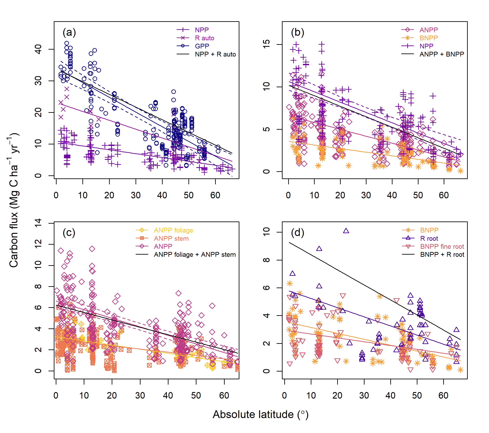

```{r, include=FALSE}
options(tinytex.verbose = TRUE)
options(knitr.table.format = "latex")
```


```{r include=FALSE}
knitr::write_bib(c(
  .packages(), 'knitr', 'rmarkdown', 'lme4', 'MuMIn', 'plyr', 'raster', 'ncdf4', 'Hmisc', 'plyr', 'merTools', 'visreg', 'r2glmm', 'nlme', 'viridis', 'ggplot2', 'ggpubr', 'gridExtra', 'AICcmodavg'
), 'packages.bib')
```

```{r setup, include = FALSE}
# knitr::opts_knit$set(root.dir = 'C:/Users/gyrcbm/Dropbox/Global_Productivity/manuscript/')
knitr::opts_knit$set(root.dir = '/Users/kteixeira/Dropbox (Smithsonian)/GitHub/ForC-db/Global_Productivity/manuscript/')
```

```{r results="asis", include=FALSE}
cat("
<style>
caption {
      font-size: 0.75em;
    }
</style>
")
```


###Abstract
[**very rough start:**]
..... Here, we drew upon # records from the Global Forest Carbon Database (ForC), representing all major forest types and the nine most significant forest autotrophic carbon flux (FACF) variables, to comprehensively explore how C cycling in mature, undisturbed forests varies with latitude and climate on a global scale. We show that, across all FACF variables analyzed, C cycling decreases linearly with latitude --a finding that confirms multiple previous studies and contradicts the idea that productivity of temperate forests rivals that of tropical forests. The FACF variables increase in proportion to one another, with no differences in allocation detectable at this global scale, but differed in that latitude explained a lower proportion of variation among subsidiary fluxes (in particular, woody aboveground productivity and belowground net primary productivity, $BNPP$). Climate explained a significant proportion (#-#%) of variation in all C fluxes analyzed (less for subsidiary fluxes), with temperature variables in general and mean annual temperature ($MAT$) in particular being the best predictors of FACF on this global scale. While other climate variables (*e.g.*, **XX**) displayed significant correlation with FACF, none of them had significantly better explanatory power than $MAT$. The effects of temperature were modified by moisture availability, with reduced FACF under hot and dry conditions and sometimes under very high precipitaiton (especially for $BNPP$). FACF declined with temperature seasonality, but growing season length doesn't improve upon MAT as a predictor. Within the growing season, the influence of climate on C cycling is smaller but still significant for a number of carbon fluxes. These findings clarify the big picture of how FACF varies with latitude and climate on a global scale. As we enter a period of accelerating climatic change, understanding of the fundamental climatic controls on FACF sets a foundation for understanding patterns of change. 


### Introduction

(**revisit these first two paragraphs.**)

**Forests play a critical role in regulating atmospheric CO~2~ and climate** (**Bonan**). Approximately **##** Gt of CO~2~ cycle through Earth's forests each year **REF-KAT**), and their net C sequestration (~2.4 GtCyr^-1^) offsets roughly 30% of anthropogenic fossil fuel emissions [@pan_large_2011]. As atmospheric carbon dioxide levels continue to rise, driving climate change, there is increasing recognition that  protection and management of forest resources will play an important role in mitigating climate change (** REFS- e.g., IPCC 1.5C and land reports**). Carbon fixation, allocation, and metabolism by trees set the basis for energy and material flows in forest ecosystems and define their interactions with Earth's changing climate. 

**Forests' autotrophic carbon flux (FACF, bbl:define) influences all organic matter stocks in ecosystems and is linked to cycling of energy, water, and nutrients** (**REFS; *Piao et al. 2010. Forest annual carbon cost: a global‐scale analysis of autotrophic respiration. Ecology 91(3), 652-661* **). Forest productivity sets the energy ultimately available to heterotrophic organisms (including microbes), in turn influencing their abundance (**REFS**) and possibly diversity ([Waide et al. 2009](https://www.annualreviews.org/doi/abs/10.1146/annurev.ecolsys.30.1.257)**REFS**). However, our ability to draw general macroscopic conclusions regarding global variation in multiple FACF variables with respect to climate has been limited in that these analyses often mix forests that vary in stand age, disturbance history, and/or management status; do not always sufficiently parse related variables (*e.g.*, combining net primary productivity records with and without belowground components); and typically consider only one or a few variables at a time. 

**FACF varies with latitude**, showing a general trend of decreasing FACF with latitude [@beer_terrestrial_2010; @jung_global_2011]. Studies agree that FACF is lowest in the boreal regions, and increases into the temperate regions [@luyssaert_co_2007; @huston_global_2009; @beer_terrestrial_2010; @jung_global_2011]. However, evidence is inconclusive on whether primary productivity continues to increase into the tropics, or whether it plateaus in temperate regions. Evidence for this is further complicated by the fact that different studies use different measures of productivity to explore these relationships. For example, modelling of global terrestrial ecosystem gross primary productivity (GPP) through upscaling and calibration of eddy flux measurements indicates that GPP peaks in tropical forests [@beer_terrestrial_2010; @jung_global_2011];[Bagdley et al. 2019](https://onlinelibrary.wiley.com/doi/epdf/10.1111/gcb.14729)). This is corroborated by analysis of site-level GPP measurements, which appear to reach their highest levels in tropical forests [@luyssaert_co_2007]. {**condense the previous two sentences into one-- both primarily eddy flux**} In contrast, some studies suggest that the highest values of net primary productivity (NPP) may be found in temperate forests [@luyssaert_co_2007; @huston_global_2009], while others find NPP highest in the tropics and decreasing with latitude [@simova_enigma_2017]. Other studies have chosen to focus exclusively on above-ground net primary productivity (ANPP), finding evidence of a weak negative relationship between ANPP and latitude [@huston_global_2009; @gillman_latitude_2015].

**Climate is a significant driver of FACF across broad spatial scales** [@cleveland_relationships_2011]. The majority of studies have focused on exploring the relationships of FACF to mean annual temperature (MAT) and mean annual precipitation (MAP), as the most commonly reported site-level climate variables. These variables have the advantage that they describe broad trends in temperature and water availability, and therefore capture a lot of global-scale variation in climate. There is strong evidence that both MAT and MAP show significant positive relationships with FACF [@chu_does_2016]. However, as with latitude, the shape of those relationships is not always clear, and, again, is complicated by the use of different measures of FACF across studies. Various measures of primary productivity {**FACF?**} saturate at high levels of MAP, though the saturation points identified vary from 1500mm [@luyssaert_co_2007] up to 2445mm MAP [@schuur_productivity_2003]. Studies of the influence of MAT on productivity {**FACF?**} are less conclusive. Luyssaert et al. [-@luyssaert_co_2007] examined GPP and NPP and found that, while GPP increases linearly with MAT, NPP saturates at around 10$^\circ$C MAT. In contrast, Larjavaara and Muller-Landau [-@larjavaara_temperature_2012], find that increases in GPP saturate at approximately 25$^\circ$C MAT, while Schuur [-@schuur_productivity_2003] shows that NPP increases linearly with temperature. bbl:maybe remove following sentences The influence of these climate variables on productivity is further complicated by the possibility of interactive effects occurring between them. Taylor et al. [-@taylor_temperature_2017] showed that high rainfall had a negative effect on productivity where MAT was low, but a positive effect at sites with high MAT. Similarly, at sites with high MAT, increases in rainfall were found to enhance productivity, in contrast to cooler sites, where high levels of rainfall inhibit productivity.  {**It would be good to add some more citations on soil respiraiton. I'm sure BBL can help.**}

**FACF can be influenced by many other factors as well**, which often act across a range of scales, and may show interactive effects with each other [@cleveland_relationships_2011]. On a local scale, stand age [@litton_carbon_2007; @gillman_latitude_2015], biodiversity (Liang et al. 2019. Positive biodiversity-productivity relationship predominant in global forests. Science 354, Issue 6309, aaf8957), management [@simova_enigma_2017]; nutrient availability [@aragao_above-_2009]; and altitude [@girardin_net_2010; @malhi_variation_2017] all impact FACF. On a global scale, we expect that FACF is most strongly influenced by broad climatic gradients. There is evidence that FACF also responds to variables such as cloud cover [@taylor_temperature_2017], solar radiation [@fyllas_solar_2017], and potential evapotranspiration [@kerkhoff_plant_2005] in potentially significant ways. Furthermore, MAT and MAP are very coarse measures of climate, and so fail to capture much variation in climate on an intra-annual scale, including the effects of factors such as growing season length, number of frost-free days, temperature seasonality, and dry season length. Some studies have suggested that the apparently strong relationship between MAT and FACF is actually a consequence of the correlation between MAT and growing season length [@kerkhoff_plant_2005; @malhi_productivity_2012; @michaletz_convergence_2014; @michaletz_drivers_2018]. Kerkhoff et al. [-@kerkhoff_plant_2005] and Michaletz et al. [-@michaletz_convergence_2014] find that, within the growing season, there is no significant relationship between primary productivity and MAT, suggesting that the effect of temperature is due to increased length of growing season, rather than an inherent influence of temperature on FACF.  
  
**The recent development of a global forest carbon database synthesizing multiple variables and including records of stand history (ForC; [@anderson-teixeira_carbon_2016; @anderson-teixeira_forc:_2018]) opens up the possibility for a standardized analysis of global scale variation** in multiple components of FACF and the principle climatic drivers of these patterns.  In order to approach these broad and complex issues, we simplify the major gaps in our knowledge to five broad hypotheses and corresponding specific predictions (Table 1). ** see [issue #48 ](https://github.com/forc-db/Global_Productivity/issues/48)** First, we ask how forest autotrophic carbon fluxes (FACF) vary with latitude. We then test how these fluxes relate to MAT and MAP, and additionally how they respond to other, less well studied, climate variables. Finally, we consider the relationship between FACF and seasonality, considering the role of seasonality in explaining variation in carbon fluxes, and the influence of climate on FACF standardized by growing season length. We use a comprehensive global database of forest carbon fluxes to address the above questions for nine carbon fluxes, allowing for an in-depth exploration of the effect of climate on FACF globally.  

\renewcommand{\arraystretch}{2}
```{r eval = TRUE, echo=FALSE, warning=FALSE}
library(knitr)
library(kableExtra)
hypothesis_table <- read.csv("hypothesis_table.csv", stringsAsFactors = FALSE, check.names = FALSE)
kable(hypothesis_table, booktabs = TRUE, caption = "Summary of hypotheses, corresponding specific predictions, and results. Direction of significant relationships is indicated by '+' and '-', and  shape is summarized as linear (L), concave up (CU), and concave down (CD). 'n.s.' indicates that the relationship is not signficant.") %>%
  kable_styling(latex_options = c("scale_down", "hold_position"), font_size = 12) %>%
  pack_rows("Q1. How do FACFs vary with latitude?", 1, 1, latex_gap_space = "1em", colnum = 1, hline_before = FALSE) %>%
  pack_rows("Q2. How do FACFs vary with MAT and MAP?", 2, 4, latex_gap_space = "1em", colnum = 1, hline_before = TRUE) %>%
  pack_rows("Q3. How are FACFs related to climate variables, other than MAT and MAP?", 5, 7, latex_gap_space = "1em", colnum = 1, hline_before = TRUE) %>%
  pack_rows("Q4. How does seasonality influence FACFs?", 8, 11, latex_gap_space = "1em", colnum = 1, hline_before = TRUE) %>%
  pack_rows("Q5. When standardised by growing season length, how do FACFs vary with climate?", 12, 15, latex_gap_space = "1em", colnum = 1, hline_before = TRUE) %>%
  add_header_above(c(" ", " ", " ", "Forest autotrophic carbon fluxes (FACF)" = 9, " ")) %>%
  #column_spec(1, width = "15cm") %>%
  column_spec(2, width = "5cm") %>%
  column_spec(3:13, width = "1.8cm") %>%
  kableExtra::landscape()
```


### Materials and Methods  
  
Analyses were conducted on data contained in the open-access ForC database [@anderson-teixeira_carbon_2016; @anderson-teixeira_forc:_2018]. This database contains records of field-based measurements of forest carbon stocks and annual fluxes, compiled from original publications and existing data compilations and databases. Associated data, such as stand age, measurement methodologies, and disturbance history, are also included. The database was significantly expanded since the publication of [@anderson-teixeira_forc:_2018] through integration with the Global Soil Respiration Database [@bond-lamberty_global_2010]. Additional targeted literature searches were conducted to identify any further available data on FACF, with particular focus on mature forests in temperate and boreal regions. ForC currently contains 29730 records from 4979 plots, representing 20 distinct ecozones across all forested biogeographic and climate zones. We used ForC v3.0, archived on Zenodo with DOI 10.5281/zenodo.3403855.

```{r echo=FALSE, out.width='100%', fig.cap = "Map showing all data used in the analysis, coded by variable. Variables are plotted individually in Fig. S1. ", fig.pos='H'}
  knitr::include_graphics("distribution_all_variables_cropped.png")
```
*Data selection.* This analysis focused on nine autotrophic carbon fluxes included in the ForC database (Table 2). These were selected based on *...*. The ForC database contains annual flux estimates, associated to plots, each with associated data on stand age and known history of disturbance and management, and, more broadly, sites (**Define**). Geographically proximate sites are clustered into geographic areas, with proximity defined using a hierarchical cluster analysis on the distance matrix of the sites and a cutoff of 25km [@anderson-teixeira_forc_2018].

A subset of the ForC database was generated for the purposes of this analysis, in order to control for data quality and remove biasing factors. Since management can alter observed patterns of FACF [@simova_enigma_2017], sites were excluded from analysis if they were managed, defined as plots that were planted, managed as plantations, irrigated, fertilised or including the term "managed" in their site description. Sites that had experienced significant disturbance were also excluded. Disturbances that justified site exclusion were major cutting or harvesting, and/or burning, flooding, drought and storm events with site mortality >10% of trees. Grazed sites were retained.  
There is evidence that stand age influences patterns of FACF and carbon allocation in forest ecosystems, and can confound relationships between latitude and primary productivity [@de_lucia_forest_2007; @gillman_latitude_2015]. To reduce any biasing effects of stand age, we included only stands of known age $\ge$ 100 years and those described by terms such as "mature", "intact", or "old-growth". 

\newpage  
| Variable | Definition | Components included | Methodologies used | Number of records | Number of geographic areas |
|--------------|-------------------|-------------|------------------------|-------|-------|
| $GPP$ | Gross Primary Production | NA | flux partitioning of eddy-covariance; $NPP$+$R_{auto}$ | 243 | 49 |
| $NPP$ | Net Primary Production | stem, foliage, coarse root, fine root, optionally others (e.g., branch, reproductive, understory) | $ANPP$ + $BNPP$ (majority); $GPP$-$R_{auto}$ | 161 | 56 |
| $ANPP$ | Aboveground Net Primary Production | stem, foliage, optionally others (e.g., branch, reproductive, understory) |$ANPP_{woody-stem}$ + $ANPP_{foliage}$ (+ others) | 278 | 86 |
| $ANPP_{woody-stem}$ | Woody stem growth component of $ANPP$ | woody stems down to DBH $\le$ 10cm (no branch turnover) | stem growth measurements scaled to biomass using allometries | 264 | 96 |
| $ANPP_{foliage}$ | Foliage component of $ANPP$ | foliage | litterfall collection (separated into components) | 98 | 49 |
| $BNPP$  | Belowground Net Primary Production | coarse and fine roots |  coarse roots estimated indirectly using allometries based on aboveground stem increment measures ; fine roots as below | 101 | 48 |
| $BNPP_{fine.root}$ | Fine root component of $BNPP$ | fine roots | measurements combined one or more of the following: soil cores, minirhizotrons, turnover estimates,  root ingrowth cores | 88 | 41 |
| $R_{root}$ | Root Respiration | coarse and fine roots | partitioning of total soil respiration (e.g., through root exclusion), scaling of root gas exchange | 64 | 26 |
| $R_{auto}$ | Autotrophic Respiration | foliage, stem, and root | chamber measurements of component gas exchange | 22 | 13 |
  
Table: Definitions and sample sizes of variables (all annual) used in analysis. Geographic areas group geographically proximate sites, defined using a hierarchical cluster analysis on the distance matrix of the sites, and a cutoff of 25km.


  
*Methodological consistency.* 
{**This whole section needs to be re-written.**} 
The data in ForC is derived from a range of studies, often employing different methods. For this reason, criteria were introduced to standardise for differences in methodology. Where data was based on forest plot census measurements, studies which used a minimum diameter at breast height (DBH) measure of >10cm were excluded from analysis.  It would be preferable to standardise by minimum area sampled; however x% of plots in the database are 1 ha or under in size; excluding these plots would place significant constraints on sample size. (**really, we didn't exclude any studies based on methodology (except soil respiration. all studies measured min DBH 10 or less... ), so this paragraph needs revision. Also, address whether we standardize for inclusion/ exclusion of recruitment.**)
- recruitment preferred when an option, did not review whether all included recruitment
- excluded alkali absoption and soda lime methods for estimating soil / root respiration
  
*Climate datasets.* Where site-level data on mean annual temperature, mean annual precipitation, and latitude were available in the primary literature, this data was compiled and entered directly into the ForC database. Based on the geographic co-ordinates for each site, data on a further 11 climate variables was extracted from five open-access climate datasets: WorldClim [@hijmans_very_2005], WorldClim2 [@fick_worldclim_2017], the Climate Research Unit (CRU) time-series dataset v. 4.03 [@harris_updated_2014], the Global Aridity Index and Potential Evapotranspiration Climate Database [@trabucco_global_2018], and TerraClimate [@abatzoglou_terraclimate_2018] (see Supplementary Information S1 for details of climate variables). Where site-level data was missing for mean annual temperature and/or mean annual precipitation, data was extracted from the WorldClim dataset.
  
Additionally, two climate variables were derived from the above datasets: maximum vapour pressure deficit, defined as the vapour pressure deficit of the month with the largest deficit; and water stress months, defined as the number of months annually where precipitation was lower than potential evapotranspiration (PET; **HML:defined how?**).

*Length of growing season.* Growing season months were defined as months with mean minimum temperature > 0.5$^\circ$C. Growing season months were initially calculated following methods used by Kerkhoff et al. (2005), which additionally required that growing season months had a moisture index, defined as (MAT - PET)/PET, > -0.95. Michaletz et al. (2014) included an equivalent requirement in their calculation of growing season length. However, we found that including this requirement had no effect on the estimates of growing season length, and so chose to exclude it.

Monthly data for PET, precipitation, and temperature was downloaded from the Climate Research Unit (CRU) time-series dataset v 4.03 [@harris_updated_2014], and for solar radiation from WorldClim2 [@fick_worldclim_2017], and used to calculate mean monthly PET, precipitation, temperature and solar radiation during the growing season. Total growing season precipitation and solar radiation were also calculated. 
  
*Model specification.* 

{**from Helene: It was frequently unclear to me whether the influences of other climate variables were being considered in multivariate or univariate analyses.  This needs to be clear.  I can see reasons to do it either way, but they need to be differently motivated and clearly presented.**}

The effects of climate and latitude on FACF were analysed using mixed effects models using the package 'lme4' [@bates_fitting_2015] in R v.3.5.1 [@r_core_team_r:_2018]. First, the individual effect of each climate variable on each FACF variable was modelled by specifying the climate variable as a fixed effect in a univariate model. For each climate variable, three models were specified: a null model; a model with the climate variable as a linear term; and a model with the climate variable as a second-order polynomial term. AIC values were calculated for the models and used to select the best model. If the best model included a polynomial term, the shape of the polynomial relationship was considered. If the shape of the relationship *made biological sense*, and was a significant improvement on the linear relationship (deltaAIC >2), we accepted the polynomial as the best model. If not, we ran the linear model as the final model. $R^2$ values were calculated for the best model. All $R^2$ values presented here are marginal $R^2$ values, and refer to the proportion of variation explained by only the fixed effects, unless otherwise specified. In addition, slope coefficients were calculated for the linear models.  
  
To test for a potential influence of altitude, models were also run with site altitude included as a second fixed effect. These multivariate models were compared against univariate models with no altitude term, and AIC values calculated to identify whether inclusion of altitude as a term improved the models. Including altitude had a very small effect on most models, with the difference in AIC values between models including and excluding altitude often being <2, suggesting the models are very similar in their explanatory power. As a result, it was decided not to include altitude as a fixed term in the final models.
  
To account for correlations in measurements between tightly clustered sites, a random effect was specified as plot nested within geographic area. 
  
Models were run for total annual FACF against annual climate variables, and for fluxes standardized by growing season length, defined as annual FACF/length of growing season, against growing season climate variables. For analyses on data within the growing season, only linear models were specified.  

{**Note from Helene on the following paragraph: this makes it sound like analyses from H3 were about variation remaining after accounting for temperature, but analyses below don't seem to do that.**}   
To investigate the potential interactive effects of climate variables on carbon fluxes, multivariate models were also specified. To ensure that models were biologically meaningful, the terms included in the models tested built on results from the univariate models. Modelling of individual climate variables identified that the best predictors of carbon fluxes were variables related to temperature. We therefore decided to include mean annual temperature as a term in all multivariate models. We first modelled the interaction effect between mean annual temperature and mean annual precipitation, in order to capture climate variation along the axes of temperature and water availability. Models were tested for a significant interactive effect and a significant additive effect. We then explored whether any other climate variable, in combination with mean annual temperature, could significantly improve on the combination of mean annual temperature and mean annual precipitation. In specifying the range of models to test, climate variables which were strongly correlated with temperature were dropped, in order to capture the greatest range of variation in climate. For each possible pairing of climate variables, two models were specified: a model with the two climate variables showing an additive effect; and a model with the two climate variables showing an interactive effect. As before, plot nested within geographic area was included as a random effect. Altitude was not considered. AIC values were calculated for the models, and used to compare models. Models were considered to be significantly better than the baseline MAT*MAP model if:  
  i) the AIC value of the model was smaller than the AIC value of the baseline model by >2  
  ii) the r-squared value of the model was larger than the r-squared value of the baseline model by >0.05 
  
*Validating models of component fluxes.* Comparison of component fluxes is based on the assumption that components sum accurately to estimates of larger fluxes. To test this, components of larger fluxes were regressed against latitude, and the models used to generate a series of point estimates along lines of best fit for each component. The point estimates for smaller component fluxes were summed to generate new "stacked" estimates of larger fluxes, which were then compared against actual measurements of the larger flux. Confidence intervals for the larger flux were calculated using the 'bootMer' function from the lme4 package [@bates_fitting_2015]. Stacked plots were generated for:  
1. GPP = NPP + R~auto~  
2. NPP = ANPP + BNPP  
3. ANPP = ANPP~foliage~ + ANPP~woody~ ~stem~  
4. Total belowground carbon flux = BNPP + R~root~  
  
*Allocation to carbon fluxes along latitudinal gradients.* Variation in allocation to component carbon fluxes along latitudinal gradients was explored for a range of pairings: firstly, GPP:NPP, ANPP:BNPP, and ANPP~foliage~:ANPP~woody~ ~stem~; and secondly, the ratio of NPP to each of ANPP, BNPP, ANPP~foliage~, and ANPP~woody~ ~stem~. For each set of paired fluxes, measurements taken at the same site and plot, and in the same year, were paired together, and the ratio of each pair of measurements calculated. The ratios were regressed against latitude and climate variables, using the linear model specified above. Cook's distance analyses were carried out for each of the models, and indicated that data from a few high-elevation sites were having a disproportionate influence on the regressions. To account for this, models were re-run using only data from sites $\le$ 1000m.
     
###Results

In total, we analyzed 1228 records from 9 C flux variables taken from forests that had experienced no major anthropogenic disturbances within the past 100 years. These records represented a total of 154 distinct geographic areas (Fig. 1, Table 2), across all forested biogeographic and climate zones. 
  
*How does FACF vary with latitude?* 

All major carbon fluxes decreased linearly with latitude (Fig. 2).   
  
Latitude was a strong predictor for many of the carbon fluxes, explaining 64% of variation in GPP (n = 254, p<0.0001), 50% in NPP (n = 114, p<0.0001) and 45% in ANPP (n = 259, p<0.0001). For all fluxes, their relationship with latitude was best predicted by the linear model. 

*Relationships and differences among fluxes.* In general, smaller component fluxes summed approximately to larger fluxes across the latitudinal gradient (fig. 2). That is, modelled estimates of GPP, generated from the sum of NPP and R auto; NPP, generated from the sum of ANPP and BNPP~root~; and ANPP, generated from the sum of ANPP~foliage~ and ANPP~woody~ ~stem~, fell completely within the confidence intervals of the regressions of field estimates of GPP, NPP and ANPP respectively.

bbl: here or in the discussion, note that this is a fairly stringent test: it's easy for sub-fluxes not to sum up! (Extensive citations from EC literature for example.). HML: yes and no. confidence intervals are pretty large. 
  
```{r echo=FALSE, out.width='100%', fig.cap = "Latitudinal trends in forest autotropic carbon flux. Lines of best fit are plotted according to the best model selected during analysis. All regressions are significant $(p<0.05)$. Each panel shows major C fluxes together with component fluxes. Also plotted are predicted trends in the major C fluxes based on the sum of component fluxes. 95\\% confidence intervals are plotted for the major flux for comparison with predicted trends. In (d),  which shows three belowground fluxes, the major flux, total belowground carbon flux, is one for which we have no data", fig.pos='H'}

  
```

*We found no evidence that allocation between fluxes varied substantially with latitude or climate. There were no significant results from regressing ratios of carbon fluxes against latitude, or against any of the climate variables.* **THIS HAS CHANGED: [issue #51](https://github.com/forc-db/Global_Productivity/issues/51#issuecomment-581892186)
  
$R^2$ values were generally highest in the major fluxes, and decreased in subsidiary fluxes (Supporting Information S2). Of the major fluxes, R~auto~ and GPP were the most strongly explained by latitude and climate, with climate explaining at most 71% of variation in GPP, and 65% in R~auto~. The proportion of variation explained by climate and latitude decreased in NPP and ANPP, with climate explaining at most 51% of variation in NPP and 44% in ANPP. Of the major fluxes, BNPP~root~ was the least well explained by climate and latitude, with climate explaining at most 36% of variation.  
  
With the exception of ANPP~foliage~, the proportion of variation explained by climate and latitude in subsidiary fluxes was much lower. Climate explained at most 24% of the variation in ANPP~woody~ ~stem~, 19% in BNPP~fine~ ~root~, and 27% in R~root~. In contrast, climate strongly explained variation in ANPP~foliage~, with mean annual temperature explaining 58% of variation. This pattern was also seen in the $R^2$ values for multivariate models. 
   
*How does FACF relate to MAT and MAP?* MAT and MAP are the most commonly reported site-level climate variables, and much previous research into the effect of climate on FACF has focused on these as key climate variables. MAT was a significant (p<0.05) and strong predictor of FACF for all fluxes tested. All FACF increased linearly with temperature (Fig. 4), and we found no support for a saturation point of FACF with temperature.  
  
MAP was found to be a significant (p<0.05) but poor predictor of FACF, explaining, with the exception of R~auto~, at most 37% of variation in carbon flux. For the majority FACF, a polynomial model was the best fit. FACF increased with precipitation, up until a saturation point at between 3000 and 4000mm annual precipitation, above which FACF started to decrease (Fig. 4). The notable exception to this was GPP: the model indicated that GPP continued to increase with precipitation up to measures of at least 5000mm annually (p<0.0001, $R^2$ = 0.33. Data above this point was not available, but the model trend indicated that the saturation point for this model would be around 5000mm MAP. 

There was a significant interactive effect between MAT and MAP for GPP, BNPP~root~, BNPP~fine~ ~root~, ANPP, ANPP~woody~ ~stem~, and R~root~ (fig.3). There was a significant additive effect for R~auto~. NPP and ANPP~foliage~ showed no significant interactive or additive effect.  {**NEED SI TABLE GIVING FITTED COEFFICIENTS & STATS**}
  
For the variables which showed a significant interactive or additive effect between MAT and MAP, no other climate variable, in combination with MAT, significantly improved on that model. For NPP, there was a significant interactive effect between MAT and water stress months, with this model explaining nearly 5% more variation in NPP than MAT alone {**Helene: but less than MATxMAP? if so, why bother mentioning?**}. However, for ANPP~foliage~, no multivariate model improved on the univariate model including only MAT.  

```{r echo=FALSE, out.width='100%', fig.cap = "Interactive effects of mean annual temperature and mean annual precipitation on FACF. For visualization purposes, data points are grouped into bins of 0 - 1000, 1001 - 2000, 2001 - 3000, and >3000mm mean annual precipitation, and lines of best fit models are plotted for mean annual precipitation values of 500, 1500, 2500, and 3500mm. All regressions are significant $(p<0.05)$.", fig.pos='H'}
  knitr::include_graphics("mat_map_interaction.png")
```

*How does FACF relate to other climate variables?* {**Here, maybe add some statement about covariation among climate variables, site SI figure**} Our results indicated that FACF was most strongly explained by temperature at the global scale, with temperature-related climate variables coming out as strong predictors of FACF. In addition to MAT, temperature seasonality, annual temperature range, and annual frost days were consistently identified as strong univariate predictors of FACF.  {**cite some table/ SI?**}
  
We found a significant relationship between FACF and potential evapotranspiration for all fluxes. ANPP~foliage~, BNPP~fine~ ~root~ and R~root~ increased linearly with PET; however, all other fluxes showed a polynomial relationship with PET (fig. 4). We found strong evidence for a saturation point or peak with PET: FACF tended to increase at values below 1000mm, before saturating between 1200 and 1700mm. There was also evidence that FACF begins to decrease at values above 1800mm PET.

Vapour pressure deficit was a significant predictor of FACF for all fluxes. BNPP~fine~ ~root~ showed a linear relationship with vapour pressure deficit ($R^2$ = 0.07, p<0.05), but all other fluxes showed a polynomial relationship (fig. 4). FACF initially increased with vapour pressure deficit, before saturating at around 0.8 kPa. At values above 0.8 kPa, FACF began to decrease.

All fluxes, with the exception of R~root~, showed a positive linear relationship with solar radiation. Solar radiation explained a low proportion of variability in FACF for all variables, explaining less than 20% of the variation in each flux, with the exception of R~auto~ ($R^2$ = 0.26, p<0.05).
  
Of the climate variables tested, annual wet days, aridity, cloud cover, mean diurnal temperature range, precipitation seasonality, maximum vapour pressure deficit and water stress months were poor or non-significant explainers of variation in FACF, explaining less than 20% of the variation in each of the carbon fluxes.

```{r echo=FALSE, out.width='100%', fig.cap = "Plots of carbon fluxes against (a) mean annual temperature; (b) mean annual precipitation; (c) potential evapotranspiration, (d) vapour pressure deficit; (e) temperature seasonality; (f) length of growing season. For visualization purposes, data for each flux was rescaled with a mean of 0 and standard deviation of 1. Lines of best fit are plotted according to the best model selected during analysis (**see issue 47**). All regressions are significant $(p<0.05)$.", fig.pos='H'}
  knitr::include_graphics("combined_plots.png")
```

*What is the role of seasonality in explaining FACF?* Temperature seasonality was a significant predictor of FACF. GPP, NPP, ANPP, and R~root~ exhibited a polynomial relationship with seasonality (Fig. 4) {**give statistic on signficiance**}. ANPP~foliage~, ANPP~woody~ ~stem~ and R~auto~ decreased linearly with temperature seasonality. Temperature seasonality was strongly correlated with annual temperature range, and, as expected, all fluxes showed almost identical responses to it {**meaning unclear**}. FACF was highest where temperature seasonality = 0, and at an annual temperature range of 15$^\circ$C or lower. In contrast, there was no significant effect of precipitation seasonality on FACF.

We found a significant relationship between length of growing season and FACF, with all fluxes showing a linear increase with length of growing season (Fig. 4). Length of growing season was a strong predictor of FACF, explaining 51% of variation in GPP, 39% of variation in NPP, and 34% of variation in ANPP, but it was a weaker predictor than MAT for all fluxes analysed.

*Within the growing season, how does FACF vary with climate?* When FACF was standardized by growing season length, correlations with climate variables were much weaker. Growing season temperature, precipitation, solar radiation, and PET each had a small effect on one or more of the nine FACF analyzed (Table 2; Fig. **S#**). Speficifally, $ANPP$ increased with growing season temperature ($R^2$ = 0.10, p<0.001) and precipitation ($R^2$ = 0.04, p<0.05). Similaryly, $ANPP_{foliage}$ increased slightly with growing season temperature ($R^2$ = 0.16, p<0.01) and precipitation ($R^2$ = 0.09, p<0.05). Growing season solar radiation had a positive influence on $GPP$ ($R^2$ = 0.21, p<0.001), $NPP$ ($R^2$ = 0.21, p<0.001), $BNPP$ ($R^2$ = 0.16, p<0.001) and $BNPP_{fine.root}$ ($R^2$ = 0.12, p<0.01). Growing season PET had a positive influence on $GPP$ ($R^2$ = 0.15, p<0.01), $NPP$ ($R^2$ = 0.18, p<0.01), $BNPP$ ($R^2$ = 0.23, p<0.0001), $BNPP_{fine.root}$ ($R^2$ = 0.11, p<0.05), and $ANPP_{woody-stem}$ ($R^2$ = 0.06, p<0.05). {**Becky, please verify/ edit the following:** There were no other signifcant correlations between growing season length-standardized FACF (9 variables in Table 2) and growing season climate (**which variables?**)}. 
  
###Discussion  

We used a large global database (ForC), containing an unprecedented amount of data representing all major forest types (Fig. 1) and the nine most significant forest autotrophic carbon flux (FACF) variables (Table 2), to comprehensively explore how C cycling in mature, undisturbed forests varies with latitude and climate on a global scale. We test a suite of hypotheses, including many previously posed (Table 1), standardising for factors that have not always been controlled for (*e.g.*, stand age, flux components measured) to gain a stronger understanding of climatic effects on FACF. 

bbl: Most of these two paragraphs (following) just restate the results. Honestly I would remove them enitrely, but at the very least, condense into a single paragraph.

We show that, across all nine FACF variables analyzed, C cycling decreases linearly with latitude (*H1.1*; Fig. 2)--a finding that confirms multiple previous studies (**REFS**) but contradicts the idea that productivity of temperate forests rivals that of tropical forests (*H1.1.alt*; **REFS**). The FACF variables increase in proportion to one another (*H1.2*), with no differences in allocation detectable at this global scale and with component fluxes summing appropriately to larger fluxes (Fig. 2), indicating no major, systematic omissions or overestimations of flux components. However, we did detect a tendency for greater variability among subsidiary C fluxes (e.g., *$ANPP_{woody}$*, *$BNPP_{fine.root}$*; Fig. 2; **some SI table?**). 

**Climate explains a significant proportion of variation in all C fluxes analyzed** (albiet less for subsidiary fluxes), with temperature variables the best predictors of FACF at this global scale (Figs. 3-4). While other climate variables are significant predictors of FACF (*H3*), none of them in isolation improve on the explanatory power of temperature-related variables in general or MAT specifically (Fig. 4). Water availability is an important factor in explaining FACF on a global scale: we find a positive influence of precipitation at low MAP, with saturation at higher levels of MAP (Fig. 4b) and a significant interaction between MAT and MAP for seven of the nine variables analyzed (Fig. 3). Temperature seasonality and growing season length are closely correlated with MAT and are strong predictors of FACF (*H4*; Fig. 4e-f), though growing season length doesn't improve upon MAT as a predictor. Within the growing season, the influence of climate on C cycling is smaller but still significant for a number of carbon fluxes (*H5*; **some SI table?**). These findings clarify the big picture of how FACF varies with latitude and climate on a global scale.

Past studies have differed in their conclusions regarding the relationship between FACF and latitude or its correlates (Table 1, *H1*; **REFS**)--quite possibly because of lack of standardization with respect to stand age and disturbance history. Our findings indicate that, among mature, undisturbed stands, FACF is unambiguously highest in the tropical regions, and the relationship is approximately linear (Fig. 2). This contrasts with suggestions that productivity of temperate forests is similar to that of tropical forests (**REFS**). Temperate forests tend to be younger than tropical forests (**REF**), so analyses comparing across latitudinal gradients without controlling for stand age risk confounding age with biome effects ([Poulter et al. 2018-DOI:10.1594/PANGAEA.889943](http://pure.iiasa.ac.at/id/eprint/15361/); Potapov et al. 2008. Mapping the World’s Intact Forest Landscapes by Remote Sensing. Ecology and Society 13 (2), 51. ). In addition, because C allocation varies with stand age [@de_lucia_forest_2007] (**See Nobby's comment in manuscript-draft_NK.pdf**), age differences may introduce systematic biases into analyses of FACF across latitude or global climatic gradients. For example, woody productivity tends to be higher in rapidly aggrading secondary stands than in old-growth forests, where proportionally more C is allocated to respiration (** Nobby AFM paper: Understanding the controls over forest carbon use efficiency on small spatial scales: Effects of forest disturbance and tree diversity**) [*purpose for respiration/ other compenents (**See Nobby's comment in manuscript-draft_NK.pdf**)]. 

We show that FACF are broadly consistent in their responses to climate drivers on the global scale (with the exception of some differences in MAT-MAP interactions; Fig. 3), with no major trends in C allocation among the variable pairs tested (Table 1, *H1*; Fig. 2; **Some SI table**). Although variation in allocation has been observed along gradients of elevation [@moser_elevation_2011] and water availability [@newman_above-_2006]--along with non-climatic axes of stand age [@litton_carbon_2007], nutrient availability [@litton_carbon_2007; @gill_belowground_2016], and forest structure [@taylor_greater_2019]--variation in relation to climate is not apparent at the global scale within ForC, which contains the bulk of relevant data. Our conclusion, then, is that hypothesized gradients in allocation along global climate gradients cannot currently be supported for mature forests, although data quantity and standardization is currently insufficent to rule out the possibility that such trends exist. 

bbl: remove this sentence? Of particular interest and significance are the relationships amongst $GPP$, net primary productivity ($NPP$ and its components, particularly $ANPP_{woody-stem}$), and respiration ($R_{auto}$ and components). There have been suggestions that tropical forests tend to have low carbon use efficiency ($CUE$= $NPP$/$GPP$=($GPP$-$R_{auto}$/$GPP$), which are based on observations of low $CUE$ in old-growth tropical forests relative to (mostly younger) extratropical forests [@de_lucia_forest_2007; [Malhi 2012](https://www.researchgate.net/publication/227837530_The_productivity_metabolism_and_carbon_cycle_of_tropical_forest_vegetation); @anderson-teixeira_carbon_2016], but our analysis suggests that these low values might more appropriately be attributed to the fact that these forests are old than to their tropical climate. Indeed, $CUE$ is known to decline with forest age ([@de_lucia_forest_2007]; [Collalti & Prentice 2019](https://academic.oup.com/treephys/article-abstract/39/8/1473/5423351?redirectedFrom=fulltext)) but appears to be roughly independent of $GPP$ [@litton_carbon_2007]. Among our sites with relevant data, there is indication that CUE or $ANPP_{woody-stem}$/$GPP$ increase with latitude (**some SI table**). Additional measurements with careful methodological standardization across a consistent set of mature forest sites will be necessary to determine whether any climate-driven gradients in allocation exist at the global scale. 

One interesting observation was that climate tends to explain more variation in the major fluxes ($GPP$, $NPP$, $R_{auto}$ - latitude $R^2\ge$ 48%) than in subsidiary fluxes (latitude $R^2$ <27% for $BNPP_{fine.root}$, $R_{auto-root}$,$ANPP_{woody-stem}$) (Fig. 2; **some SI table?**). There are two, non-exclusive, potential explanations for this. First, it may be that methodological variation is larger relative to flux magnitude for some of the subsidiary fluxes. Belowground fluxes in particular are difficult to quantify, and measurement methods for the belowground fluxes considered here may be measured through fundamentally different approaches (*e.g.*, minirhizotrons, ingrowth cores, or sequential coring for $BNPP_{root-fine}$; root exclusion, stable isotope tracking, or gas exchange of excised roots for $R_{auto-root}$), and sampling depth is variable and often insufficient to capture the full soil profile. $ANPP_{woody-stem}$, which is also poorly explained by latitude or climate, is more straightforward to measure but is subject to variability introduced by differences such as biomass allometries applied and minimum plant size sampled (bbl: cite e.g. Huntzinger?). However, methodological variation and uncertainty affect all of fluxes considered here--not necessarily any less than the aforementioned, and some of the larger fluxes that vary more strongly with respect to climate ($ANPP$, $NPP$) are estimated by summing uncertain component fluxes. Second, differences among variables in the proportion of variation explained by climate may be attributable to more dicrect climatic control over $GPP$ than subsidiary fluxes. That is, subsidiary fluxes may be shaped by climate both indirectly through its influence on $GPP$ and respiration and directly through any climatic influence on C allocation, as well as many other local- and regional-scale factors (**REFS**).

The latitudinal gradient in FACF (Fig. 2) is driven primarily by temperature-related climate variables, and secondarily by moisture availability (Table 1, *H2-H3*; Figs. 3-4). Because many climate variables co-vary across the latitudinal gradient, because climatic drivers affect forest carbon flux on much shorter time scales than can be captured by annual climate summary variables, and because both climatic conditions and C flux vary intra- and inter-annually around the long-term means, it is not appropriate to attempt to identify any one mean annual climate variable as a mechanistic driver of FACF. However, it remains informative to consider these relationships. We find that temperature-related climate variables ($MAT$, temperature seasonality, ...**LIST**) explain the highest proportion of variability in FACF, and among these, $MAT$ is generally the best predictor--perhaps because site-specific MAT is recorded for the majority of sites in ForC, whereas other variables are extracted from global gridded data products (Table S1**?**). The effects of temperature are modified by moisture availability, with reduced FACF under hot and dry conditions (*i.e.*, high PET, high deficit; Fig. 4c-d) and sometimes under very high precipitaiton (Figs. 3, 4b). Negative effects of very high precipitation on FACF have been previously observed (**REFS**) and are attributable to nutrient and light limitations (**REFS**) Thus, although temperature and water availability jointly and interactively drive global-scale patterns of FACF. 

bbl: this seems really interesting and novel, consider expanding the following paragraph

FACF is negatively correlated with temperature seasonality (Table 1, *H4*; Fig. 4e), and is minimal during cold- or dry- dormant seasons. To account for this, a number of analyses seeking to characterize global-scale effects of climate on productivity have examined the relationship of FACF per month of the growing season with growing season climatic conditions (Table 1, *H5*; **REFS**). We found that the sort of simple metric needed to define growing season at a global scale was uncertain for temperature and problematic for moisture (**WORK ON THIS**). A temperature-defined growing season length had stong positive correlation with FACF (Fig. 4f), but explained less variation than $MAT$. Dividing FACFs by growing season length to yield FACF per growing season month removed the majority of climate-related variation, supporting the idea that the latitudinal gradient in FACF is attributable more to shorter growing seasons at high latitudes than to inherently lower rates of photosyntheiss or respiration by high-latitude forests (*[ Enquist et al. 2007 GCB- but check]*). However, there remained a number of significant correlations with growing season climatic conditions, suggesting that climatic conditions remain influential within the growing season. We conclude that while correcting for growing season length takes analyses a step closer to mechanistic linkage of instantaneous C flux rates to environmental conditions, it remains very crude relative to the the timescales on which climate affects plant metabolism and does not advance statistical predictive power. Rather, mechanistic accounting for climatic effects on global FACF patterns requires models representing physiologically meaningful timescales (*e.g.*, **refs**).

Our analysis clarifies how FACF varies (bbl: is FACF singular or plural? Be consistent) with latitude and climate on a global scale, with some important implications for how forest carbon cycling relates to climate and, by extension, how it is likely to respond to climatic warming. We find no support for non-linear trends in mature forest C cycling with respect to latitude or $MAT$, and no distinct trends in C allocation across the global scale (Fig. 2). The implication is that under warmer conditions with similar moisture availability--and within the temperature range to which forest communities are adapated and acclimatized--higher temperatures result in a generalized acceleration of FACF, with no major shifts in C allocation among subsidiary fluxes. Of course, actual climatic changes will result in very different sets of conditions than represented across geographic gradients in climate, but our analysis clarifies how carbon cycles through contemporary forest ecosystems. As we enter a period of accelerating climatic change, understanding of the fundamental climatic controls on FACF sets a foundation for understanding patterns of change. **[work on this]**


### Acknowledgements
Scholarly Studies
ForestGEO
Compilation of the ForC database was originally funded by DOE

