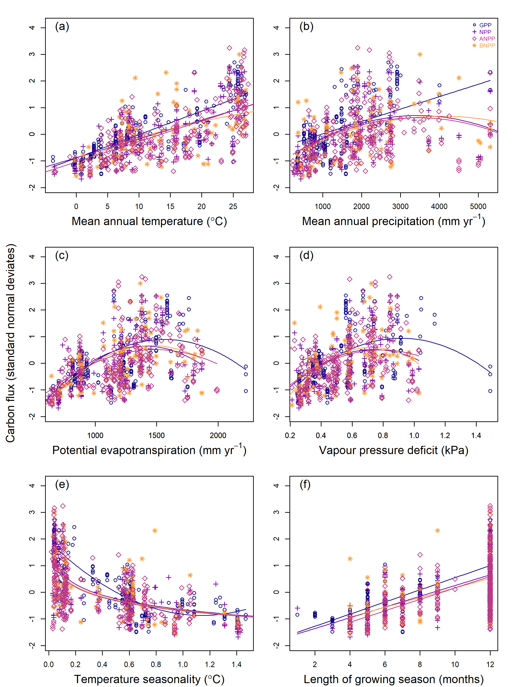

```{r, include=FALSE}
options(tinytex.verbose = TRUE)
options(knitr.table.format = "latex")
```


```{r include=FALSE}
knitr::write_bib(c(
  .packages(), 'knitr', 'rmarkdown', 'lme4', 'MuMIn', 'plyr', 'raster', 'ncdf4', 'Hmisc', 'plyr', 'merTools', 'visreg', 'r2glmm', 'nlme', 'viridis', 'ggplot2', 'ggpubr', 'gridExtra', 'AICcmodavg'
), 'packages.bib')
```

```{r setup, include = FALSE}
#knitr::opts_knit$set(root.dir = 'C:/Users/becky/Dropbox (Smithsonian)/GitHub/Global_Productivity/manuscript/')
  # knitr::opts_knit$set(root.dir = '/Users/kteixeira/Dropbox (Smithsonian)/GitHub/ForC-db/Global_Productivity/manuscript/')
```

```{r results="asis", include=FALSE}
cat("
<style>
caption {
      font-size: 0.75em;
    }
</style>
")
```
**Title:** Global patterns of forest autotrophic carbon fluxes

**Running head:** Global patterns of forest carbon fluxes


**Authors:** 

Rebecca Banbury Morgan^1,2^

Valentine Herrmann^1^

Norbert Kunert^1,3,4^

Ben Bond-Lamberty^5^

Helene C. Muller-Landau^3^ 

Kristina J. Anderson-Teixeira^1,3^*


**Institutional Affiliations:**

1. Conservation Ecology Center; Smithsonian Conservation Biology Institute; Front Royal, VA, USA

2. School of Geography, University of Leeds, Leeds, UK

3. Center for Tropical Forest Science-Forest Global Earth Observatory; Smithsonian Tropical Research Institute; Panama, Republic of Panama

4. Institute of Botany, University of Natural Resources and Applied Life Sciences, Vienna, Austria

5. Joint Global Change Research Institute, Pacific Northwest National Laboratory, College Park Maryland 20740 USA 


*Corresponding Author:

phone: 1-540-635-6546 

fax:1-540-635-6506

email: teixeirak@si.edu


\newpage
### Abstract
Carbon (C) fixation, allocation, and metabolism by trees set the basis for energy and material flows in forest ecosystems and define their interactions with Earth's changing climate. 
However, while many studies have considered variation in productivity with latitude and climate, we lack a cohesive synthesis on how forest carbon fluxes vary globally with respect to climate and one another. 
Here, we draw upon 1,319 records from the Global Forest Carbon Database (ForC), representing all major forest types and the nine most significant autotrophic carbon fluxes, to comprehensively explore how annual C cycling in mature, undisturbed forests varies with latitude and climate on a global scale. 
We show that, across all flux variables analyzed, C cycling decreases continuously with absolute latitude -- a finding that confirms multiple previous studies and contradicts the idea that net primary productivity of temperate forests rivals that of tropical forests. 
C flux variables generally displayed similar trends across latitude and multiple climate variables, with no differences in allocation detected at this global scale.
Temperature variables in general, and mean annual temperature or temperature seasonality in particular, were the single best predictors of C flux, explaining 19 - 71% of variation in the C fluxes analyzed. 
The effects of temperature were modified by moisture availability, with C flux reduced under hot and dry conditions and sometimes under very high precipitation. 
Annual C fluxes increased with growing season length and were also influenced by growing season climate. 
These findings clarify how forest C flux varies with latitude and climate on a global scale. 
In an era when forests will play a critical yet uncertain role in shaping Earth's rapidly changing climate, our synthesis provides a foundation for understanding global patterns in forest C cycling. 

**Keywords:**  carbon fluxes; carbon dioxide (CO~2~); climate; forest; global; productivity; respiration; latitude

\newpage
### Introduction

Carbon (C) cycling in Earth's forests provides the energetic basis for sustaining the majority of Earth's terrestrial biodiversity and many human populations [@millennium_ecosystem_assessment_ecosystems_2005], while strongly influencing atmospheric carbon dioxide (CO~2~) and climate [@bonan_forests_2008]. 
Forests' autotrophic carbon fluxes -- that is, carbon fixation, allocation, and metabolism by trees and other primary producers -- sets the energy ultimately available to heterotrophic organisms (including microbes), in turn influencing their abundance [@zak_plant_1994; @niedzialkowska_species_2010] and possibly diversity [@waide_relationship_1999; @chu_direct_2018]. 
They are linked to cycling of energy, water, and nutrients and, critically, influence all C stocks and define forest interactions with Earth's changing climate. 
Each year, over 69 Gt of C cycle through Earth's forests [@badgley_terrestrial_2019] -- a flux more than seven times greater than that of recent anthropogenic fossil fuel emissions [9.5 Gt C yr^-1^; @friedlingstein_global_2019]. 
As atmospheric CO~2~ continues to rise, driving climate change, forests will play a critical role in shaping the future of Earth's climate [@cavaleri_urgent_2015; @rogelj_mitigation_2018]. 
However, our understanding of global-scale variation in forest C cycling remains incomplete, in large part because it is pieced together from numerous studies, most considering only one or a few variables at a time, with various approaches for handling influential factors such as stand age, disturbance history, and management status [@litton_carbon_2007; @gillman_latitude_2015; @simova_enigma_2017].

Forest C fluxes decrease with latitude [e.g., @luyssaert_co_2007;  @gillman_latitude_2015; @li_mapping_2019]. 
However, studies have differed in their conclusions regarding the shape of this relationship -- quite possibly because of lack of standardization with respect to methodology and stand history. 
Productivity may vary with stand age, disturbance, and management [@de_lucia_forest_2007; @yu_high_2014; @fernandez-martinez_spatial_2014; @simova_enigma_2017], making clear latitudinal patterns difficult to discern without standardization of the dataset.
Studies agree that gross primary productivity ($GPP$) increases continuously with decreasing latitude and is indisputably highest in tropical forests [@luyssaert_co_2007; @beer_terrestrial_2010; @jung_global_2011; @badgley_terrestrial_2019; @li_mapping_2019]. However, this relationship is more ambiguous in subsidiary fluxes. Some studies have suggested that net primary productivity ($NPP$), or its aboveground portion ($ANPP$), exhibits a less distinct increase from temperate to tropical forests [@luyssaert_co_2007] -- or even a decrease [@huston_global_2009, but see Gillman et al., 2015].
A shallower increase in $NPP$ than in $GPP$ with decreasing latitude would align with the suggestion that tropical forests tend to have low carbon use efficiency [$CUE$= $NPP$/$GPP$; @de_lucia_forest_2007; @malhi_productivity_2012; @anderson-teixeira_carbon_2016].
Such differences among C fluxes in their relationship to latitude could have profound implications for our understanding of the C cycle and its climate sensitivity. However, until recently the potential to compare latitudinal trends across C fluxes has been limited by lack of a large database with standardization for methodology, stand history, and management [@anderson-teixeira_forc_2018].

The latitudinal gradient in forest C flux rates, along with altitudinal gradients [@girardin_net_2010; @malhi_variation_2017], is driven primarily by climate, which is a significant driver of C fluxes across broad spatial scales [@luyssaert_co_2007; @cleveland_relationships_2011; @wei_forest_2010; @mullerlandau_patterns_2020].
However, there is little consensus as to the shapes of these relationships or the best predictor variables.
The majority of studies have focused on exploring the relationships of C fluxes to mean annual temperature ($MAT$) and mean annual precipitation ($MAP$), as the most commonly reported site-level climate variables. 
C fluxes increase strongly with $MAT$ on the global scale, but whether they saturate or potentially decrease at higher temperatures remains disputed. 
Some studies have detected no deceleration or decline in $GPP$ [@luyssaert_co_2007], $NPP$ [@schuur_productivity_2003], or root respiration [$R_{root}$; @piao_forest_2010; @wei_forest_2010] with increasing $MAT$.
In contrast, others have found evidence of saturation or decline of C flux in the warmest climates; @luyssaert_co_2007 found $NPP$ saturating at around 10$^\circ$C MAT; @larjavaara_temperature_2012 found that increases in $GPP$ saturate at approximately 25$^\circ$C $MAT$, and @sullivan_long-term_2020 found that, within the tropics, woody stem productivity ($ANPP_{stem}$) decreases at the highest maximum temperatures.
C fluxes generally saturate at high levels of $MAP$, though the saturation points identified vary widely [e.g., ~1000 - 2,445 mm yr^-1^; @wei_forest_2010; @schuur_productivity_2003]. 
Interactions between $MAT$ and $MAP$ may also influence productivity [@yu_high_2014]; within the tropics, there is a positive interaction between $MAT$ and $MAP$ in shaping $ANPP$, such that temperature has a positive effect on productivity in moist climates, but a negative effect in dry climates [@taylor_temperature_2017]. 
There is also evidence that C fluxes also respond to climate variables such as seasonality of temperature and precipitation [@wagner_climate_2016], cloud cover [@taylor_temperature_2017], solar radiation [@beer_terrestrial_2010; @fyllas_solar_2017], and potential evapotranspiration [@kerkhoff_plant_2005]; however, these are not typically assessed in global-scale analyses of annual forest C flux. 

Mean annual temperature and precipitation do not capture intra-annual climate variation, including temperature and precipitation seasonality and growing season length. 
Most forests--even tropical evergreen--exhibit some seasonality in both climate and C flux [e.g., @wagner_pan-tropical_2014], and this seasonality influences annual C fluxes [@churkina_spatial_2005; @keenan_net_2014; @fu_maximum_2019].
In particular, growing season length has been linked to $ANPP$, $NPP$, $GPP$, and net ecosystem exchange of CO~2~ [$NEE$, or the difference between $GPP$ and ecosystem respiration; @kerkhoff_plant_2005; @michaletz_convergence_2014; @churkina_spatial_2005; @keenan_net_2014; @zhou_explaining_2016].
However, the relative importance of climate within the growing season, as opposed to growing season length, remains debated.
On one end of the spectrum, some studies have suggested that the influence of temperature on C fluxes may be limited to determining the length of the frost-free growing season, and that climate within the growing season has little influence on C fluxes because of plant adaptation and acclimatization to local climates [@kerkhoff_plant_2005; @enquist_adaptive_2007; @michaletz_convergence_2014; @michaletz_drivers_2018]. 
In support of this, @kerkhoff_plant_2005 and @michaletz_convergence_2014 found no significant relationship between growing season temperature and $ANPP$ or $NPP$ standardized to a climate-defined growing season length [but see @chu_does_2016].
The idea that growing season length is an important determinant of annual C flux also aligns with evidence that cross-site variation in $NEE$ is strongly correlated with growing season length [@churkina_spatial_2005] and that warming-induced increases in growing season length are enhancing forest $GPP$ and C sequestration [@keenan_net_2014; @zhou_explaining_2016].
On the other end of the spectrum, climatic conditions within the growing season may exert a stronger influence on annual C fluxes than the length of the growing season. 
This aligns with observations that in forests, $NEE$ tends to be more closely tied to the maximum rate of CO~2~ uptake than to the carbon uptake period [@zhou_explaining_2016; @fu_maximum_2019], and with numerous tree-ring analyses finding that annual growth is more closely controlled by peak growing season climate than by spring or fall conditions [e.g., @helcoski_growing_2019].
Thus, the extent to which growing season length controls global-scale variation in forest autotrophic C fluxes remains unclear.  

The recent development of the Global Forest Carbon database (ForC), which synthesizes multiple variables and includes records of stand history [@anderson-teixeira_carbon_2016; @anderson-teixeira_forc_2018], opens up the possibility for a standardized analysis of global scale variation in multiple C fluxes and the principle climatic drivers of these patterns.
Our analyses represent a major step forward in relation to previous work. The most comprehensive previous analysis of this type was @luyssaert_co_2007, which was based on a database <25% the size of the ForC version used here, did not control for effects of stand age, and examined global climatic trends in only three variables.
In order to approach this broad topic, we simplify the major gaps in our knowledge to five broad review questions and corresponding predictions (Table 1).
First, we ask how nine forest autotrophic carbon fluxes in ForC vary with latitude (*Q1*).
We then test how these fluxes relate to $MAT$ and $MAP$ (*Q2*), and additionally how they respond to other, less well-studied, climate variables (*Q3*).
Finally, we consider the relationship between C flux and seasonality, considering the role of seasonality in explaining variation in carbon fluxes (*Q4*), and the influence of climate on C flux standardized by growing season length (*Q5*).

\renewcommand{\arraystretch}{2}
```{r eval = TRUE, echo=FALSE, warning=FALSE}
library(knitr)
library(kableExtra)
hypothesis_table <- read.csv("hypothesis_table.csv", stringsAsFactors = FALSE, check.names = FALSE)
hypothesis_table[1,1] <- paste0(hypothesis_table[1,1], footnote_marker_number(1),"$^{,}$",footnote_marker_number(2),"$^{,}$", footnote_marker_number(3)) #Luyssaert, Gillman et al. (2015)", "Simova and Storch (2017)"
hypothesis_table[2,1] <- paste0(hypothesis_table[2,1], footnote_marker_number(1),"$^{,}$", footnote_marker_number(4)) #Luyssaert, Huston & Wolverton
hypothesis_table[3,1] <- paste0(hypothesis_table[3,1], footnote_marker_number(1),"$^{,}$",footnote_marker_number(5),"$^{,}$",footnote_marker_number(6),"$^{,}$",footnote_marker_number(7)) ## Luyssaert, Schuur, Piao, Wei
hypothesis_table[4,1] <- paste0(hypothesis_table[4,1], footnote_marker_number(1),"$^{,}$",footnote_marker_number(4),"$^{,}$",footnote_marker_number(7)) ## Luyssaert, Schuur, Wei
hypothesis_table[5,1] <- paste0(hypothesis_table[5,1], footnote_marker_number(8),"$^{,}$",footnote_marker_number(9)) ### Taylor, muller Landau
hypothesis_table[7,1] <- paste0(hypothesis_table[7,1], footnote_marker_number(10)) ## smith et al. 2020
hypothesis_table[8,1] <- paste0(hypothesis_table[8,1], footnote_marker_number(11),"$^{,}$",footnote_marker_number(12)) ### fyllas nemani
hypothesis_table[10,1] <- paste0(hypothesis_table[10,1], footnote_marker_number(13),"$^{,}$",footnote_marker_number(14)) ## wagner 2016 + 2014
hypothesis_table[11,1] <- paste0(hypothesis_table[11,1], footnote_marker_number(15),"$^{,}$",footnote_marker_number(16),"$^{,}$", footnote_marker_number(17),"$^{,}$", footnote_marker_number(18)) ## and fernandez martinez
hypothesis_table[12,1] <- paste0(hypothesis_table[12,1], footnote_marker_number(16),"$^{,}$", footnote_marker_number(17))
hypothesis_table[13,1] <- paste0(hypothesis_table[13,1], footnote_marker_number(17))
hypothesis_table[15,1] <-paste0(hypothesis_table[15,1], footnote_marker_number(18)) ##fernandez martinez
kable(hypothesis_table, format = "latex", booktabs = TRUE, caption = "Summary of review questions, corresponding expectations based on previous studies (when applicable), and results. Statistically signficant support for/ rejection of hypotheses is indicated by checkmarks/ X's, and '-' indicates no significant relationship. Parentheses indicate partial overall support or rejection of hypotheses across all fluxes considered. Flux variables are defined in Table 2.", escape = F) %>%
  kable_styling(latex_options = c("scale_down", "hold_position"), font_size = 12) %>%
  pack_rows("Q1. How do C fluxes vary with latitude?", 1, 2,  colnum =7, hline_before = FALSE) %>%
  pack_rows("Q2. How do C fluxes vary with mean annual temperature (MAT) and precipitation (MAP)?", 3, 5,  colnum = 7, hline_before = TRUE) %>%
  pack_rows("Q3. How are C fluxes related to other annual climate variables?", 6, 8,  colnum = 7, hline_before = TRUE) %>%
  pack_rows("Q4. How does seasonality influence annual C fluxes?", 9, 12,  colnum = 7, hline_before = TRUE) %>%
  pack_rows("Q5. When standardised by growing season length, how do annual C fluxes still vary with climate?", 13, 16, colnum = 7, hline_before = TRUE) %>%
  add_header_above(c(" ",  " ", "Forest autotrophic carbon fluxes" = 9, " ")) %>%
  #column_spec(2:11, width = "1.8cm") %>%
  kableExtra::landscape() %>%
  kableExtra::footnote(number = c("Luyssaert et al. (2007)", "Gillman et al. (2015)", "Simova and Storch (2017)", "Huston & Wolverton (2009)", "Schuur (2003)", "Piao et al. (2010)", "Wei et al. (2010)", "Taylor et al. (2017)", "Muller-Landau et al. (2020)", "Smith et al. (2020)", "Fyllas et al. (2017)", "Nemani et al. (2003)", "Wagner et al. (2014)" , "Wagner et al. (2016)", "Malhi (2012)", "Michaletz et al. (2014)", "Chu et al. (2016)", "Fernandez-Martinez et al. (2014)"), threeparttable = TRUE, footnote_as_chunk = TRUE)
```

---
nocite: | 
  @gillman_latitude_2015
  @fernandez-martinez_spatial_2014
---

### Materials and Methods  

*Forest carbon flux data* 

This analysis focused on nine C flux variables included in the open-access ForC database [Table 2; @anderson-teixeira_carbon_2016; @anderson-teixeira_forc_2018]. 
ForC contains records of field-based measurements of forest carbon stocks and annual fluxes, compiled from original publications and existing data compilations and databases. 
Associated data, such as stand age, measurement methodologies, and disturbance history, are also included. The database was significantly expanded since the publication of @anderson-teixeira_forc_2018 through integration with the Global Soil Respiration Database [@bond-lamberty_global_2010]. 
Additional targeted literature searches were conducted to identify further available data on the fluxes analyzed here, with particular focus on mature forests in temperate and boreal regions, which were not included in the review of @anderson-teixeira_carbon_2016. 
We used ForC v3.0, archived on Zenodo with DOI 10.5281/zenodo.3403855. 
This version contained 29,730 records from 4,979 plots, representing 20 distinct ecozones across all forested biogeographic and climate zones.
From this, we drew 1,319 records that met our criteria, as outlined below (Fig. 1).

This analysis focused on mature forests with no known history of significant disturbance or management. 
There is evidence that stand age influences patterns of C flux and allocation in forest ecosystems, and can confound relationships between latitude and primary productivity [@de_lucia_forest_2007; @gillman_latitude_2015]. To reduce any biasing effects of stand age, we included only stands of known age $\ge$ 100 years and those described by terms such as "mature", "intact", or "old-growth". 
Since management can alter observed patterns of C cycling [@simova_enigma_2017], sites were excluded from analysis if they were managed, defined as plots that were planted, managed as plantations, irrigated, fertilised or included the term "managed" in their site description. 
Sites that had experienced significant disturbance within the past 100 years were also excluded. Disturbances that qualified sites for exclusion included major cutting or harvesting, burning, flooding, drought and storm events with site mortality >10% of trees. Grazed sites were retained.  

```{r eval = TRUE, echo=FALSE, warning=FALSE}
library(knitr)
library(kableExtra)
FACF_table <- read.csv("FACF_variables.csv", stringsAsFactors = FALSE, check.names = FALSE)
names(FACF_table) [6]  <- paste0(names(FACF_table) [6], footnote_marker_symbol(1))
kable(FACF_table, format = "latex", booktabs = TRUE, caption = "Definitions and sample sizes of carbon flux variables used in analysis. All variables are in units of Mg C ha$^{-1}$ yr$^{-1}$. ", escape = F) %>%
  kable_styling(latex_options = c("scale_down", "hold_position"), font_size = 12) %>%
  column_spec(2, width = "4cm") %>%
  column_spec(3, width = "7cm") %>%
  column_spec(4, width = "10cm") %>%
  column_spec(5:6, width = "1.5cm") %>%
  add_header_above(c(" ",  " "," ",  " ", "Sample size" = 2)) %>%
  kableExtra::footnote(symbol = c("Geographic areas group geographically proximate sites, defined using a hierarchical cluster analysis on the distance matrix of the sites, and a cutoff of 25km"), footnote_as_chunk = FALSE) 
```


```{r echo=FALSE, out.width='100%', fig.cap = "Map showing all data used in the analysis, coded by variable. Variables are plotted individually in Fig. S1. ", fig.pos='H'}
  
```
  
\newpage  
*Climate data* 

ForC contains geographic coordinates associated with each measurement record and, when available, $MAT$ and $MAP$ as reported in the primary literature [@anderson-teixeira_forc_2018]. Based on the geographic co-ordinates for each site, data on twelve climate variables -- including $MAT$, $MAP$, temperature seasonality (*i.e.*, standard deviation across months), precipitation seasonality (*i.e.*, coefficient of variation across months), annual temperature range, solar radiation, cloud cover, annual frost and wet days, potential evapotranspiration ($PET$), aridity ($MAP/PET$), and vapor pressure deficit ($VPD$) -- were extracted from five open-access climate datasets: WorldClim [@hijmans_very_2005], WorldClim2 [@fick_worldclim_2017], the Climate Research Unit time-series dataset (CRU TS v4.03 [@harris_updated_2014], the Global Aridity Index and Potential Evapotranspiration Climate Database [@trabucco_global_2019], and TerraClimate [@abatzoglou_terraclimate_2018] (Table S1). Definitions and methods used to calculate each variable are included in Table S1. From these data, we derived maximum $VPD$, defined as the $VPD$ of the month with the largest deficit, and the number of water stress months, defined as the number of months annually where precipitation was lower than $PET$. Where site-level data was missing for $MAT$ or $MAP$, we used values from the WorldClim dataset.

Length of the growing season was estimated to the nearest month, where growing season months were defined as months with mean minimum temperature > 0.5$^\circ$C. 
This is consistent with the previous studies whose hypothesis we were evaluating [@kerkhoff_plant_2005; @michaletz_convergence_2014].
We experimented with a definition of growing season months including a moisture index, defined as $(MAT - PET)/PET > -0.95$ [@kerkhoff_plant_2005; see also @michaletz_convergence_2014]. 
However, we found that including a moisture index had minimal effect on the estimates of growing season length for the sites included here, and so chose to exclude it. 
Monthly data for $PET$, precipitation, and temperature from  CRU v 4.03 [@harris_updated_2014] and solar radiation from WorldClim2 [@fick_worldclim_2017] were used to calculate mean monthly $PET$, precipitation, temperature and solar radiation during the growing season. 
  
*Analyses*

The effects of latitude and climate on C fluxes were analysed using mixed effects models using the package 'lme4' [@bates_fitting_2015] in R v.3.5.1 [@r_2020]. 
The basic model for all analyses included a fixed effect of latitude or climate and a random effect of plot nested within geographic area. 
Geographic areas--*i.e.*, spatially clustered sites--were defined within ForC using a hierarchical cluster analysis on the distance matrix of the sites and a cutoff of 25km [@anderson-teixeira_forc_2018]. 
We experimented with inclusion of altitude as a fixed effect, as productivity is known to decline with elevation [@mullerlandau_patterns_2020], but excluded it from the final models because it added very little explanatory power -- that is, the difference in AIC ($\Delta AIC$) relative to models excluding altitude was generally small (often $\Delta AIC$<2). 
Effects were considered significant when inclusion of the fixed effect of interest resulted in p $\le$ 0.05 under an ANOVA test, and $\Delta AIC$ $\ge$ 2.0 relative to a corresponding null model. 
All $R^2$ values presented here are marginal $R^2$ values, and refer to the proportion of variation explained by only the fixed effects. 
Specific analyses are as described below.

We first examined the relationship between latitude and C fluxes (*Q1*; Table 1). 
We tested models with latitude as a first-order linear, second-order polynomial, and logarithmic term. 
For brevity, we henceforth refer to first-order linear models as "linear" and second-order polynomial models as "polynomial".
We selected as the best model that with the highest $\Delta$ AIC relative to a null model with no fixed term, with the qualification that a polynomial model was considered an improvement over a linear model only if it reduced the AIC value by 2.0 or more.
In addition, pairwise comparisons of $R^2$ values were carried out for a selection of pairs of C fluxes to test for differences among variables in the proportion of variation explained by latitude and climate. Models were run on data from sets of sites that were common to each pair, in order to account for variation in the number of data points included. To standardise for variation in degrees of freedom across model types, only linear and logarithmic models were included in the pairwise analysis.

To test whether trends in component fluxes across latitude sum to match those of larger fluxes, regression lines for smaller component fluxes were summed to generate new estimates of larger fluxes. 
Because no fluxes were significantly better predicted by a logarithmic or polynomial fit than by a linear fit, we used linear fits for all fluxes in this analysis.
We then determined whether these summed predictions fell within the 95% CI for the larger flux across the entire latitudinal range.
Confidence intervals for the line of best fit for the larger flux were estimated using the 'bootMer' function, a parametric bootstrapping method for mixed models [@bates_fitting_2015]. This function carried out 2000 simulations estimating the line of best fit, using quantiles at 0.025 and 0.975 to estimate 95% CIs. 
This analysis was applied to the following sets of fluxes: (1) $GPP = NPP + R_{auto}$, (2) $NPP = ANPP + BNPP$, and (3) $ANPP = ANPP_{foliage} + ANPP_{stem}$. In addition, we estimated total belowground C flux (TBCF, not analyzed due to limited data) as $TBCF = BNPP + R_{root}$. 

We next examined the relationships of C fluxes to climate variables (*Q2-Q4*; Table 1). 
We tested first-order linear, second-order polynomial, and logarithmic fits for each climate variable. 
Again, polynomial fits were considered superior to first-order linear fits only if inclusion of a second-order polynomial term resulted in $\Delta$AIC $\ge$ 2.0 relative to a first-order linear model.
We tested relationships of each C flux (Table 2) against each climate variable (Table S1). Variables which were not significant explanatory variables or which explained <20% of variation in C fluxes are only presented in SI.

Linear models were used to investigate the potential joint and interactive effects of $MAT$ and $MAP$ on carbon fluxes (*Q2*; Table 1). An additive model including $MAP$ in addition to $MAT$ was accepted when $\Delta$AIC >2 relative to a null including only $MAT$ as a fixed effect. An interactive model containing a $MAT$ x $MAP$ interaction was accepted when $\Delta$AIC >2 relative to a null including $MAT$ and $MAP$ as fixed effects. 

Variation in allocation to component carbon fluxes was explored for three groupings: (1) $GPP = NPP + R_{auto}$, (2) $NPP = ANPP + BNPP$, and (3) $ANPP = ANPP_{foliage} + ANPP_{stem}$. For each group, measurements taken at the same site and plot, and in the same year, were grouped together. For groups (1) and (2), where 2 of the 3 flux measurements were available for a given site, plot, and year, these measurements were used to calculate the third. We then calculated the ratio of each pair of component fluxes ($NPP: R_{auto}$; $ANPP:BNPP$; $ANPP_{foliage}:ANPP_{stem}$). The logs of these ratios were regressed against latitude, $MAT$, $MAP$, and temperature seasonality, using the linear models specified above. Cook's distance analyses were carried out for each of the models, and extreme outliers removed.

To test whether and how C fluxes varied with climate when standardised by growing season length (*Q5*; Table 1), we first standardized all annual C fluxes by dividing by growing season length (as defined above). We then derived four variables to describe growing season climate, specifically growing season temperature, precipitation, solar radiation, and PET (Table S1). We tested for correlations between these standardised fluxes and growing season climate variables, using only first-order linear models.

All analyses were conducted in R v.3.5.1 [@r_2020]. Code and data necessary to reproduce all results are available through GitHub (https://github.com/forc-db/Global_Productivity) and archived in Zenodo (DOI: TBD).

### Results

In total, we analyzed 1,319 records from nine forest autotrophic C flux variables taken from forests that had experienced no major anthropogenic disturbances within the past 100 years. These records represented a total of 255 plots in 154 distinct geographic areas across all forested biogeographic and climate zones (Figs. 1, S1;  Table 2). 
  
*Q1. How do C fluxes vary with latitude?* 

All major carbon fluxes decreased with latitude (Fig. 2; Table S2). Latitude was a strong predictor for many of the carbon fluxes, particularly the larger fluxes (Table S2, S6). Latitude explained 64% of variation in GPP (n = 243, p<0.0001), 50% in NPP (n = 161, p<0.0001) and 44% in ANPP (n = 278, p<0.0001). The C fluxes that were most poorly predicted by latitude were $BNPP_{fine.root}$ (n = 88, p< .01, $R^2$=0.17) and $ANPP_{stem}$ (n = 264, p<0.0001, $R^2$=0.18). The relationship with latitude was best fit by the first-order linear model, with the exception of NPP and $R_{root}$, for which a logarithmic model was a slightly -- but not significantly -- better fit.
  
```{r echo=FALSE, out.width='100%', fig.cap = "Latitudinal trends in forest autotropic carbon flux. Plotted are linear models, all of which were significant $(p<0.05)$ and had AIC values within 2.0 of the best model (for two fluxes, logarithmic fits were marginally better; Table S2). Each panel shows major C fluxes together with component fluxes. Also plotted are predicted trends in the major C fluxes based on the sum of component fluxes. 95\\% confidence intervals are plotted for the major flux for comparison with predicted trends. In (d), which shows three belowground fluxes, the major flux, total belowground carbon flux, has insufficient data (n=9) to support a regression", fig.pos='H'}

  knitr::include_graphics("combined_stacked.png")
```

Smaller component fluxes summed approximately to larger fluxes across the latitudinal gradient (Fig. 2). That is, modeled estimates of $GPP$, generated from the sum of $NPP$ and $R_{auto}$; $NPP$, generated from the sum of $ANPP$ and $BNPP$; and $ANPP$, generated from the sum of $ANPP_{foliage}$ and $ANPP_{stem}$, fell almost completely within the confidence intervals of the regressions of field estimates of $GPP$, $NPP$, and $ANPP$, respectively.

We found no evidence of systematic variation in C allocation with latitude or climate (Fig. S3). Of 12 relationships tested (3 ratios among C flux variables regressed against latitude, $MAT$, $MAP$ and temperature seasonality), none were significant.
   
*Q2. How do C fluxes relate to $MAT$ and $MAP$?* 

All fluxes increased with $MAT$ (all p<0.05; Figs. 3-4, S4-S5, Table S2). 
For eight of the nine fluxes, this relationship was linear.
For $BNPP$ the best fit was a lognormal fit, though this was not significant ($\Delta$AIC <2).
As with latitude, $MAT$ tended to explain more variation in the larger fluxes ($GPP$, $NPP$, $ANPP$, $R_{auto}$) and $ANPP_{foliage}$ (all $R^2$> 0.4) than in subsidiary and belowground fluxes ($ANPP_{stem}$, $R_{root}$, $BNPP_{fine.root}$; all $R^2$< 0.25; Table S6).
  
$MAP$ was a significant (p<0.05) predictor of all fluxes (Figs. 4a, S4-S5; Table S2). 
However, it explained little variation: with the exception of $R_{auto}$, $MAP$ explained at most 25% of variation in C flux. All fluxes increased with $MAP$ up to at least 2000 mm, above which responses were variable (Figs. 4, S4-S5).   

There was a significant additive effect of $MAT$ and $MAP$ on $GPP$, $ANPP$ and $R_{auto}$ (Fig. 3, Table S3), and a significant interactive effect between $MAT$ and $MAP$ for $NPP$ and $ANPP_{stem}$ (Fig. 3, Table S3). The interaction was negative for $NPP$ and positive for $ANPP_{stem}$. For $ANPP_{foliage}$, $BNPP$, $BNPP_{fine.root}$, and $R_{root}$, $MAP$ did not have a significant effect when accounting for $MAT$ (Fig. 3, Table S3). 

```{r echo=FALSE, out.width='100%', fig.cap = "Interactive effects of mean annual temperature and precipitation on annual forest carbon fluxes. For visualization purposes, data points are grouped into bins of 0 - 1000, 1001 - 2000, 2001 - 3000, and >3000mm mean annual precipitation, and lines of best fit models are plotted for mean annual precipitation values of 500, 1500, 2500, and 3500mm. Significance is defined as p < 0.05.", fig.pos='H'}
  knitr::include_graphics("mat_map_interaction.png")
```

*Q3. How do C fluxes relate to other annual climate variables?* 
  
All C flux variables showed a significant relationship with annual $PET$. The relationship was logarithmic for $ANPP_{foliage}$, $BNPP_{fine.root}$ and $R_{root}$, and polynomial for all other fluxes (Fig. 4c, S4-5; Table S2). We found strong evidence for a saturation point or peak with $PET$: C fluxes tended to increase at values below 1000mm, before saturating between 1200 and 1700mm. There was also evidence that some C fluxes begin to decrease at values above 1800mm PET.

Mean annual $VPD$ was a significant predictor of all C fluxes. $ANPP_{foliage}$, $BNPP_{fine.root}$ and $R_{root}$ showed a logarithmic relationship with $VPD$, but all other fluxes showed a polynomial relationship (Figs. 4d, S4-5; Table S2). 
C fluxes initially increased with $VPD$, before saturating at around 0.8 kPa, after which point they began to decrease.

All fluxes, with the exception of $R_{root}$, showed a significant positive relationship with solar radiation (Figs. S4-S5, Table S2). 
Solar radiation explained a low proportion of variability (<30%) in all C fluxes.
  
Annual wet days, cloud cover, and aridity were poor or non-significant predictors of variation in C fluxes, explaining less than 20% of the variation in each of the carbon fluxes (Figs. S4-S5; Table S2).

```{r echo=FALSE, out.width='100%', fig.cap = "Plots of carbon fluxes against (a) mean annual temperature; (b) mean annual precipitation; (c) potential evapotranspiration, (d) vapour pressure deficit; (e) temperature seasonality; (f) length of growing season. For visualization purposes, data for each flux was rescaled with a mean of 0 and standard deviation of 1. Lines of best fit are plotted according to the best model selected during analysis. All regressions are significant $(p<0.05)$.", fig.pos='H'}
  
```

*Q4. What is the role of seasonality in explaining C fluxes?* 

Variables describing temperature seasonality -- temperature seasonality, annual temperature range, annual frost days, and length of growing season -- were strongly correlated with both latitude and $MAT$ (all r$\ge$ 0.2; Fig. S2), and were consistently identified as strong univariate predictors of C fluxes (Figs. 4, S4-S7).  

All fluxes decrease with increasing temperature seasonality, though the shape of this relationship varies (all p<0.05; Figs. 4e, S6-7; Table S2). 
Temperature seasonality was strongly correlated with annual temperature range, which was likewise a similarly strong predictor of C fluxes (Table S2). 
C fluxes were highest where temperature seasonality = 0, and at an annual temperature range of 15$^\circ$C or lower (*i.e.*, in the tropics). 

In contrast, there was no significant effect of precipitation seasonality on C fluxes at this global scale.
Both maximum vapour pressure deficit and water stress months were poor or non-significant predictors of variation in C fluxes (Figs. S6-S7; Table S2).

We found a significant relationship between length of growing season and C fluxes, with all fluxes showing a positive relationship with length of growing season (Figs. 4e, S6-S7; Table S2). Length of growing season was a strong predictor of C fluxes, explaining 53% of variation in GPP, 38% of variation in NPP, and 34% of variation in ANPP (all p<0.05; Table S2), but it was a weaker predictor than $MAT$ for all fluxes analysed (Table S4).

*Q5. Within the growing season, how do C fluxes vary with climate?* 

When annual C fluxes were standardized by growing season length (in integer number of months), correlations with growing season climate were generally weak (Figs. S8-S9).
$ANPP$ increased with growing season temperature ($R^2$ = 0.09, p<0.001) and precipitation ($R^2$ = 0.04, p<0.05). 
Similarly, $ANPP_{foliage}$ increased slightly with growing season temperature ($R^2$ = 0.16, p<0.01) and precipitation ($R^2$ = 0.09, p<0.05). 
Growing season solar radiation was positively correlated with on $BNPP$ ($R^2$ = 0.17, p<0.001) and $BNPP_{fine.root}$ ($R^2$ = 0.13, p<0.01). 
Growing season PET had a positive influence on $GPP$ ($R^2$ = 0.15, p<0.01), $NPP$ ($R^2$ = 0.07, p<0.01), $BNPP$ ($R^2$ = 0.23, p<0.0001), $BNPP_{fine.root}$ ($R^2$ = 0.10, p<0.05), and $ANPP_{stem}$ ($R^2$ = 0.06, p<0.05). 
All other relationships were non-significant.
  
### Discussion  

Our analysis of a large global database (ForC) clarifies how autotrophic C fluxes in mature forests vary with latitude and climate on a global scale.
We show that, across all nine variables analyzed, annual C flux decreases continually with latitude (Fig. 2), a finding that confirms multiple previous studies and contradicts the idea that productivity of temperate forests rivals or even exceeds that of tropical forests [@luyssaert_co_2007; @huston_global_2009]. 
At this global scale, C fluxes increase approximately in proportion to one another, with component fluxes summing appropriately to larger fluxes and no detectable differences in allocation across latitude or climates (Figs. 2, 4, S3). 
Similarly, we show broad - *albeit* not complete - consistency of climate responses across C fluxes, with the observed latitudinal variation primarily attributable to temperature and its seasonality (Figs. 3-4).
Water availability is also influential, but of secondary importance across the climate space occupied by forests (Figs. 3-4). 
Contrary to prior suggestions that the majority of variation in C cycling is driven primarily by the length of the growing season [@kerkhoff_plant_2005; @enquist_adaptive_2007; @michaletz_convergence_2014], we find modest explanatory power of growing season length and small but sometimes significant influences of growing season climate (Figs. 4f,S6-S9).
Together, these findings yield a unified understanding of climate's influence on forest C cycling.

Our findings indicate that, among mature, undisturbed stands, forest C fluxes are unambiguously highest in the tropical regions, and the relationship with both latitude and $MAT$ is approximately linear (Table 1, *Q1*,*Q2*; Figs. 2, 4).
This contrasts with the suggestion that C fluxes (e.g., $NPP$, $ANPP$, $ANPP_{stem}$) of temperate forests are similar to or even greater than that of tropical forests [@luyssaert_co_2007; @huston_global_2009]. 
Previous indications of this pattern may have been an artifact of differences in stand age across biomes.
Compared to tropical forests, the temperate forest biome has experienced more widespread anthropogenic disturbance and has a larger fraction of secondary stands [@potapov_mapping_2008; @yu_high_2014; @poulter_global_2018], so analyses comparing across latitudinal gradients without controlling for stand age risk confounding age with biome effects. 
Because carbon allocation varies with stand age [@de_lucia_forest_2007; @anderson-teixeira_altered_2013; @yu_high_2014; @doughty_what_2018], age differences may introduce systematic biases into analyses of C fluxes across latitude or global climatic gradients. 
For example, woody productivity tends to be higher in rapidly aggrading secondary stands than in old-growth forests, where proportionally more C is allocated to respiration and non-woody productivity [@de_lucia_forest_2007; @piao_forest_2010; @doughty_what_2018; @kunert_understanding_2019].
Thus, findings that temperate forest productivity rivals that of tropical forests are likely an artifact of different forest ages across biomes.


We show that C fluxes are broadly consistent in their responses to climate drivers on the global scale, with no trends in C allocation among the variable pairs tested (Figs. 2, S3).
This parallels the observation that C allocation across multiple C fluxes varies little with respect to climate along a steep tropical elevational gradient [@malhi_variation_2017; but see @moser_elevation_2011], 
and is not surprising given that carbon allocation within forest ecosystems is relatively constrained [@enquist_global_2002; @litton_carbon_2007; @malhi_allocation_2011]. 
We find no significant trend in the allocation of $GPP$ between production and respiration across latitude or climate ($NPP$:$R_{auto}$; Fig. S3), counter to the idea that tropical forests have anomalously low $CUE$ [@de_lucia_forest_2007; @malhi_productivity_2012; @anderson-teixeira_carbon_2016]. 
Rather, differences in $CUE$ between old-growth tropical forests relative to (mostly younger) extratropical forests are likely an artifact of comparing stands of different age, as $CUE$ is known to decline with forest age [@de_lucia_forest_2007; @piao_forest_2010; @collalti_forest_2020].
Another previously observed pattern for which we find no support is a tendency for belowground C allocation to decrease with increasing temperature  [@moser_elevation_2011; @gill_belowground_2016]; rather, we observe no trends in allocation between $ANPP$ and $BNPP$ across latitudes.
Failure to detect significant trends in C allocation with respect to climate in this analysis does not imply that none exist; rather, it suggests that, at this global scale, differences are subtle and/or that more careful methodological standardization and/or more data is required to detect them.

**in the paragraph above, discuss/ cite @collalti_forest_2020** *I wonder here whether lack of trends in allocation may be confounded to some extent by the fact that in this dataset temperate forests are on average younger than tropical forests i.e. increases in CUE in tropical regions because of e.g. temperature as found by Collalti et al. (2020) are offset by the higher age of these forests. R2 comment 5 gets at this - I'm not sure how you would deal with this in the analysis as we don't have good information on tropical forest precise age generally, but we could discuss this further here?*

Despite the broad consistency of climate responses across C fluxes, climate explains lower proportions of variability among some of the subsidiary C fluxes (*e.g.*, $ANPP_{stem}$, $BNPP$,  $BNPP_{fine.root}$; Fig. 2; Tables S2, S6). 
There are two, non-exclusive, potential explanations for this. 
First, it may be that methodological variation is larger relative to flux magnitude for some of the subsidiary fluxes. 
Belowground fluxes in particular are difficult to quantify, and measurement methods for the belowground fluxes considered here may use fundamentally different approaches in different sites (*e.g.*, minirhizotrons, ingrowth cores, or sequential coring for $BNPP_{fine.root}$; root exclusion, stable isotope tracking, or gas exchange of excised roots for $R_{root}$), and sampling depth is variable and often insufficient to capture the full soil profile. 
$ANPP_{stem}$, which is also poorly explained by latitude or climate, is more straightforward to estimate but subject to variability introduced by methodological differences including minimum plant size sampled and choice of biomass allometries [@clark_measuring_2001]. 
That said, methodological variation and uncertainty affect all of fluxes considered here, and some of the larger fluxes that vary more strongly with respect to climate ($ANPP$, $NPP$) are estimated by summing uncertain component fluxes. 
Second, differences among variables in the proportion of variation explained by climate may be attributable to more direct climatic control over $GPP$ than subsidiary fluxes. 
That is, subsidiary fluxes may be shaped by climate both through its influence on $GPP$ and through its influence on $CUE$ and C allocation.

Temperature and its seasonality were the primary drivers of C fluxes on the global scale (Table 1, *Q2*,*Q4*; Figs. 2-4), consistent with a long legacy of research identifying temperature as a primary driver of forest ecosystem C cycling [e.g., @lieth_primary_1973; @luyssaert_co_2007; @wei_forest_2010].
We find little evidence of any non-linearity in temperature's influence on C fluxes.
The relationship of all fluxes to $MAT$ as an individual driver were best described by a linear function (Table S2) -- with the exception of $BNPP$, whose response to $MAT$ was close to linear (Fig. 4a).
This result contrasts with the hypothesis that fluxes saturate with $MAT$ below approximately 25$^\circ$C $MAT$ [@luyssaert_co_2007; @huston_global_2009].
It remains possible that fluxes decline above this threshold [@larjavaara_temperature_2012; @sullivan_long-term_2020], as is also consistent with tree-ring records indicating that tropical tree growth declines at high temperatures [e.g., @vlam_temperature_2014].
However, these higher temperatures also tend to be associated with high $PET$ and $VPD$, both of which are associated with reduced C fluxes [Figs. 4c-d, S4-S5; @slot_high_2018; @zani_increased_2020].

Indeed, while temperature responses dominate at this global scale and within the climate space occupied by forests, the effects of temperature are moderated by moisture availability (Table 1, *Q2*,*Q3*; Figs 3-4).
Specifically, C fluxes are reduced under relatively dry conditions (*i.e.*, low $MAP$; high $VPD$) and sometimes under very high precipitation (Figs. 3-4). 
The observed positive interaction between $MAT$ and $MAP$ for $ANPP_{stem}$ on the global scale (Fig. 3) is consistent with an analysis showing a similar interaction for $ANPP$ in tropical forests, also with a cross-over point at ~20^$\circ$C [@taylor_temperature_2017].
However, we detect no such interaction for $ANPP$ or most other C fluxes, and we find a contrasting negative interaction for $NPP$ (Fig. 3), suggesting that more data are required to sort out potential differences in the interactive effects of $MAT$ and $MAP$ on C fluxes in the tropics.

Forest C fluxes decline with temperature seasonality (Table 1, *Q4*; Fig. 4e), as is to be expected given that fluxes are minimal during winters. 
A temperature-defined growing season length correlated strongly with global-scale variation in annual C flux [Table 1, *Q5*; Fig. 4f; see also @churkina_spatial_2005], consistent with the idea that the latitudinal gradient in carbon flux is attributable more to shorter growing seasons at high latitudes than to inherently lower rates of photosynthesis or respiration by high-latitude forests [@enquist_adaptive_2007; @fu_maximum_2019]. 
While there is evidence that trees in high-latitude forests have adaptations to maximize photosynthesis at low temperatures [@helliker_subtropical_2008; @huang_air_2019], this is not sufficient to yield growing season fluxes comparable to those of tropical forests, as indicated by a number of positive correlations between monthly mean flux during the growing season and growing season temperature, solar radiation, and $PET$ (Table 1, Figs. S8-S9).
Thus, we reject the hypothesis that growing season length alone accounts for global-scale variation in productivity--*i.e.*, that there is no relationship between C flux per month of the growing season and growing season climatic conditions [Table 1, *Q5*; @kerkhoff_plant_2005; @enquist_adaptive_2007; @michaletz_convergence_2014]. 
Rather, annual C flux is shaped by both growing season length and the climate of peak growing season months [@chu_does_2016; @fu_maximum_2019]. 
Given strong co-variation between growing season length and $MAT$ [Fig. S2; @chu_does_2016], accurately partitioning this variation will require data on intra-annual variation in C flux coupled with a higher-precision metric of growing season length than the monthly-resolution metric used here [e.g., based on leaf phenology or C exchange, *sensu* @fu_maximum_2019]. 
@fu_maximum_2019 find that global-scale geographic variation in annual $NEE$ is driven more strongly by growing season length than by carbon uptake rates within the growing season, whereas interannual variation in $NEE$ and $GPP$ at any given site appears to be driven predominantly by the maximum rate of C uptake, as opposed to growing season length [@zhou_explaining_2016; @fu_maximum_2019].
Further analysis of interannual variation in C fluxes in relation to climate will be valuable to disentangling how seasonality shapes broad geographic patterns in forest C flux. 

Our analysis clarifies how annual forest autotrophic C fluxes vary with latitude and climate on a global scale. 
To the extent that patterns across broad scale climatic gradients can foretell ecosystem responses to climate change, our findings suggest that higher temperatures with similar moisture availability would result in a generalized acceleration of forest C cycling (Figs. 2-3).
This is consistent with observations of continental- to global-scale increases over time in $GPP$ [@li_mapping_2019], $ANPP_{stem}$ [@brienen_long-term_2015; @hubau_asynchronous_2020], tree mortality [@brienen_long-term_2015; @mcdowell_drivers_2018], soil respiration [@bond-lamberty_global_2010], and heterotrophic soil respiration [@bond-lamberty_globally_2018]. 
However, increasing C flux rates are by no means universal [e.g., @rutishauser_testing_2020; @hubau_asynchronous_2020], likely because other factors are at play, including changes to other aspects of climate, atmospheric pollution (CO~2~, SO~2~, NO~x~), and local disturbances.
Moreover, forest ecosystem responses to climatic changes outside the temperature range to which forest communities are adapted and acclimatized will not necessarily parallel responses across geographic gradients in climate.
Indeed, tree-ring studies from forests around the world indicate that tree growth rates -- along with $ANPP_{stem}$ and possibly other ecosystem C fluxes -- respond negatively to temperature [e.g., @helcoski_growing_2019].
Furthermore, in the tropics, climate change will push temperatures beyond any contemporary climate, and there are some indications that this could reduce forest C flux rates  [@mau_temperate_2018; @sullivan_long-term_2020] if paralleled by $VPD$ increases [@smith_empirical_2020].
Further research is required to understand the extent to which forest responses to climate change will track the observed global gradients, and the time scale on which they will do so.
In the meantime, understanding the fundamental climatic controls on annual C cycling in Earth's forests sets a firmer foundation for understanding forest C cycle responses to accelerating climate change. 

### Acknowledgements
We gratefully acknowledge all authors of the original studies and data compilations included in this analysis, their funding agencies, and the various networks that support ground-based measurements of C fluxes. 
We also thank the numerous researchers who have contributed to the building of ForC.
This study was funded by a Smithsonian Scholarly Studies grant to KJAT and HCML and by Smithsonian's Forest Global Earth Observatory (ForestGEO). 
Original compilation of the ForC database was funded by DOE grants DE-SC0008085 and DE-SC0010039 to KAT.

### References