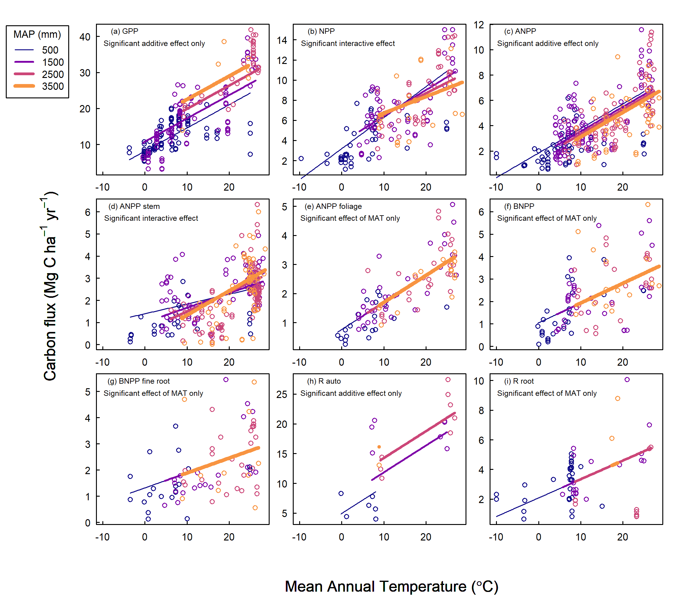

```{r, include=FALSE}
options(tinytex.verbose = TRUE)
options(knitr.table.format = "latex")
```


```{r include=FALSE}
knitr::write_bib(c(
  .packages(), 'knitr', 'rmarkdown', 'lme4', 'MuMIn', 'plyr', 'raster', 'ncdf4', 'Hmisc', 'plyr', 'merTools', 'visreg', 'r2glmm', 'nlme', 'viridis', 'ggplot2', 'ggpubr', 'gridExtra', 'AICcmodavg'
), 'packages.bib')
```

```{r setup, include = FALSE}
# knitr::opts_knit$set(root.dir = 'C:/Users/becky/Dropbox (Smithsonian)/GitHub/Global_Productivity/manuscript/')
knitr::opts_knit$set(root.dir = '/Users/kteixeira/Dropbox (Smithsonian)/GitHub/ForC-db/Global_Productivity/manuscript/')
```

```{r results="asis", include=FALSE}
cat("
<style>
caption {
      font-size: 0.75em;
    }
</style>
")
```
**Title:** Global patterns of forest autotrophic carbon fluxes

**Running head:** 


**Authors:** 

Rebecca Banbury Morgan^1,2^

Valentine Herrmann^1^

Norbert Kunert^1,3^

Ben Bond-Lamberty^4^

Helene C. Muller-Landau^3^ 

Kristina J. Anderson-Teixeira^1,3^*


**Author Affiliations:**

1. Conservation Ecology Center; Smithsonian Conservation Biology Institute; National Zoological Park, Front Royal, VA, USA

2. *Becky- current*

3. Center for Tropical Forest Science-Forest Global Earth Observatory; Smithsonian Tropical Research Institute; Panama, Republic of Panama

4. Joint Global Change Research Institute, Pacific Northwest National Laboratory, College Park Maryland 20740 USA 


*Corresponding Author:

phone: 1-540-635-6546 

fax:1-540-635-6506

email: teixeirak@si.edu


**Keywords:**

**Paper type:** Primary Research Article

\newpage
###Abstract
[**very rough start:**]
Carbon fixation, allocation, and metabolism by trees set the basis for energy and material flows in forest ecosystems and define their interactions with Earth's changing climate.
Here, we drew upon # records from the Global Forest Carbon Database (ForC), representing all major forest types and the nine most significant forest autotrophic carbon flux (FACF) variables, to comprehensively explore how C cycling in mature, undisturbed forests varies with latitude and climate on a global scale. We show that, across all FACF variables analyzed, C cycling decreases linearly with latitude -- a finding that confirms multiple previous studies but contradicts the idea that net primary productivity ($NPP$) of temperate forests rivals that of tropical forests. The FACF variables generally increase in proportion to one another, with few differences in allocation detectable at this global scale, but differed in that latitude explained a lower proportion of variation among subsidiary fluxes (in particular, woody aboveground $NPP$ and belowground $NPP$, $BNPP$). Climate explained a significant proportion (#-#%) of variation in all C fluxes analyzed (less for subsidiary fluxes), with temperature variables in general and mean annual temperature ($MAT$) in particular being the best predictors of FACF on this global scale. While other climate variables (*e.g.*, **XX**) displayed significant correlation with FACF, none of them had significantly better explanatory power than $MAT$. The effects of temperature were modified by moisture availability, with reduced FACF under hot and dry conditions and sometimes under very high precipitaiton (especially for $BNPP$). FACF declined with temperature seasonality, but growing season length doesn't improve upon MAT as a predictor. Within the growing season, the influence of climate on C cycling is smaller but still significant for a number of carbon fluxes. These findings clarify the big picture of how FACF varies with latitude and climate on a global scale. As we enter a period of accelerating climatic change, understanding of the fundamental climatic controls on FACF sets a foundation for understanding patterns of change. 

\newpage
### Introduction

Carbon cycling in forests worldwide provides the energetic basis for sustaining the majority of Earth's terrestrial biodiversity, while strongly influencing atmospheric CO~2~ and climate [@bonan_forests_2008]. Forests' autotrophic carbon fluxes (FACF)--that is, carbon fixation, allocation, and metabolism by trees and other primary producers--sets the energy ultimately available to heterotrophic organisms (including microbes), in turn influencing their abundance (**REFS**) and possibly diversity [@waide_relationship_1999] (**REFS**). FACF influences all organic matter stocks in forest ecosystems and is linked to cycling of energy, water, and nutrients (**REFS**) [@piao_forest_2010]. Critically, FACF also define forest interactions with Earth's changing climate. Over 69 Gt of CO~2~ cycle through Earth's forests each year [@badgley_terrestrial_2019], and in recent decades their net C sequestration (~2.4 Gt C yr^-1^) offset roughly 30% of anthropogenic fossil fuel emissions [@pan_large_2011]. As atmospheric carbon dioxide levels continue to rise, driving climate change, forests will play a critical role in shaping the future of Earth's climate ([Cavaleri et al. 2015](https://onlinelibrary.wiley.com/doi/epdf/10.1111/gcb.12860); [Rogelj et al. 2018](https://www.ipcc.ch/site/assets/uploads/sites/2/2019/05/SR15_Chapter2_Low_Res.pdf)). However, our ability to draw general macroscopic conclusions regarding global variation in FACF with respect to climate has been limited in that these analyses often mix forests that vary in stand age, disturbance history, and/or management status; do not always sufficiently parse related variables; and typically consider only one or a few variables at a time. 

FACF decrease with latitude, but it remains unclear whether and how the shape of this relationship varies across fluxes. Studies agree that FACF are lowest in the boreal regions, and increase into the temperate regions [@luyssaert_co_2007; @huston_global_2009; @beer_terrestrial_2010; @jung_global_2011]. However, evidence is inconclusive on whether primary productivity continues to increase into the tropics, or whether it plateaus in temperate regions. Evidence for this is further complicated by the fact that different studies use different measures of productivity to explore these relationships. For example, modelling of global terrestrial ecosystem gross primary productivity ($GPP$) through upscaling and calibration of eddy flux measurements indicates that GPP peaks in tropical forests [@beer_terrestrial_2010; @jung_global_2011; @badgley_terrestrial_2019](*[Li & Xiao 2019](https://www.mdpi.com/2072-4292/11/21/2563)*). In contrast, some studies suggest that the highest values of net primary productivity ($NPP$) may be found in temperate forests [@luyssaert_co_2007; @huston_global_2009], while others find $NPP$ highest in the tropics and decreasing with latitude [@simova_enigma_2017]. Other studies have chosen to focus exclusively on above-ground net primary productivity ($ANPP$), finding evidence of a weak negative relationship between $ANPP$ and latitude [@huston_global_2009; @gillman_latitude_2015].

The latitudinal gradient in FACF is primarily driven by climate, which is a significant driver of FACF across broad spatial scales [@luyssaert_co_2007; @cleveland_relationships_2011]([Hursh et al. 2017](https://onlinelibrary.wiley.com/doi/epdf/10.1111/gcb.13489)). The majority of studies have focused on exploring the relationships of FACF to mean annual temperature (MAT) and mean annual precipitation (MAP), as the most commonly reported site-level climate variables. While these fail to capture some important aspects of climate such as seasonality, they do describe broad trends in temperature and water availability, and therefore capture a substantial portion of global-scale variation in climate. There is strong evidence that both MAT and MAP show significant positive relationships with FACF [@chu_does_2016]. However, as with latitude, the shape of those relationships is not always clear, and, again, is complicated by the use of different measures of FACF across studies. Various measures of primary productivity {**FACF?**} saturate at high levels of MAP, though the saturation points identified vary from 1500mm [@luyssaert_co_2007] up to 2445mm MAP [@schuur_productivity_2003]. Studies of the influence of MAT on productivity {**FACF?**} are less conclusive. Luyssaert et al. [-@luyssaert_co_2007] examined GPP and NPP and found that, while $GPP$ increases linearly with MAT, NPP saturates at around 10$^\circ$C MAT. In contrast, Larjavaara and Muller-Landau [-@larjavaara_temperature_2012], find that increases in $GPP$ saturate at approximately 25$^\circ$C MAT, while Schuur [-@schuur_productivity_2003] shows that $NPP$ increases linearly with temperature. Taylor et al. [-@taylor_temperature_2017] showed a positive interaction between MAT and MAP in shaping tropical forest productivity, such that high rainfall had a negative effect on productivity in cooler climates, compared to a positive effect in warmer climates. {**It would be good to add some more citations on soil respiraiton. I'm sure BBL can help.**}

FACF can be influenced by many other factors as well, which often act across a range of scales, and may show interactive effects with each other [@cleveland_relationships_2011]. On a local scale, stand age [@litton_carbon_2007; @gillman_latitude_2015], biodiversity [@liang_positive_2016], management [@simova_enigma_2017], nutrient availability [@aragao_above_2009], and altitude [@girardin_net_2010; @malhi_variation_2017] all impact FACF. On a global scale, we expect that FACF are most strongly influenced by broad climatic gradients. There is evidence that FACFs also respond to variables such as cloud cover [@taylor_temperature_2017], solar radiation [@fyllas_solar_2017], and potential evapotranspiration [@kerkhoff_plant_2005] in potentially significant ways. Furthermore, MAT and MAP are very coarse measures of climate, and so fail to capture much variation in climate on an intra-annual scale, including the effects of factors such as growing season length, number of frost-free days, temperature seasonality, and dry season length. Some studies have suggested that the apparently strong relationship between MAT and FACFs is actually a consequence of the correlation between MAT and growing season length [@kerkhoff_plant_2005; @malhi_productivity_2012; @michaletz_convergence_2014; @michaletz_drivers_2018]. Kerkhoff et al. [-@kerkhoff_plant_2005] and Michaletz et al. [-@michaletz_convergence_2014] find that, within the growing season, there is no significant relationship between primary productivity and MAT, suggesting that the effect of temperature is due to increased length of growing season, rather than an inherent influence of temperature on FACF.  
  
The recent development of a global forest carbon database synthesizing multiple variables and including records of stand history (ForC; [@anderson-teixeira_carbon_2016; @anderson-teixeira_forc_2018]) opens up the possibility for a standardized analysis of global scale variation in multiple FACF and the principle climatic drivers of these patterns. In order to approach this broad topic, we simplify the major gaps in our knowledge to five broad questions and corresponding hypotheses (Table 1). ** see [issue #48 ](https://github.com/forc-db/Global_Productivity/issues/48)** First, we ask how forest autotrophic carbon fluxes (FACF) vary with latitude. We then test how these fluxes relate to MAT and MAP, and additionally how they respond to other, less well-studied, climate variables. Finally, we consider the relationship between FACF and seasonality, considering the role of seasonality in explaining variation in carbon fluxes, and the influence of climate on FACF standardized by growing season length. We use a comprehensive global database of forest carbon fluxes to address the above questions for nine carbon fluxes, allowing for an in-depth exploration of the effect of climate on FACF globally.

\renewcommand{\arraystretch}{2}
```{r eval = TRUE, echo=FALSE, warning=FALSE}
library(knitr)
library(kableExtra)
hypothesis_table <- read.csv("hypothesis_table.csv", stringsAsFactors = FALSE, check.names = FALSE)
hypothesis_table[1,1] <- paste0(hypothesis_table[1,1], footnote_marker_number(1),"$^{,}$",footnote_marker_number(2),"$^{,}$", footnote_marker_number(3))
hypothesis_table[2,1] <- paste0(hypothesis_table[2,1], footnote_marker_number(1),"$^{,}$",footnote_marker_number(4))
hypothesis_table[3,1] <- paste0(hypothesis_table[3,1], footnote_marker_number(1),"$^{,}$",footnote_marker_number(4))
hypothesis_table[4,1] <- paste0(hypothesis_table[4,1], footnote_marker_number(5))
hypothesis_table[10,1] <- paste0(hypothesis_table[10,1], footnote_marker_number(6),"$^{,}$",footnote_marker_number(7),"$^{,}$", footnote_marker_number(8))
hypothesis_table[11,1] <- paste0(hypothesis_table[11,1], footnote_marker_number(7),"$^{,}$", footnote_marker_number(8))
hypothesis_table[12,1] <- paste0(hypothesis_table[12,1], footnote_marker_number(8))
kable(hypothesis_table, format = "latex", booktabs = TRUE, caption = "Summary of research questions, corresponding hypotheses, and results. Statistically signficant support for/ rejection of hypotheses is indicated with 'yes'/'no', parentheses indicate partial overall support/rejection of hypotheses across all FACF, and '-' indicates no significant relationship.", escape = F) %>%
  kable_styling(latex_options = c("scale_down", "hold_position"), font_size = 12) %>%
  pack_rows("Q1. How do FACF vary with latitude?", 1, 1, latex_gap_space = "1em", colnum = 5, hline_before = FALSE) %>%
  pack_rows("Q2. How do FACF vary with MAT and MAP?", 2, 4, latex_gap_space = "1em", colnum = 5, hline_before = TRUE) %>%
  pack_rows("Q3. How are FACF related to other climate variables?", 5, 7, latex_gap_space = "1em", colnum = 5, hline_before = TRUE) %>%
  pack_rows("Q4. How does seasonality influence FACF?", 8, 11, latex_gap_space = "1em", colnum = 5, hline_before = TRUE) %>%
  pack_rows("Q5. When standardised by growing season length, how do FACF vary with climate?", 12, 15, latex_gap_space = "1em", colnum = 5, hline_before = TRUE) %>%
  add_header_above(c(" ",  " ", "Forest autotrophic carbon fluxes (FACF)" = 9, " ")) %>%
  #column_spec(2:11, width = "1.8cm") %>%
  kableExtra::landscape() %>%
  kableExtra::footnote(number = c("Luyssaert et al. (2007)", "Gillman et al. (2015)", "Simova and Storch (2017)", "Schuur (2003)", "Taylor et al. (2016)", "Malhi (2012)", "Michaletz et al. (2014)", "Chu et al. (2016)"), footnote_as_chunk = TRUE)
```


### Materials and Methods  

*Forest carbon flux data* 

This analysis focused on nine FACF included in the open-access ForC database (Table 2) [@anderson-teixeira_carbon_2016; @anderson-teixeira_forc_2018]. ForC contains records of field-based measurements of forest carbon stocks and annual fluxes, compiled from original publications and existing data compilations and databases. Associated data, such as stand age, measurement methodologies, and disturbance history, are also included. The database was significantly expanded since the publication of @anderson-teixeira_forc_2018 through integration with the Global Soil Respiration Database [@bond-lamberty_global_2010]. Additional targeted literature searches were conducted to identify any further available data on the FACF analyzed here, with particular focus on mature forests in temperate and boreal regions, which were not included in the review of @anderson-teixeira_carbon_2016. We used ForC v3.0, archived on Zenodo with DOI 10.5281/zenodo.3403855. This version contained 29,730 records from 4,979 plots, representing 20 distinct ecozones across all forested biogeographic and climate zones.

This analysis focused on mature forests with no known history of signficant disturbance or management. 
There is evidence that stand age influences patterns of FACF and carbon allocation in forest ecosystems, and can confound relationships between latitude and primary productivity [@delucia_forest_2007; @gillman_latitude_2015]. To reduce any biasing effects of stand age, we included only stands of known age $\ge$ 100 years and those described by terms such as "mature", "intact", or "old-growth". 
Since management can alter observed patterns of FACF [@simova_enigma_2017], sites were excluded from analysis if they were managed, defined as plots that were planted, managed as plantations, irrigated, fertilised or including the term "managed" in their site description. 
Sites that had experienced significant disturbance within the past 100 years were also excluded. Disturbances that qualified sites for exclusion included major cutting or harvesting, burning, flooding, drought and storm events with site mortality >10% of trees. Grazed sites were retained.  

```{r eval = TRUE, echo=FALSE, warning=FALSE}
library(knitr)
library(kableExtra)
FACF_table <- read.csv("FACF_variables.csv", stringsAsFactors = FALSE, check.names = FALSE)
names(FACF_table) [6]  <- paste0(names(FACF_table) [6], footnote_marker_symbol(1))
kable(FACF_table, format = "latex", booktabs = TRUE, caption = "Definitions and sample sizes of FACF variables used in analysis. All variables are in units of Mg C ha$^{-1}$ yr$^{-1}$. ", escape = F) %>%
  kable_styling(latex_options = c("scale_down", "hold_position"), font_size = 12) %>%
  column_spec(2, width = "4cm") %>%
  column_spec(3, width = "7cm") %>%
  column_spec(4, width = "10cm") %>%
  column_spec(5:6, width = "1.5cm") %>%
  add_header_above(c(" ",  " "," ",  " ", "Sample size" = 2)) %>%
  kableExtra::footnote(symbol = c("Geographic areas group geographically proximate sites, defined using a hierarchical cluster analysis on the distance matrix of the sites, and a cutoff of 25km"), footnote_as_chunk = FALSE) 
```


```{r echo=FALSE, out.width='100%', fig.cap = "Map showing all data used in the analysis, coded by variable. Variables are plotted individually in Fig. S1. ", fig.pos='H'}
  knitr::include_graphics("distribution_all_variables_cropped.png")
```
  
  
*Climate data* 

ForC contains geographic coordinates associated with each measurement record and, when available, mean annual temperature (MAT) and mean annual precipitation (MAP) as reported in the primary literature [@anderson-teixeira_forc_2018]. Based on the geographic co-ordinates for each site, data on twelve climate variables--including MAT, MAP, temperature and precipitation seasonality, annual temperature range, solar radiation, cloud cover, annual frost and wet days, potential evapotranspiration (PET), aridity (MAP/PET), and vapor pressure deficit (VPD)--were extracted from five open-access climate datasets: WorldClim [@hijmans_very_2005], WorldClim2 [@fick_worldclim_2017], the Climate Research Unit (CRU) time-series dataset v. 4.03 [@harris_updated_2014], the Global Aridity Index and Potential Evapotranspiration Climate Database [@trabucco_global_2019], and TerraClimate [@abatzoglou_terraclimate_2018] (Table S1). From these data, we derived maximum VPD, defined as the VPD of the month with the largest deficit, and the number of water stress months, defined as the number of months annually where precipitation was lower than PET. Where site-level data was missing for MAT or MAP, we used values from the WorldClim dataset.

Length of the growing season was estimated to the nearest month, where growing season months were defined as months with mean minimum temperature > 0.5$^\circ$C. We experimented with a definion of growing season months including a moisture index, defined as (MAT - PET)/PET, > -0.95 (Kerkhoff et al. 2005; see also Michaletz et al. 2014). However, we found that including a moisture index had **no** effect on the estimates of growing season length, and so chose to exclude it.  (**Becky, was it really no effect? or minimal?**) Monthly data for PET, precipitation, and temperature from the CRU dataset v 4.03 [@harris_updated_2014], and solar radiation from WorldClim2 [@fick_worldclim_2017] were used to calculate mean monthly PET, precipitation, temperature and solar radiation during the growing season. Total growing season precipitation and solar radiation were also calculated. 
  
*Analyses*

The effects of latitude and climate on FACF were analysed using mixed effects models using the package 'lme4' [@bates_fitting_2015] in R v.3.5.1 [@r_core_team_r:_2018]. The basic model for all analyses included a fixed effect of latitude or climate and a random effect of plot nested within geographic area. Geographic areas--*i.e.*, spatially clustered sites--are defined within ForC using a hierarchical cluster analysis on the distance matrix of the sites and a cutoff of 25km [@anderson-teixeira_forc_2018]. We experimented with inclusion of altitude as a fixed effect, but excluded it from the final models because it added very little explanatory power--that is, the difference in AIC ($\Delta$AIC) relative to models excluding altitude was generally small (often $\Delta$AIC<2). Hypotheses were accepted if the $\Delta$AIC between a model including the fixed effect of interest and a corresponding null model excluding that fixed effect exceeded 2.0. All $R^2$ values presented here are marginal $R^2$ values, and refer to the proportion of variation explained by only the fixed effects, **unless otherwise specified**. **Becky, are there any instances of this?** Specific analyses are as described below.

We first examined the relationship between latitude and FACF (Q1; Table 1). We tested models with latitude as a linear and term (corresponding null: model without latitude) and as a second-order polynomial term (corresponding null: model with latitude as a linear term). If the shape of the relationship [**made biological sense**](https://github.com/forc-db/Global_Productivity/issues/64), and was a significant improvement on the linear relationship ($\Delta$AIC >2), we accepted the polynomial as the best model. We also examined relationships among fluxes across latitude, testing whether sums of component fluxes matched the larger fluxes and whether C allocation varied with latitude, as specified below.

To test whether trends in component fluxes across latitude sum to match those of larger fluxes, regression lines for smaller component fluxes were summed to generate new estimates of larger fluxes, which were then compared against the latitudinal regression of the larger flux. Confidence intervals for the larger flux were calculated using the 'bootMer' function from the lme4 package [@bates_fitting_2015]. This analysis was applied to following sets of fluxes: (1) $GPP = NPP + R_{auto}$, (2) $NPP = ANPP + BNPP$, and (3) $ANPP = ANPP_{foliage} + ANPP_{woody.stem}$. In addition, we estimated total belowground C flux (TBCF, not analyzed due to limited data) as $TBCF = BNPP + R_{root}$. 
 
Variation in allocation to component carbon fluxes along latitudinal gradients was explored for the following pairings: $GPP:NPP$, $ANPP:BNPP$, and $ANPP_{foliage}:ANPP_{woody.stem}$; $ANPP_{foliage}:NPP$, $ANPP_{woody.stem}:NPP$, $ANPP:NPP$, and $BNPP:NPP$. For each set of paired fluxes, measurements taken at the same site and plot, and in the same year, were paired together, and the ratio of each pair of measurements calculated. The ratios were regressed against latitude and climate variables, using the linear model specified above. Cook's distance analyses were carried out for each of the models, and indicated that data from a few high-elevation sites were having a disproportionate influence on the regressions. To account for this, models were re-run using only data from sites $\le$ 1000m.

We next examined the relationships of FACF to climate variables (Q2-Q4; Table 1). As with latitude, we tested both linear and polynomial fits for each climate variable. We tested relationships of each FACF (Table 2) against each climate variable (Table S1), but focus presentation--including focal hypotheses (Table 1)--on climate variables that explained >20% of variation in FACF. **Becky, please make this more specific. I drafted this based on the results, but its not very clear.** 

To investigate the potential joint and interactive effects of climate variables on carbon fluxes, multivariate models were also specified. We explored a large range of climate variable combinations and ultimately decided to focus on MAT and MAP. We favored these over variables with similar explanatory power because they are the most commonly reported climate variables and are recorded in ForC. MAT was consistently among the best individual predictors of FACF (Table S2), although it was occasionally out-performed by closely correlated climate variables (Fig. S2). In combination with MAT as a primary climate variable, MAP was consistently among the best secondary climate variables. Specifically, compared again a model including MAT x MAP, there were no other variables that, in interaction with MAT, improved AIC by >2.0 and $R^2$ by >0.05. In examinging the joint and interactive effects of climate variables, an additive model including MAT and MAP as fixed effects was accepted when $\Delta$AIC >2 relative to a null including only MAT as a fixed effect. An interactive model including an MAT x MAP interaction was accepted when $\Delta$AIC >2 relative to a null including MAT and MAP as fixed effects. 

To test whether and how FACF varied with climate when standardised by growing season length (Q5), we first standardized FACF by dividing by growing season length (as defined above). We then tested for correlations between growing season length-standardised FACF against growing season climate variables. For analyses on data within the growing season, only linear models were specified.  

**All analyses were conducted in R (**Version**). Code and results are archived on GitHub....**
     
###Results

In total, we analyzed 1228 records from nine FACF variables taken from forests that had experienced no major anthropogenic disturbances within the past 100 years. These records represented a total of 154 distinct geographic areas (Fig. 1, Table 2), across all forested biogeographic and climate zones. 
  
*How do FACF vary with latitude?* 

All major carbon fluxes decreased linearly with latitude (Fig. 2; Table S2). Latitude was a strong predictor for many of the carbon fluxes--particularly the larger fluxes (Table S2). Specifically, latitude explained 64% of variation in GPP (n = 254, p<0.0001), 50% in NPP (n = 114, p<0.0001) and 45% in ANPP (n = 259, p<0.0001). The FACF that were most poorly predicted by latitude were $BNPP_{root-fine}$ ($R^2$=0.17) and $ANPP_{woody.stem}$=0.18). For all FACF, the relationship with latitude was best predicted by the linear model (**but see [this issue]((https://github.com/forc-db/Global_Productivity/issues/64))**). 
  
```{r echo=FALSE, out.width='100%', fig.cap = "Latitudinal trends in forest autotropic carbon flux. Lines of best fit are plotted according to the best model selected during analysis. All regressions are significant $(p<0.05)$. Each panel shows major C fluxes together with component fluxes. Also plotted are predicted trends in the major C fluxes based on the sum of component fluxes. 95\\% confidence intervals are plotted for the major flux for comparison with predicted trends. In (d),  which shows three belowground fluxes, the major flux, total belowground carbon flux, is one for which we have no data", fig.pos='H'}

  knitr::include_graphics("combined_stacked.png")
```

In general, smaller component fluxes summed approximately to larger fluxes across the latitudinal gradient (Fig. 2). That is, modelled estimates of $GPP$, generated from the sum of $NPP$ and $R_{auto}$; $NPP$, generated from the sum of $ANPP$ and $BNPP$; and $ANPP$, generated from the sum of $ANPP_{foliage}$ and $ANPP_{woody-stem}$, fell completely within the confidence intervals of the regressions of field estimates of $GPP$, $NPP$, and $ANPP$, respectively.

We found little evidence that allocation between fluxes varied substantially with latitude or climate (Fig. S3). Of the 7 FACF ratios regressed against latitude and three climate variables (MAT, MAP, temperature seasonality), there were only four signficant relationships, all with $R^2 \le 0.2$ (Fig. S3). Specifically, the proportion of NPP allocated to $ANPP_{foliage}$ increased weakly with MAT ($R^2=0.20$), and the proportion of $NPP$ allocated aboveground ($ANPP$) decreased weakly with latitude ($R^2=0.11$) and temperature seasonality ($R^2=0.17$), while increasing with MAT ($R^2=0.11$).  There were no significant results from regressing ratios of carbon fluxes against latitude, or against any of the climate variables. 
   
*How do FACF relate to MAT and MAP?* 

All FACF increased linearly with MAT, and we found no support for a saturation point of FACF with MAT (all p<0.05; Figs. 3-4, S4-S5, Table S2). As with latitude, MAT tended to explain more variation in the larger FACF ($GPP$, $NPP$, $ANPP$, $R_{auto}$) and $ANPP_foliage$ (all $R^2$> 0.4) than in subsidiary and belowground fluxes ($ANPP_{woody-stem}$, $R_{root}$, $BNPP_{root-fine}$; all $R^2$< 0.25).
  
MAP was a significant (p<0.05) predictor of all FACF but $ANPP_{woody-stem}$ (Figs. 4a, S4-S5; Table S2). However, it explained little variation: with the exception of $R_{auto}$, MAP explained at most 37% of variation in FACF. For the majority of FACF, a polynomial model was the best fit. FACF generally increased with precipitation, up until a saturation point at between 3000 and 4000mm annual precipitation, above which they started to decrease (Figs. 4, S4-S5). The notable exception to this was GPP: the model indicated that GPP continued to increase with precipitation up to measures of at least 5000mm annually (p<0.0001, $R^2$ = 0.33. Data above this point were not available, but the model trend indicated that the saturation point for this model would be around 5000mm MAP. 

There was a significant additive effect of MAT and MAP on $GPP$, $ANPP$ and $R_{auto}$ (Fig. 3, Table S3). Accounting for MAT, MAP had a substantial positive effect on $GPP$ and $R_{auto}$ and a small negative effect on $ANPP$. There was a significant interactive effect between MAT and MAP for $NPP$ and $ANPP_{woody-stem}$ (Fig. 3, Table S3). The interaction was negative for $NPP$ and positive for $ANPP_{woody-stem}$. For $ANPP_{foliage}$, $BNPP$, $BNPP_{root-fine}$, and $R_{auto-root}$, MAP did not have a signficant effect when accounting for MAT (Fig. 3, Table S3). For the variables which showed a significant interactive or additive effect between MAT and MAP, no other climate variable, in combination with MAT, significantly improved on that model. {**need to confirm this given changes in MAT MAP results (or you could just drop the sentence.)**}

```{r echo=FALSE, out.width='100%', fig.cap = "Interactive effects of mean annual temperature and mean annual precipitation on FACF. For visualization purposes, data points are grouped into bins of 0 - 1000, 1001 - 2000, 2001 - 3000, and >3000mm mean annual precipitation, and lines of best fit models are plotted for mean annual precipitation values of 500, 1500, 2500, and 3500mm. All regressions are significant $(p<0.05)$.", fig.pos='H'}
  
```

*How do FACF relate to other climate variables?* 

Our results indicated that FACF were most strongly explained by temperature at the global scale, with temperature-related climate variables coming out as strong predictors of FACF. In addition to MAT, several of its correlates (Fig. S2) were consistently identified as strong univariate predictors of FACF: temperature seasonality, annual temperature range, annual frost days, PET, and length of growing season (Figs. 4, S4-S7).  
  
We found a significant relationship between C flux and potential evapotranspiration for all FACF. $ANPP_{foliage}$, $BNPP_{root-fine}$ and $R_{root}$ increased linearly with PET; however, all other fluxes showed a polynomial relationship with PET (Fig. 4c, S4-5; Table S2). We found strong evidence for a saturation point or peak with PET: FACF tended to increase at values below 1000mm, before saturating between 1200 and 1700mm. There was also evidence that FACF begin to decrease at values above 1800mm PET.

Vapour pressure deficit was a significant predictor of C flux for all FACF. $BNPP_{root-fine}$ showed a linear relationship with vapour pressure deficit ($R^2$ = 0.07, p<0.05), but all other fluxes showed a polynomial relationship (Figs. 4d, S4-5; Table S2). FACF initially increased with vapour pressure deficit, before saturating at around 0.8 kPa, after wich point they began to decrease.

All fluxes, with the exception of $R_{root}$, showed a positive linear relationship with solar radiation (Figs. S4-S5, Table S2). Solar radiation explained a low proportion of variability in all FACF, explaining less than 20% of the variation in each flux, with the exception of$R_{auto}$ ($R^2$ = 0.26, p<0.05).
  
Annual wet days, cloud cover, and aridity were poor or non-significant explainers of variation in FACF, explaining less than 20% of the variation in each of the carbon fluxes (Figs. S4-S5; Table S2).

```{r echo=FALSE, out.width='100%', fig.cap = "Plots of carbon fluxes against (a) mean annual temperature; (b) mean annual precipitation; (c) potential evapotranspiration, (d) vapour pressure deficit; (e) temperature seasonality; (f) length of growing season. For visualization purposes, data for each flux was rescaled with a mean of 0 and standard deviation of 1. Lines of best fit are plotted according to the best model selected during analysis (**see issue 47**). All regressions are significant $(p<0.05)$.", fig.pos='H'}
  knitr::include_graphics("combined_plots.png")
```

*What is the role of seasonality in explaining FACF?* 

Temperature seasonality was a significant predictor of FACF. $GPP$, $NPP$, $ANPP$, and $R_{root}$ exhibited a polynomial relationship with seasonality (all p<0.05; Figs. 4e, S6-7; Table S2). $ANPP_{foliage}$, $ANPP_{woody-stem}$ and $R_{auto}$ decreased linearly with temperature seasonality (all p<0.05; Figs. 4e, S6-S7; Table S2). Temperature seasonality was strongly correlated with annual temperature range, which was likewise a similarly strong predictor of FACF (Table S2).FACF were highest where temperature seasonality = 0, and at an annual temperature range of 15$^\circ$C or lower.

In contrast, there was no significant effect of precipitation seasonality on FACF, and both maximum vapour pressure deficit, and water stress months were poor or non-significant explainers of variation in FACF (Figs. S6-S7; Table S2).

We found a significant relationship between length of growing season and FACF, with all fluxes showing a linear increase with length of growing season (Figs. 4e, S6-S7; Table S2). Length of growing season was a strong predictor of FACF, explaining 51% of variation in GPP, 39% of variation in NPP, and 34% of variation in ANPP, but it was a weaker predictor than MAT for all fluxes analysed (Table S4).

*Within the growing season, how do FACF vary with climate?* 

When FACF were standardized by growing season length, correlations with growing season climate--including temperature, precipitation, solar radiation, and PET--were generally weak (Figs. S8-S9). Speficifally, $ANPP$ increased with growing season temperature ($R^2$ = 0.10, p<0.001) and precipitation ($R^2$ = 0.04, p<0.05). Similaryly, $ANPP_{foliage}$ increased slightly with growing season temperature ($R^2$ = 0.16, p<0.01) and precipitation ($R^2$ = 0.09, p<0.05). Growing season solar radiation had a positive influence on $GPP$ ($R^2$ = 0.21, p<0.001), $NPP$ ($R^2$ = 0.21, p<0.001), $BNPP$ ($R^2$ = 0.16, p<0.001) and $BNPP_{fine.root}$ ($R^2$ = 0.12, p<0.01). Growing season PET had a positive influence on $GPP$ ($R^2$ = 0.15, p<0.01), $NPP$ ($R^2$ = 0.18, p<0.01), $BNPP$ ($R^2$ = 0.23, p<0.0001), $BNPP_{fine.root}$ ($R^2$ = 0.11, p<0.05), and $ANPP_{woody-stem}$ ($R^2$ = 0.06, p<0.05). {**Becky, please verify/ edit the following:** There were no other signifcant correlations between growing season length-standardized FACF (9 variables in Table 2) and growing season climate (**which variables?**)}. 
  
###Discussion  

Our analysis of a large global database (ForC) reveals how autotrophic carbon fluxes in mature forests vary with latitude and climate on a global scale. We show that, across all nine FACF analyzed, C cycling decreases linearly with latitude (*H1.1*; Fig. 2)--a finding that confirms multiple previous studies (**REFS**) but contradicts the idea that productivity of temperate forests rivals that of tropical forests (*H1.1.alt*; **REFS**). The FACF generally increase in proportion to one another (*H1.2*), with few differences in allocation detectable at this global scale (Fig. S2) and with component fluxes summing appropriately to larger fluxes (Fig. 2), indicating no major, systematic omissions or overestimations of flux components. However, climate explained lower proportions of variability among subsidiary C fluxes (e.g., *$ANPP_{woody}$*, *$BNPP_{fine.root}$*, $R_{auto-root}$; Fig. 2; Table S2). Latitudianal variation in FACF is primarily attributable to temperature-related variables (*H3, H4*), particularly MAT (Figs. 3-4). Water availability is also influential, but generally of secondary importance across the range represented in our database (Figs. 3-4). Temperature seasonality and growing season length are closely correlated with MAT and are strong predictors of FACF (*H4*; Figs. 4e-f, S2, S6-S7), though growing season length doesn't improve upon MAT as a predictor. Within the growing season, the influence of climate on C cycling is smaller but still significant for a number of FACF (*H5*; Fig. S9; Table S4). These findings clarify the big picture of how FACF vary with latitude and climate on a global scale.

Past studies have differed in their conclusions regarding the relationship between FACF and latitude or its correlates (Table 1, *H1*; **REFS**)--quite possibly because of lack of standardization with respect to stand age and disturbance history. Our findings indicate that, among mature, undisturbed stands, FACF are unambiguously highest in the tropical regions, and the relationship is approximately linear (Fig. 2). This contrasts with suggestions that productivity of temperate forests is similar to that of tropical forests (**REFS**). Temperate forests tend to be younger than tropical forests (**REF**), so analyses comparing across latitudinal gradients without controlling for stand age risk confounding age with biome effects ([Poulter et al. 2018-DOI:10.1594/PANGAEA.889943](http://pure.iiasa.ac.at/id/eprint/15361/); Potapov et al. 2008. Mapping the World’s Intact Forest Landscapes by Remote Sensing. Ecology and Society 13 (2), 51. ). In addition, because C allocation varies with stand age [@delucia_forest_2007] (**See Nobby's comment in manuscript-draft_NK.pdf**), age differences may introduce systematic biases into analyses of FACF across latitude or global climatic gradients. For example, woody productivity tends to be higher in rapidly aggrading secondary stands than in old-growth forests, where proportionally more C is allocated to respiration (** Nobby AFM paper: Understanding the controls over forest carbon use efficiency on small spatial scales: Effects of forest disturbance and tree diversity**) [*purpose for respiration/ other compenents (**See Nobby's comment in manuscript-draft_NK.pdf**)]. 

We show that FACF are broadly consistent in their responses to climate drivers on the global scale (with the exception of some differences in MAT-MAP interactions; Fig. 3), with no major trends in C allocation among the variable pairs tested (Table 1, *H1*; Fig. 2; **Some SI table**). Although variation in allocation has been observed along gradients of elevation [@moser_elevation_2011] and water availability [@newman_above-_2006]--along with non-climatic axes of stand age [@litton_carbon_2007], nutrient availability [@litton_carbon_2007; @gill_belowground_2016], and forest structure [@taylor_greater_2019]--variation in relation to climate is not apparent at the global scale within ForC, which contains the bulk of relevant data. Our conclusion, then, is that hypothesized gradients in allocation along global climate gradients cannot currently be supported for mature forests, although data quantity and standardization is currently insufficent to rule out the possibility that such trends exist. 

bbl: remove this sentence? Of particular interest and significance are the relationships amongst $GPP$, net primary productivity ($NPP$ and its components, particularly $ANPP_{woody-stem}$), and respiration ($R_{auto}$ and components). There have been suggestions that tropical forests tend to have low carbon use efficiency ($CUE$= $NPP$/$GPP$=($GPP$-$R_{auto}$/$GPP$), which are based on observations of low $CUE$ in old-growth tropical forests relative to (mostly younger) extratropical forests [@delucia_forest_2007; @malhi_productivity_2012; @anderson-teixeira_carbon_2016], but our analysis suggests that these low values might more appropriately be attributed to the fact that these forests are old than to their tropical climate. Indeed, $CUE$ is known to decline with forest age [@delucia_forest_2007; @collalti_is_2019], but appears to be roughly independent of $GPP$ [@litton_carbon_2007]. Among our sites with relevant data, there is indication that CUE or $ANPP_{woody-stem}$/$GPP$ increase with latitude (**some SI table**). Additional measurements with careful methodological standardization across a consistent set of mature forest sites will be necessary to determine whether any climate-driven gradients in allocation exist at the global scale. 

One interesting observation was that climate tends to explain more variation in the major fluxes ($GPP$, $NPP$, $R_{auto}$ - latitude $R^2\ge$ 48%) than in subsidiary fluxes (latitude $R^2$ <27% for $BNPP_{fine.root}$, $R_{auto-root}$,$ANPP_{woody-stem}$) (Fig. 2; **some SI table?**). There are two, non-exclusive, potential explanations for this. First, it may be that methodological variation is larger relative to flux magnitude for some of the subsidiary fluxes. Belowground fluxes in particular are difficult to quantify, and measurement methods for the belowground fluxes considered here may be measured through fundamentally different approaches (*e.g.*, minirhizotrons, ingrowth cores, or sequential coring for $BNPP_{root-fine}$; root exclusion, stable isotope tracking, or gas exchange of excised roots for $R_{auto-root}$), and sampling depth is variable and often insufficient to capture the full soil profile. $ANPP_{woody-stem}$, which is also poorly explained by latitude or climate, is more straightforward to measure but is subject to variability introduced by differences such as biomass allometries applied and minimum plant size sampled (bbl: cite e.g. Huntzinger?). However, methodological variation and uncertainty affect all of fluxes considered here--not necessarily any less than the aforementioned, and some of the larger fluxes that vary more strongly with respect to climate ($ANPP$, $NPP$) are estimated by summing uncertain component fluxes. Second, differences among variables in the proportion of variation explained by climate may be attributable to more dicrect climatic control over $GPP$ than subsidiary fluxes. That is, subsidiary fluxes may be shaped by climate both indirectly through its influence on $GPP$ and respiration and directly through any climatic influence on C allocation, as well as many other local- and regional-scale factors (**REFS**).

The latitudinal gradient in FACF (Fig. 2) is driven primarily by temperature-related climate variables, and secondarily by moisture availability (Table 1, *H2-H3*; Figs. 3-4). Because many climate variables co-vary across the latitudinal gradient, because climatic drivers affect forest carbon flux on much shorter time scales than can be captured by annual climate summary variables, and because both climatic conditions and C flux vary intra- and inter-annually around the long-term means, it is not appropriate to attempt to identify any one mean annual climate variable as a mechanistic driver of FACF. However, it remains informative to consider these relationships. We find that temperature-related climate variables ($MAT$, temperature seasonality, ...**LIST**) explain the highest proportion of variability in FACF, and among these, $MAT$ is generally the best predictor--perhaps because site-specific MAT is recorded for the majority of sites in ForC, whereas other variables are extracted from global gridded data products (Table S1**?**). The effects of temperature are modified by moisture availability, with reduced FACF under hot and dry conditions (*i.e.*, high PET, high deficit; Fig. 4c-d) and sometimes under very high precipitaiton (Figs. 3, 4b). Negative effects of very high precipitation on FACF have been observed previously (**REFS**) and are attributable to nutrient and light limitations (**REFS**). Thus, although temperature and water availability jointly and interactively drive global-scale patterns of FACF. 

bbl: this seems really interesting and novel, consider expanding the following paragraph

FACF are negatively correlated with temperature seasonality (Table 1, *H4*; Fig. 4e), and is minimal during cold- or dry- dormant seasons. To account for this, a number of analyses seeking to characterize global-scale effects of climate on productivity have examined the relationship of C flux per month of the growing season with growing season climatic conditions (Table 1, *H5*; **REFS**). We found that the sort of simple metric needed to define growing season at a global scale was uncertain for temperature and problematic for moisture (**WORK ON THIS**). A temperature-defined growing season length had stong positive correlation with FACF (Fig. 4f), but explained less variation than $MAT$. Dividing FACFs by growing season length to yield FACF per growing season month removed the majority of climate-related variation, supporting the idea that the latitudinal gradient in FACF is attributable more to shorter growing seasons at high latitudes than to inherently lower rates of photosyntheiss or respiration by high-latitude forests (*[ Enquist et al. 2007 GCB- but check]*). However, there remained a number of significant correlations with growing season climatic conditions, suggesting that climatic conditions remain influential within the growing season. We conclude that while correcting for growing season length takes analyses a step closer to mechanistic linkage of instantaneous C flux rates to environmental conditions, it remains very crude relative to the the timescales on which climate affects plant metabolism and does not advance statistical predictive power. Rather, mechanistic accounting for climatic effects on global FACF patterns requires models representing physiologically meaningful timescales (*e.g.*, **refs**).

Our analysis clarifies how FACF vary with latitude and climate on a global scale, with some important implications for how forest carbon cycling relates to climate and, by extension, how it is likely to respond to climatic warming. We find no support for non-linear trends in mature forest C cycling with respect to latitude or $MAT$, and no distinct trends in C allocation across the global scale (Fig. 2). The implication is that under warmer conditions with similar moisture availability--and within the temperature range to which forest communities are adapated and acclimatized--higher temperatures result in a generalized acceleration of FACF, with no major shifts in C allocation among subsidiary fluxes. This is consistent with observations of continental- to global-scale increases in $GPP$ (*[Li & Xiao 2019](https://www.mdpi.com/2072-4292/11/21/2563)*), $ANPP_{woody stem}$ (*[Brienen et al., 2015](https://www-nature-com.smithsonian.idm.oclc.org/articles/nature14283)*), as well as some C cycle components not considered here--tree mortality (*[Brienen et al., 2015](https://www-nature-com.smithsonian.idm.oclc.org/articles/nature14283)*; **some McDowell Ref-KAT**), soil respiration ([Bond Lamberty & Thompson 2010](https://www-nature-com.smithsonian.idm.oclc.org/articles/nature08930/)), heterotrophic soil respiration ([Bond-Lamberty et al. 2018](https://www-nature-com.smithsonian.idm.oclc.org/articles/s41586-018-0358-x)). Of course, other factors such as rising CO~2~ are also at play, and such increases are not universal (e.g., [Rutishauser et al., 2019](https://onlinelibrary-wiley-com.smithsonian.idm.oclc.org/doi/full/10.1111/gcb.14833?casa_token=imtB9LD9mL8AAAAA%3AYWgsqNUfRkgs6_dIuDzmwUzL0qVyyxojhbj3jjfRcykBy8ay9T4qMOKPeOPytSGET9muIs8myhQOh3E))... Of course, actual climatic changes will result in very different sets of conditions than represented across geographic gradients in climate, but our analysis clarifies how carbon cycles through contemporary forest ecosystems. As we enter a period of accelerating climatic change, understanding of the fundamental climatic controls on FACF sets a foundation for understanding patterns of change. **[work on this]**

## misc content for discussion
- the observed positive interaction between MAT and MAP for $ANPP_woody$ is consitent with the @taylor_temperature_2017 analysis showing such an interaction for $ANPP$ in tropical forests. Similar to their analysis, we find a cross-over point at ~20C. However, we don't find such an interaction for $ANPP$, and we show a contrasting negative interaction for $NPP$. Some of this is may be stochasitic/ driven by composition of the dataset, and the interactions we observe are not internally consistent.

- consistent with [Hofhansl et al. 2015](https://agupubs.onlinelibrary.wiley.com/doi/full/10.1002/2014GB004934) (**verify**) , we found a slight tendency for warmer sites to have higher aboveground allocation

-results are consistent with *Muller-Landau et al., in review*


### Acknowledgements
Scholarly Studies
ForestGEO
Compilation of the ForC database was originally funded by DOE

